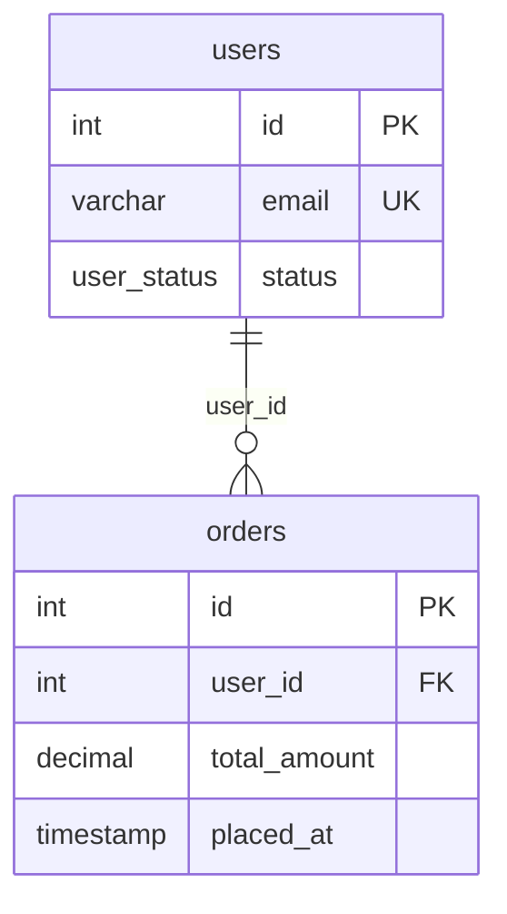

# dbml-to-mermaid example

## DBML input

```dbml
Table users {
  id int [pk]
  email varchar [unique]
  status user_status
}

Table orders {
  id int [pk]
  user_id int [ref: > users.id]
  total_amount decimal
  placed_at timestamp
}

Enum user_status {
  active
  suspended
}
```

## Mermaid output



## Caption

> 한 명의 사용자(`users`)는 여러 주문(`orders`)을 가질 수 있다. 사용자 상태는 `user_status` enum(`active`/`suspended`)으로 제어.

## Legend (항상 출력)

> 범례: PK=각 행을 구분하는 고유값, FK=다른 표를 가리키는 연결, UK=중복 불가.

## Loss notes

- `user_status` enum 값 → Mermaid 미표기. 캡션에 인용함.
- `email` unique 제약 → `UK` 마커 (Mermaid 표준은 PK/FK만, UK는 관례).

## Cardinality mapping table

| DBML | Mermaid | 의미 |
|---|---|---|
| `>` (many-to-one) | `}o--\|\|` | N:1 (default) |
| `<` (one-to-many) | `\|\|--o{` | 1:N |
| `-` (one-to-one) | `\|\|--\|\|` | 1:1 |
| `<>` (many-to-many) | join table 보존 후 양방향 | N:M |

> **주의**: Mermaid는 엔티티를 쓰는 **좌우 순서에 따라 까마귀발 기호가 뒤집힌다.** `>`(N:1) 입력이라도 부모를 왼쪽에 두면 `users ||--o{ orders` 처럼 쓴다. 본 패키지는 **항상 부모(1쪽) 먼저 + `||--o{`** 컨벤션으로 통일해 방향 역전을 막는다. 위 표의 기호를 그대로 쓰면서 엔티티 순서만 바꾸면 cardinality가 역전되니 금지.

## Embed targets

- Confluence: `Mermaid Diagrams for Confluence` 매크로. planning-publish-confluence가 자동 변환.
- GitHub README: fenced block 그대로 렌더링 (2022년 이후 지원).
- dbdocs: 자체 erDiagram이 있어 불필요. 외부 첨부 시에만 본 블록 사용.

## Input validation 상세
다이어그램 전 입력이 진짜 DBML인지 확인(비개발자는 DBML/SQL DDL 구분 못 함):
- `CREATE TABLE`/`VARCHAR(n)`/`PRIMARY KEY`/`FOREIGN KEY ... REFERENCES`/`ENGINE=`/끝 `;` 시그널 → "이건 DBML이 아니라 SQL DDL로 보입니다. ERD를 정확히 그리려면 DBML로 변환해 드릴까요, 아니면 원본 `.dbml`이 있나요?"로 응답, **추정 진행 금지**.
- Malformed/partial(`Table` 미닫힘, 빈 `Table`, 테이블 0개, 읽기 실패, 잘린 입력) → 추정으로 채워 그리지 말고 불완전한 부분 한 줄 지적 후 완전한 DBML 요청.

## Input handshake
변환 대상을 한 줄 명시 후 진행:
> DBML: `schemas/order.dbml` (6 tables, 4 refs, 2 enums)
> Target: Mermaid `erDiagram` (single block / grouped by TableGroup)

grouping이 모호하면 렌더 전 확인.

## 변환 규칙 (Rules)
- Table/column명 verbatim, `snake_case` 유지.
- Columns → `type name PK|FK|UK`. 시스템 컬럼(`created_at`/`updated_at`/`deleted_at`/`version`)은 요청 없으면 생략.
- **범례 필수**: PK/FK/UK 풀이 1줄을 Mermaid 블록 직후 항상 출력. 약어 풀이는 `../dbml-explain/references/glossary.md` 기준.
- **Cardinality 방향**(가장 치명적 오류 방지): **항상 1쪽(부모)을 왼쪽에 두고 `||--o{`로 통일** — `parent ||--o{ child`. "부모 먼저" 고정으로 역전 방지. 예: `Ref: orders.user_id > users.id` → `users ||--o{ orders : "user_id"`.
- **Table alias**: `Table users as U`의 alias `U`가 `Ref`에 나오면 실제명 `users`로 환원해 그린다. alias를 별개 엔티티로 그리지 않는다.
- **Self-ref**: `Ref: employees.manager_id > employees.id` → 같은 엔티티 양끝 `employees ||--o{ employees : "manager_id"`, 캡션에 1줄 노트.
- 관계 레이블에 FK 컬럼명을 따옴표로. Mermaid가 거부하는 문자 포함 식별자는 따옴표 처리.
- 테이블 12개 초과 → `TableGroup`/FK 클러스터 분할 제안.
- 명시 `Ref` 없는 추정 cardinality → 캡션에 "(추정)". `>`는 nullability 강제 안 하므로 선택/필수 가정을 캡션 1줄 명시.
- `classDef`는 요청 시에만. 캡션 한국어 기본(입력 영어면 영어). Mermaid 블록은 항상 fenced, never inline.

## Loss items (DBML → Mermaid)

| DBML 기능 | Mermaid 미지원 사유 | 대안 |
|---|---|---|
| `Note` 컬럼 주석 | 컬럼 코멘트 문법 없음 | 캡션 또는 별도 표 |
| `default`, `check` | 제약 표기 부재 | 캡션 또는 보충 문서 |
| `composite index`, expression index | 인덱스 표현 없음 | dbdocs 참조 |
| `Enum` 값 목록 | 값 inline 불가 | 캡션 또는 별도 표 |
| `TableGroup` 컬러/배치 | 시각 그룹 없음 | 그룹별 erDiagram 블록 분리 |
| Self-referential ref | 표시되나 가독성↓ | 별도 노트 |
