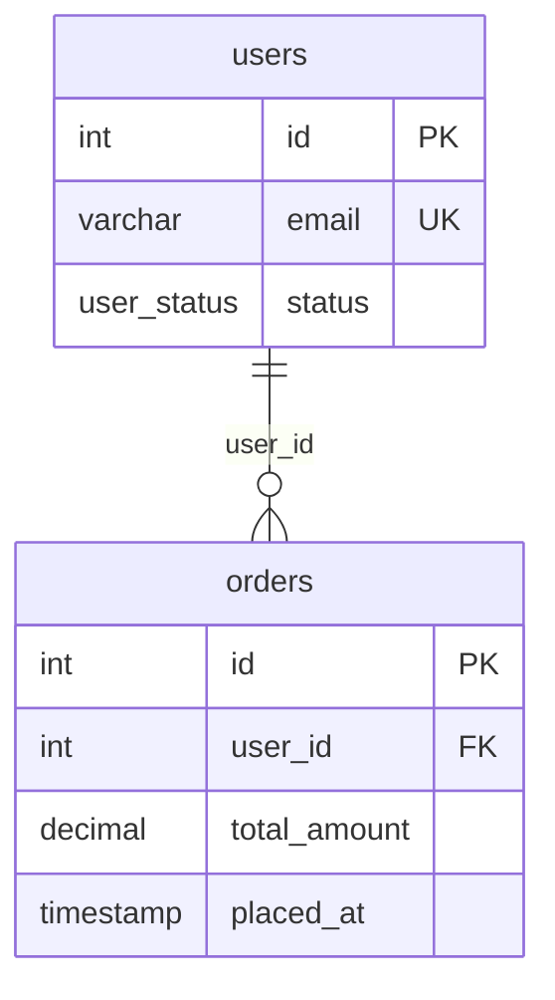

# dbml-to-mermaid example

## DBML input

```dbml
Table users {
  id int [pk]
  email varchar [unique]
  status user_status
}

Table orders {
  id int [pk]
  user_id int [ref: > users.id]
  total_amount decimal
  placed_at timestamp
}

Enum user_status {
  active
  suspended
}
```

## Mermaid output



## Caption

> 한 명의 사용자(`users`)는 여러 주문(`orders`)을 가질 수 있다. 사용자 상태는 `user_status` enum(`active`/`suspended`)으로 제어.

## Loss notes

- `user_status` enum 값 → Mermaid 미표기. 캡션에 인용함.
- `email` unique 제약 → `UK` 마커 (Mermaid 표준은 PK/FK만, UK는 관례).

## Cardinality mapping table

| DBML | Mermaid | 의미 |
|---|---|---|
| `>` (many-to-one) | `}o--\|\|` | N:1 (default) |
| `<` (one-to-many) | `\|\|--o{` | 1:N |
| `-` (one-to-one) | `\|\|--\|\|` | 1:1 |
| `<>` (many-to-many) | join table 보존 후 양방향 | N:M |

## Embed targets

- Confluence: `Mermaid Diagrams for Confluence` 매크로. planning-publish-confluence가 자동 변환.
- GitHub README: fenced block 그대로 렌더링 (2022년 이후 지원).
- dbdocs: 자체 erDiagram이 있어 불필요. 외부 첨부 시에만 본 블록 사용.

## Loss items (DBML → Mermaid)

| DBML 기능 | Mermaid 미지원 사유 | 대안 |
|---|---|---|
| `Note` 컬럼 주석 | 컬럼 코멘트 문법 없음 | 캡션 또는 별도 표 |
| `default`, `check` | 제약 표기 부재 | 캡션 또는 보충 문서 |
| `composite index`, expression index | 인덱스 표현 없음 | dbdocs 참조 |
| `Enum` 값 목록 | 값 inline 불가 | 캡션 또는 별도 표 |
| `TableGroup` 컬러/배치 | 시각 그룹 없음 | 그룹별 erDiagram 블록 분리 |
| Self-referential ref | 표시되나 가독성↓ | 별도 노트 |
