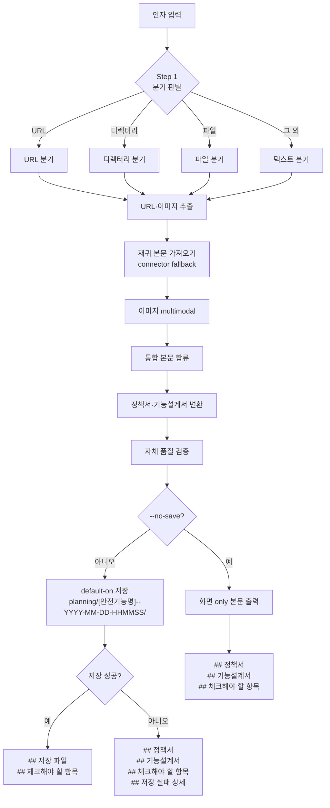
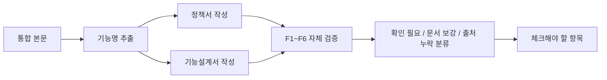
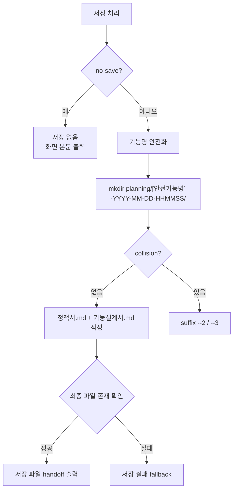

# planning-format workflow

`/planning-kit:planning-format` 한 호출의 0.2.17 흐름을 정리한 문서입니다. 0.2.17 runtime은 0.2.14에서 확정한 결과 우선 출력 계약을 유지합니다. 동작 명세는 [SKILL.md](../../../planning-kit/skills/planning-format/SKILL.md), 출력 계약은 [output-contract.md](../../../planning-kit/skills/planning-format/references/output-contract.md)에 있습니다.

## 1. 전체 시퀀스



## 2. 입력 수집

입력은 텍스트, 파일, 디렉터리, URL, 이미지입니다. URL과 이미지 참조는 모든 분기에서 추출하며, `--no-fetch`와 `--no-image`는 각각 본문 가져오기와 이미지 해석만 봉쇄합니다.

## 3. 변환과 검증



F2/F3/F4/F6처럼 의미 변경이 필요한 발견은 사용자 승인 전 본문에 조용히 반영하지 않습니다. 0.2.14에서는 이 발견을 상단 projection으로 반복하지 않고 `## 체크해야 할 항목` 또는 조건부 `## 상세 추적`으로 재배치합니다.

## 4. 저장 처리



`--save`는 0.2.x 호환용 no-op alias이며 기본 저장과 같습니다. 저장하지 않으려면 `--no-save`를 사용합니다.

## 5. 출력 구조

기본 저장 성공:

```markdown
# [기능명]
- 입력: ...
- 산출물: 정책서, 기능설계서
- 검증: 확인 필요 N건, 문서 보강 M건 / 확인 필요 없음
- 저장: planning/[안전기능명]--YYYY-MM-DD-HHMMSS/

## 저장 파일
...

## 체크해야 할 항목
...
```

`--no-save`와 저장 실패 fallback은 `## 정책서`, `## 기능설계서`, `## 체크해야 할 항목` 순서로 본문을 화면에 출력합니다. 저장 실패 fallback은 추가로 `## 저장 실패 상세`를 출력합니다.
