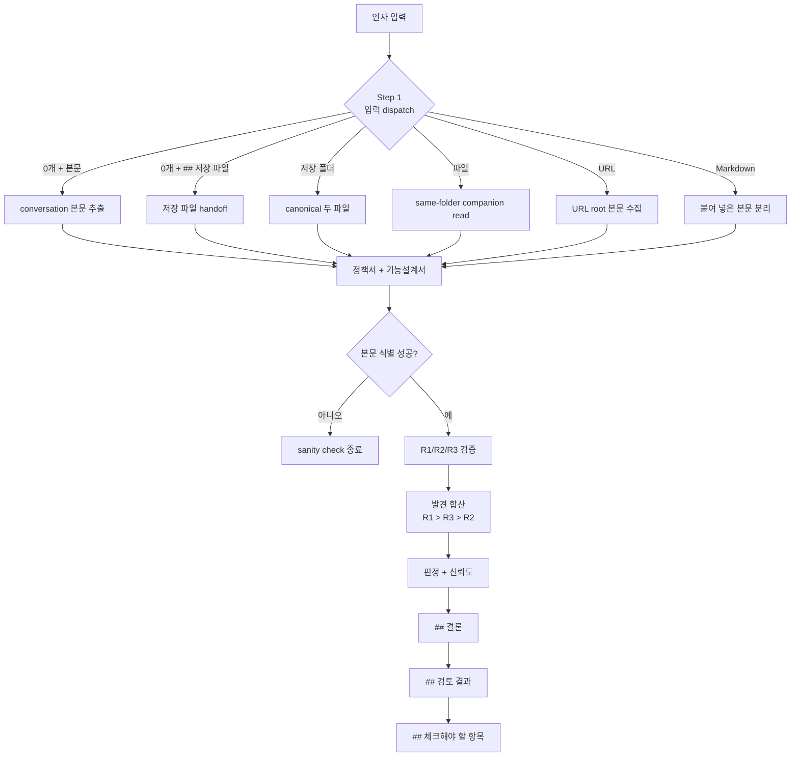
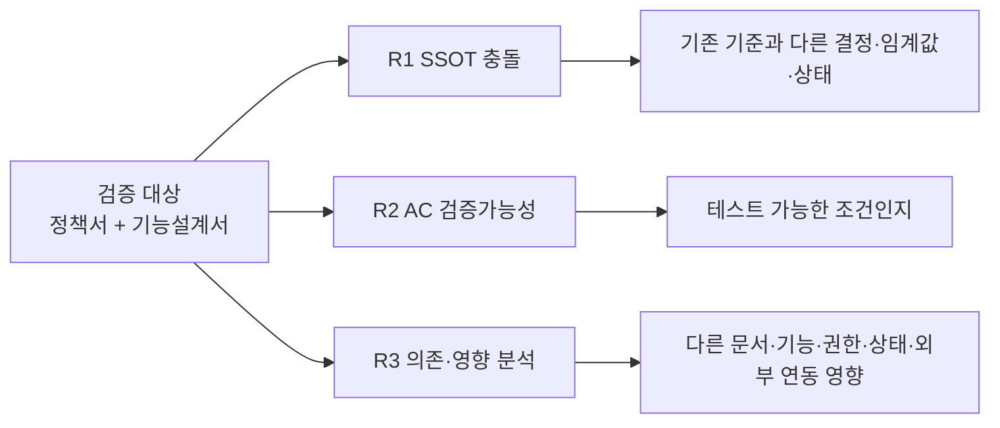

# planning-review workflow

`/planning-kit:planning-review` 한 호출의 0.2.14 흐름을 정리한 문서입니다. 동작 명세는 `skills/planning-review/SKILL.md`, 검증 기준은 `skills/planning-review/references/ssot-rules.md`·`ac-rules.md`·`deps-rules.md`에 있습니다.

## 1. 전체 시퀀스



## 2. 저장 파일 handoff

0.2.14에서 `planning-format` 기본 저장 성공 출력은 정책서·기능설계서 전문을 화면에 펼치지 않습니다. 그래서 `planning-review` 0개 인자 conversation 모드는 직전 출력의 `## 저장 파일`을 안전하게 읽을 수 있습니다.

허용 bullet:

```markdown
- 정책서: planning/[안전기능명]--YYYY-MM-DD-HHMMSS/[안전기능명]_정책서.md
- 기능설계서: planning/[안전기능명]--YYYY-MM-DD-HHMMSS/[안전기능명]_기능설계서.md
- [정책서](planning/[안전기능명]--YYYY-MM-DD-HHMMSS/[안전기능명]_정책서.md)
- [기능설계서](planning/[안전기능명]--YYYY-MM-DD-HHMMSS/[안전기능명]_기능설계서.md)
```

두 파일이 정확히 1개 `planning/[안전기능명]--YYYY-MM-DD-HHMMSS/` 폴더를 가리켜야 합니다. 후보가 0개, 2개 이상, 서로 다른 폴더, 누락 파일, 역할 식별 실패이면 임의 선택하지 않습니다.

`planning/**`은 review 대상 입력으로는 읽을 수 있지만 기준 문서 묶음 근거에서는 계속 제외합니다.

## 3. 본문 분리와 boundary

`--no-save` 출력이나 저장 실패 fallback처럼 `## 정책서`와 `## 기능설계서` 본문이 화면에 있으면 본문을 우선합니다. 다음 heading은 정책서·기능설계서 본문 boundary입니다.

- `## 저장 파일`
- `## 체크해야 할 항목`
- `## 출처/누락 요약`
- `## 상세 추적`
- `## 저장 실패 상세`
- `## 결론`
- `## 검토 결과`
- `## 검토 근거 요약`

## 4. 검증 축



같은 발견이 여러 축에 걸치면 한 번만 기록합니다. 우선순위는 `R1 > R3 > R2`입니다.

## 5. 출력 구조

```markdown
# [기능명] 검토 결과

- 판정: 통과 / 조건부 통과 / 수정 필요 / 검토 필요 / 비교 불가
- 검증 신뢰도: 충분 / 제한적 / 낮음 — 이유
- 입력: ...
- 점검 축: 기준 문서 일치성, 검증가능성, 영향 분석
- 발견: P0 N건, P1 N건, P2 N건

---

## 결론
...

---

## 검토 결과
...

---

## 체크해야 할 항목
...
```

미확정·누락·보강점은 마지막 `## 체크해야 할 항목`에 모읍니다. full 입력 출처표, full 기준 문서 출처표, 원시 발견 목록은 조건 충족 시 하단 `## 상세 추적`으로 이동합니다.

## 6. 참고 파일

| 파일 | 역할 |
|---|---|
| `skills/planning-review/SKILL.md` | 동작 시퀀스 골격 |
| `skills/planning-review/references/ssot-rules.md` | R1 SSOT 충돌 점검 |
| `skills/planning-review/references/ac-rules.md` | R2 Acceptance Criteria 기준 |
| `skills/planning-review/references/deps-rules.md` | R3 의존·영향 기준 |
| `skills/planning-format/references/output-contract.md` | 0.2.14 저장 파일, `--no-save`, parser boundary |
