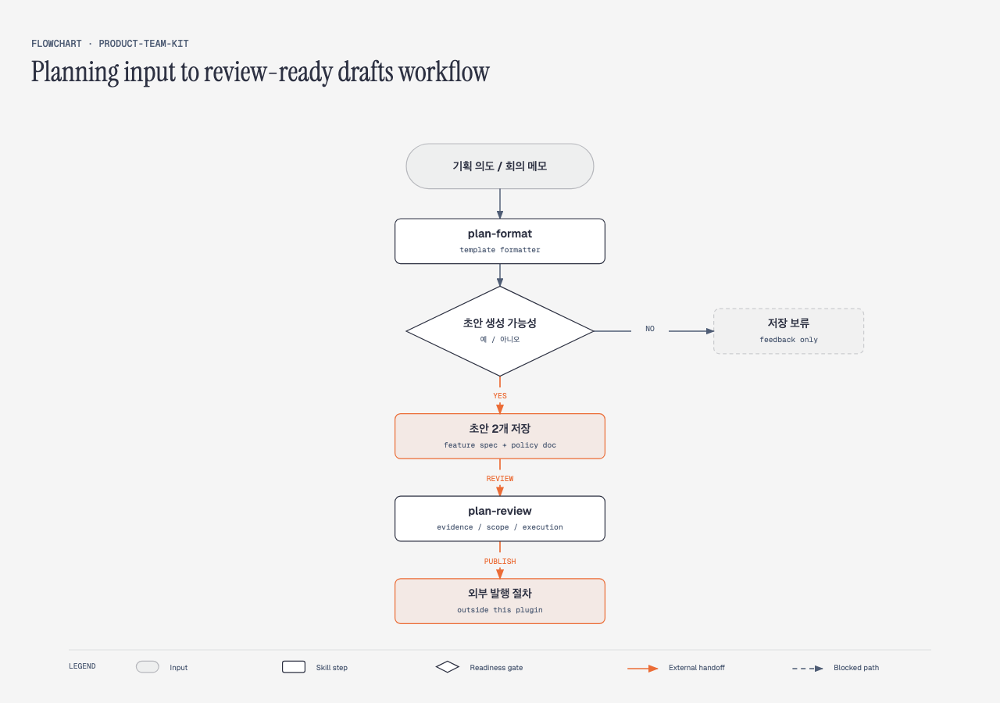
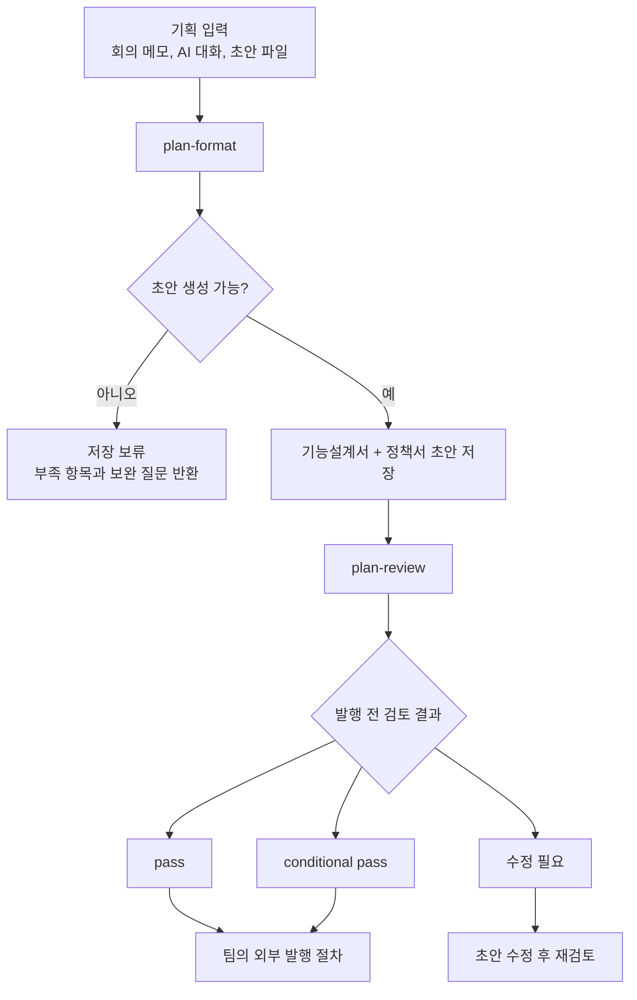

# product-team-kit 소개

`product-team-kit`은 기획 입력을 기능설계서와 정책서 초안으로 정리하는 제품팀 도구입니다. 회의 메모, AI 대화 결과물, 비구조 기획 노트처럼 아직 문서 형태가 덜 잡힌 내용을 받아 사내 표준 문서 흐름에 맞게 정리합니다.

핵심 목적은 문서를 대신 확정하는 것이 아니라, 팀이 같은 기준으로 검토할 수 있는 초안을 빠르게 만드는 것입니다. 기능 동작은 기능설계서로, 규칙과 조건은 정책서로 나눠 정리하고, 확정되지 않은 내용은 `[미정]`, `[가정]`, 확인 필요 질문으로 남깁니다.



## 왜 필요한가

기획 초안은 보통 여러 형태로 흩어져 있습니다.

- 회의록에는 결정과 질문이 섞여 있음
- 슬랙이나 AI 대화에는 배경과 아이디어가 섞여 있음
- 기존 Confluence 문서와 신규 변경안의 경계가 모호함
- 기능설계서와 정책서에 들어가야 할 내용이 한 문서 안에 섞여 있음

`product-team-kit`은 이 흩어진 입력을 먼저 문서화 가능한 수준인지 확인한 뒤, 기획 문서로 읽히는 구조로 정리합니다. 문서화하기 부족하면 파일을 만들지 않고, 어떤 정보가 더 필요한지 피드백만 반환합니다.

## 전체 흐름



## 제공하는 스킬

| 스킬 | 역할 | 결과 |
|---|---|---|
| `plan-format` | 기획 입력을 기능설계서와 정책서 초안으로 정리 | 로컬 초안 2개 저장 또는 저장 보류 피드백 |
| `plan-review` | 초안 발행 전 품질 검토 | `pass`, `conditional pass`, `수정 필요` 중 하나 |

## plan-format

`plan-format`은 formatter입니다. 입력을 받아 문서 초안을 만들 수 있는지 먼저 판단하고, 가능하면 기능설계서와 정책서를 함께 생성합니다.

기능명은 별도로 입력하지 않아도 됩니다. 입력 본문이나 파일명에서 기능명을 추출합니다.

```text
$plan-format "주문 취소 기능: 주문 취소 가능 조건, 화면 흐름, 예외 처리 메모..."
$plan-format /path/to/planning-notes.md
```

생성되는 문서는 다음 기준으로 나뉩니다.

| 문서 | 담는 내용 |
|---|---|
| 기능설계서 | 화면, 사용자 흐름, 입력값, 기능 동작, 사용자에게 보이는 결과 |
| 정책서 | 규칙, 조건, 예외, 제한, 판단 기준, 권한 정책 |

입력이 부족하면 초안을 억지로 만들지 않습니다. 예를 들어 적용 대상, 핵심 사용자 행동, 기대 결과, 주요 조건을 알 수 없으면 저장하지 않고 보완 질문을 반환합니다.

## plan-review

`plan-review`는 초안을 외부 공유나 Confluence 반영 절차에 넘기기 전에 보는 검토 단계입니다. 템플릿 형식만 확인하는 도구가 아니라, 실제로 이 문서가 팀의 의사결정과 실행에 충분한지 확인합니다.

검토는 세 관점으로 나뉩니다.

| 관점 | 확인하는 것 |
|---|---|
| 근거 | 기존 Confluence 문서와 충돌하는 내용이 있는지, 가정이 근거 없이 확정처럼 쓰였는지 |
| 결정·범위 | 적용 대상, 비대상, 예외, 결정 주체, 관련 문서 연결이 충분한지 |
| 실행·검증 가능성 | 개발·운영·QA가 같은 기준으로 판단할 수 있는지 |

```text
$plan-review planning/주문취소--YYYY-MM-DD-HHMMSS/
```

결과는 보수적으로 판단합니다. 하나라도 `수정 필요`이면 최종 결과도 `수정 필요`입니다. `pass`는 세 관점 모두에서 큰 문제가 없을 때만 나옵니다.

## 무엇을 하지 않는가

`product-team-kit`은 편의상 문서를 만들어주지만, 제품 의사결정을 자동으로 확정하지 않습니다.

- Confluence를 대체하지 않음
- Confluence에 자동 발행하지 않음
- `[미정]`이나 `[가정]`을 임의로 확정하지 않음
- API 명세, DB schema, QA 상세 케이스, 운영 런북을 완성본처럼 만들지 않음
- 기존 정책과의 충돌 검증을 `plan-format` 단계에서 수행하지 않음

Confluence는 계속 source of truth입니다. 로컬 초안은 발행 전 검토와 팀 확인을 거쳐야 합니다.

## 추천 사용 방식

1. 회의 직후 메모나 AI 대화 결과물을 `plan-format`에 넣습니다.
2. 생성된 기능설계서와 정책서에서 `[미정]`, `[가정]`, 확인 필요 질문을 먼저 봅니다.
3. 팀 내부에서 결정이 필요한 항목을 정리합니다.
4. 외부 공유나 Confluence 반영 전 `plan-review`를 실행합니다.
5. `pass` 또는 확인 조건이 정리된 `conditional pass` 상태에서 팀의 발행 절차를 진행합니다.

## 한 줄 요약

`product-team-kit`은 기획 아이디어를 바로 확정 문서로 만드는 도구가 아니라, 기능설계서와 정책서 초안을 빠르게 만들고 발행 전 검토 지점을 명확히 해주는 제품팀 문서화 도구입니다.
