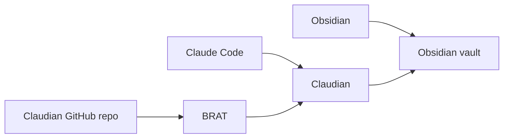

# Claude Code + Obsidian + Claudian Windows 설치 가이드

> 기획팀/작성자용 로컬 문서 작업 환경 설치 문서
> 작성일: 2026-05-10
> 대상: Windows 10/11 사용자, Claude Code와 Obsidian이 설치되지 않은 상태
> 문서 상태: 초안 v0.1

---

## 1. 목표

이 문서는 Windows PC에서 Claude Code, Obsidian, Claudian을 설치해 Obsidian vault 안에서 Claude Code 기반 작업을 할 수 있게 만드는 절차를 설명합니다.

구성 목표는 다음과 같습니다.

- Claude Code를 native Windows 방식으로 설치한다.
- Obsidian을 설치하고 작업 vault를 만든다.
- Obsidian Community Plugins에서 BRAT을 설치한다.
- BRAT으로 Claudian을 GitHub repo 기반 설치한다.
- Claudian에서 Claude Code가 정상 인식되는지 확인한다.

이 문서는 Claude Code provider 기준입니다.

---

## 2. 전체 구성



| 구성 요소 | 역할 | 필수 여부 |
|---|---|---|
| Claude Code | Claudian이 호출하는 Claude 기반 coding agent CLI | 필수 |
| Obsidian | Markdown vault 기반 작업 앱 | 필수 |
| BRAT | GitHub repo 기반 Obsidian beta plugin 설치/업데이트 도구 | 필수 |
| Claudian | Obsidian vault 안에서 Claude Code를 실행하는 plugin | 필수 |
| Git for Windows | Claude Code native Windows 환경에서 권장되는 shell 도구 | 권장 |

---

## 3. 준비 및 설치 링크

| 항목 | 링크 | 비고 |
|---|---|---|
| Claude Code 설치 | https://claude.ai/install.ps1 | PowerShell 설치 스크립트 |
| Obsidian 다운로드 | https://obsidian.md/download | Windows 앱 설치 |
| Claudian | https://github.com/YishenTu/claudian | BRAT에 입력할 repo |
| Git for Windows | https://git-scm.com/downloads/win | Claude Code Windows 사용 시 권장 |

---

## 4. Claude Code 설치

Claude Code는 Claudian이 내부에서 호출하는 실행 도구입니다. 먼저 Claude Code가 Windows에서 정상 실행되어야 Claudian도 동작합니다.

### 4.1 PowerShell로 설치

Windows 시작 메뉴에서 `PowerShell`을 열고 아래 명령을 실행합니다.

```powershell
irm https://claude.ai/install.ps1 | iex
```

설치 후 새 PowerShell 창을 열고 아래 명령으로 설치 상태를 확인합니다.

```powershell
claude --version
```

추가 점검이 필요하면 아래 명령을 실행합니다.

```powershell
claude doctor
```

### 4.2 로그인

아래 명령을 실행하면 브라우저 로그인 흐름이 열립니다.

```powershell
claude
```

Claude Code는 Claude Code 사용 권한이 있는 계정이 필요합니다. 무료 Claude 계정만으로는 사용할 수 없을 수 있으므로 조직 계정 권한을 먼저 확인합니다.

### 4.3 Git for Windows

Claude Code는 native Windows에서 Git for Windows가 있으면 Git Bash를 shell 도구로 사용할 수 있습니다. Git for Windows가 없어도 PowerShell로 fallback할 수 있지만, Windows 로컬 파일 작업 안정성을 위해 설치를 권장합니다.

---

## 5. Obsidian 설치

1. https://obsidian.md/download 에서 Windows 버전을 다운로드한다.
2. 설치 후 Obsidian을 실행한다.
3. `Create new vault` 또는 `Open folder as vault`를 선택한다.
4. 앞으로 Claudian으로 작업할 문서 폴더를 vault로 지정한다.

vault는 Obsidian이 관리하는 Markdown 작업 폴더입니다. Claudian은 이 vault를 작업 디렉터리로 사용합니다.

---

## 6. Obsidian Community Plugins 활성화

BRAT과 Claudian은 Community plugin이므로 Obsidian에서 Community plugins를 활성화해야 합니다.

1. Obsidian에서 `Settings`를 연다.
2. `Community plugins`로 이동한다.
3. `Turn on community plugins`를 선택한다.
4. 경고 문구를 확인한 뒤 진행한다.

Community plugin은 third-party code를 실행합니다. 조직 문서, API token, 개인정보가 있는 vault에서는 설치 plugin을 제한하고, 신뢰한 plugin만 사용합니다.

---

## 7. BRAT 설치

1. Obsidian `Settings`를 연다.
2. `Community plugins`로 이동한다.
3. `Browse`를 선택한다.
4. `BRAT` 또는 `Obsidian42 - BRAT`을 검색한다.
5. `Install`을 선택한다.
6. 설치 후 `Enable`을 선택한다.

BRAT은 GitHub repo URL을 입력해 beta plugin을 설치하고 업데이트 확인을 도와주는 plugin입니다.

---

## 8. Claudian 설치

Claudian은 BRAT으로 설치합니다. 이 방식은 Obsidian UI에서 GitHub repo URL만 입력합니다.

1. Obsidian `Settings`를 연다.
2. `Community plugins`에서 `BRAT` 설정을 연다.
3. `Add Beta plugin`을 선택한다.
4. 아래 GitHub repo URL을 입력한다.

```text
https://github.com/YishenTu/claudian
```

5. `Add Plugin`을 선택한다.
6. BRAT 설치가 끝나면 `Community plugins`로 돌아간다.
7. `Claudian`을 찾아 `Enable`을 선택한다.

---

## 9. Claudian 첫 실행

1. Obsidian vault를 연다.
2. 왼쪽 ribbon icon 또는 Command palette에서 `Claudian`을 실행한다.
3. provider가 필요하면 `Claude`를 선택한다.
4. Claude CLI path는 먼저 비워둔다.
5. Claudian chat이 열리면 간단한 vault 확인 요청을 실행한다.

예시:

```text
현재 vault의 주요 markdown 파일을 요약해줘.
```

Claudian이 Claude Code를 자동 인식하지 못하면 PowerShell에서 아래 명령을 실행합니다.

```powershell
where.exe claude
```

반환된 경로 중 `claude.exe` 경로를 Claudian 설정의 `Claude CLI path`에 입력합니다. Windows에서는 `.cmd` 또는 `.ps1` wrapper 경로보다 `claude.exe`를 사용하는 것이 안전합니다.

---

## 10. 업데이트

| 항목 | 업데이트 방식 |
|---|---|
| Claude Code native install | 기본적으로 background auto-update |
| Obsidian | Obsidian 앱의 update 안내 또는 공식 다운로드 페이지 |
| BRAT | Obsidian Community plugins update 확인 |
| Claudian | BRAT이 GitHub release 기준으로 update 확인 |

---

## 11. 문제 해결

| 증상 | 확인할 것 | 조치 |
|---|---|---|
| `claude` 명령을 찾을 수 없음 | 새 PowerShell 창인지, PATH 반영 여부 | PowerShell을 새로 열고 `claude --version` 재확인 |
| Claude Code 로그인이 안 됨 | 계정 권한, 조직 정책 | Claude Code 사용 가능 계정인지 확인 |
| Claudian이 Claude CLI를 못 찾음 | Claude CLI path 자동 인식 여부 | `where.exe claude` 결과의 `claude.exe` 경로를 Claudian 설정에 입력 |
| BRAT에서 Claudian 설치가 안 됨 | repo URL, 네트워크, GitHub 접근 | `https://github.com/YishenTu/claudian` URL 재입력 |
| Community plugins가 동작하지 않음 | Restricted mode 상태 | `Settings → Community plugins`에서 Community plugins 활성화 |
| Claudian이 vault 파일을 못 읽음 | 열린 vault 위치, Obsidian 권한 | 작업할 폴더를 올바른 vault로 열었는지 확인 |

---

## 12. 설치 완료 기준

아래 항목이 모두 되면 설치가 완료된 상태입니다.

- PowerShell에서 `claude --version`이 실행된다.
- PowerShell에서 `claude` 실행 후 로그인이 완료된다.
- Obsidian에서 작업 vault가 열린다.
- Obsidian Community plugins가 활성화되어 있다.
- BRAT plugin이 설치 및 활성화되어 있다.
- BRAT으로 Claudian을 설치했다.
- Claudian plugin이 활성화되어 있다.
- Claudian chat에서 vault 내용을 기준으로 응답을 받을 수 있다.
