# planning-format workflow

`/planning-kit:planning-format` 한 호출의 전체 흐름을 다이어그램으로 정리한 문서. 동작 명세는 `skills/planning-format/SKILL.md`, lookup data는 `skills/planning-format/references/connector-routing.md`·`references/self-review-rules.md`에 있다.

## 1. 전체 시퀀스

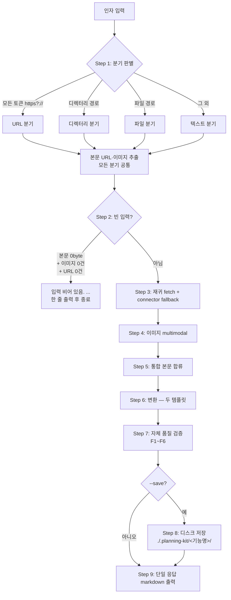

## 2. 입력 dispatch (Step 1)

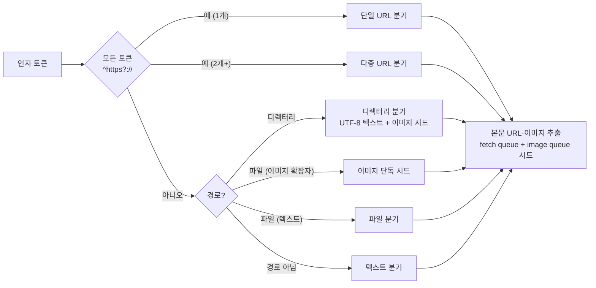

추출 패턴: markdown link / autolink / HTML href·src·img / plain URL / markdown image / data URI. 제외: self-anchor·`mailto:`/`tel:`/`javascript:`/`blob:`. `--no-fetch`/`--no-image`면 해당 시드 skip.

## 3. fetch 시퀀스 (Step 3)

URL 1개 처리 단위. WebFetch 1차 + connector fallback 2단 구조.

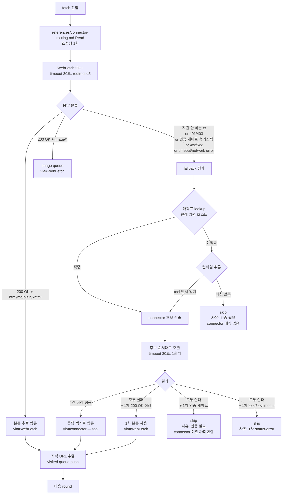

**핵심 포인트:**
- `references/connector-routing.md`는 fetch 진입 직전 1회 적재.
- 매핑 lookup 호스트는 **원래 입력된 URL의 호스트** (redirect 최종 호스트 X).
- connector 응답 본문도 자식 URL 추출 → "Confluence root → Figma 자식 → 본문 합류" 자동 동작.
- `--no-fetch`면 1차·fallback 모두 봉쇄.

## 4. 호스트 매핑표 (요약)

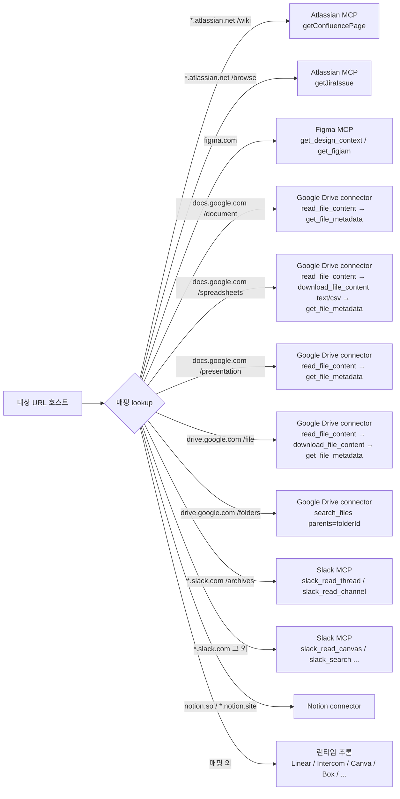

전체 매핑·tool 시퀀스 detail은 `skills/planning-format/references/connector-routing.md` §3 + §3.4 + §3.5.

## 5. URL 분기 sanity check (Step 3.4)

루트 URL이 **모두** 본문 합류 실패하면 호출 종료. 일부만 실패면 출처 list에 사유 기록 후 진행.

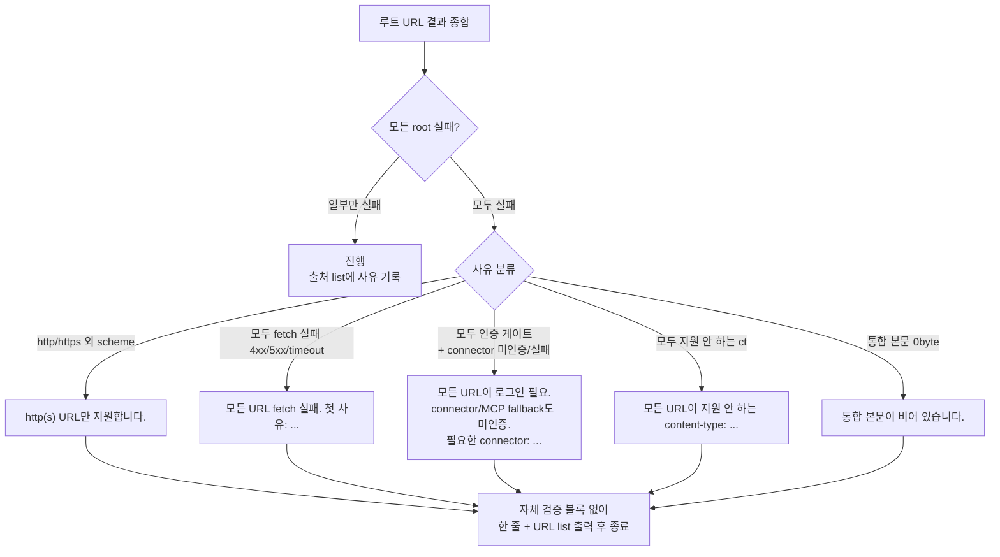

## 6. 이미지 multimodal (Step 4)

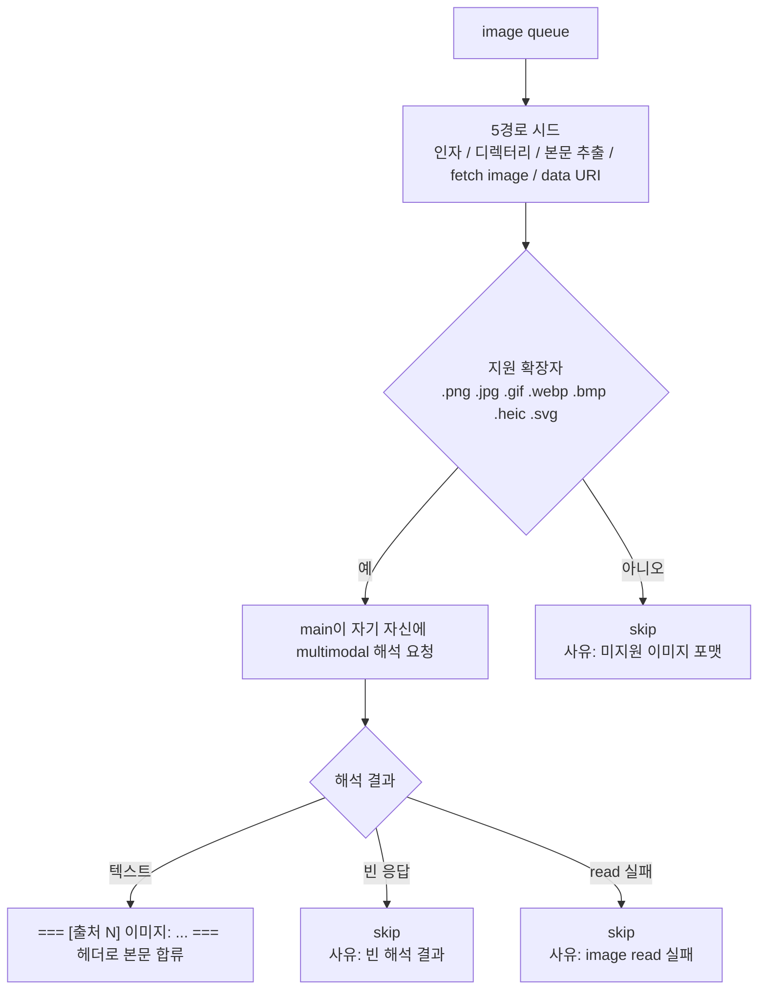

`--no-image`면 §4 전체 skip. 이미지 실패는 호출 종료 사유 아님.

## 7. 변환 + 자체 품질 검증 (Step 6 + Step 7)

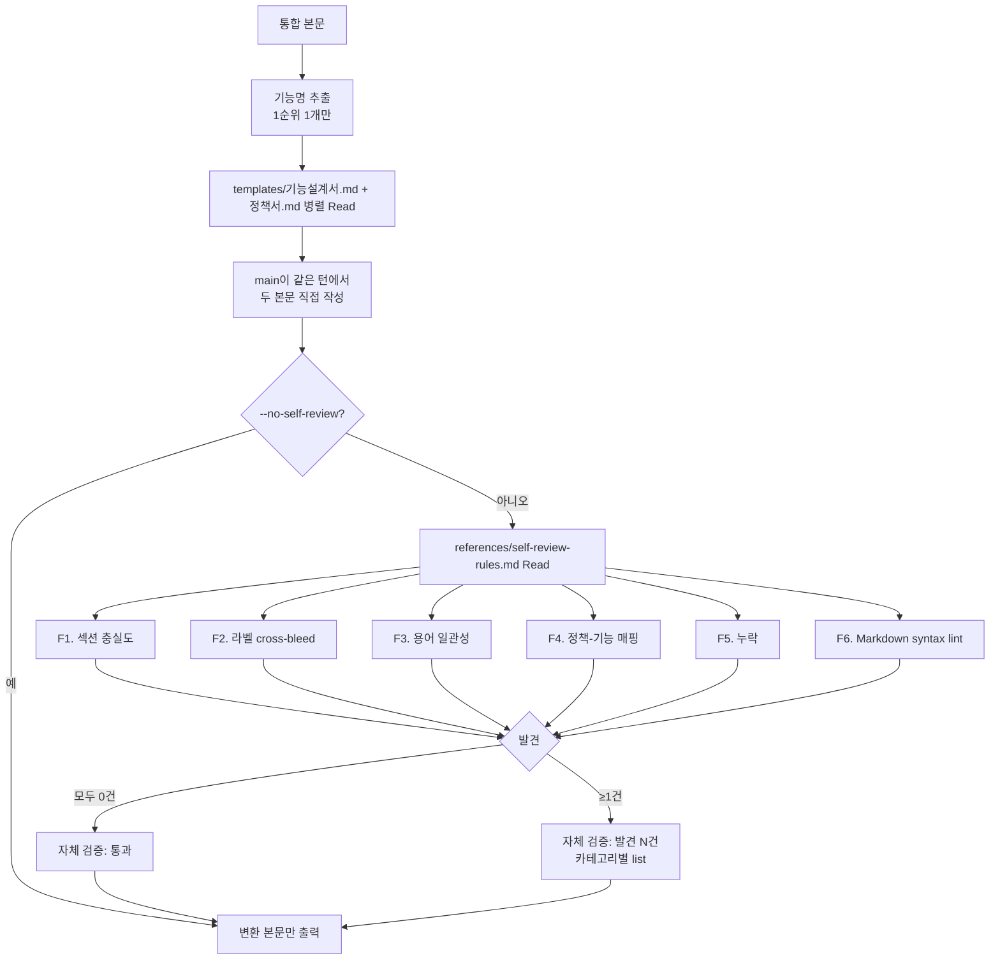

라벨 매핑:
- 화면·흐름·동작·입력 항목·권한·예외 메시지 → 기능설계서.
- 규칙·조건·예외 승인·역할 책임·상태 전이·연동 정책 → 정책서.

라벨 매핑 안 되는 조각·중복·근거 부족 조각은 입력 제외 추적으로. 근거 부족 셀은 inline `[TBD]`. marker `[TBD]` 1종만.

외부 SSOT corpus 충돌·acceptance criteria·의존 영향은 `planning-review` 스킬이 별도 처리.

## 8. `--save` 처리 (Step 8)

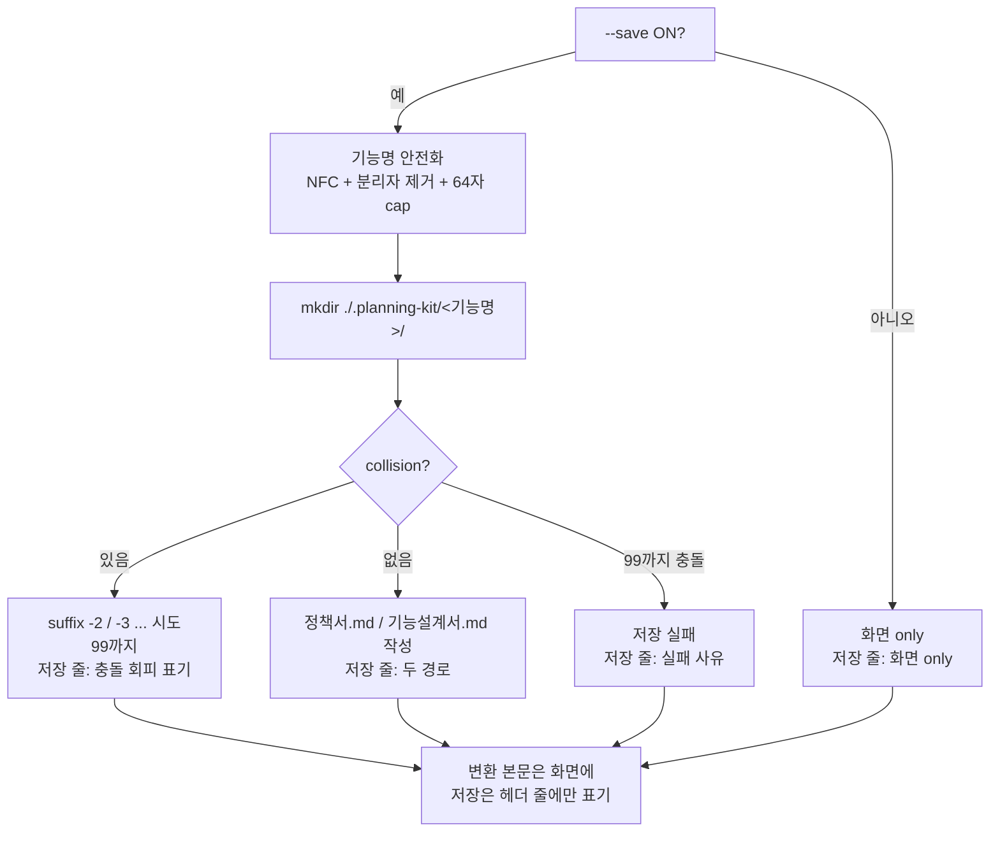

저장 실패는 호출 종료 사유 아님. 자체 검증 결과 변경 안 함.

## 9. 단일 응답 출력 구조 (Step 9)

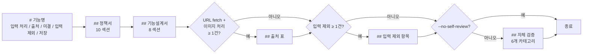

블록 순서: **변환 본문 → 출처 → 입력 제외 → 자체 검증**. 빈 블록은 통째 생략.

## 10. 출처 list status 분류

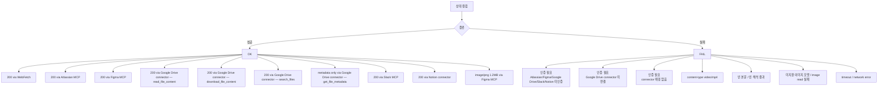

표 detail은 `references/connector-routing.md` §7.

## 11. 옵션 영향

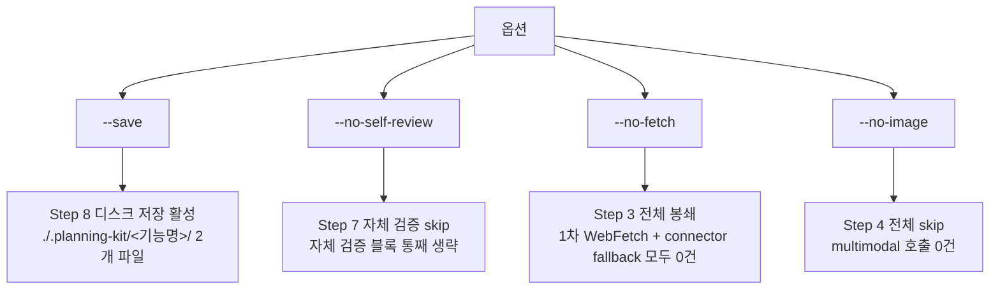

## 12. 참고 파일

| 파일 | 역할 |
|---|---|
| `skills/planning-format/SKILL.md` | 동작 시퀀스 골격 (Step 1~9) |
| `skills/planning-format/references/connector-routing.md` | 인증 휴리스틱·MCP 카탈로그·호스트 매핑표·Google Workspace 자원별 tool 시퀀스·gid/range 처리·fallback 케이스 표·sanity check·status 표기 |
| `skills/planning-format/references/self-review-rules.md` | 자체 품질 6개 카테고리 (F1~F6) 점검 기준 |
| `skills/planning-format/templates/기능설계서.md` | 8 섹션 표 골격 |
| `skills/planning-format/templates/정책서.md` | 10 섹션 표 골격 |
| `docs/planning-review-workflow.md` | planning-review 스킬 별도 워크플로 |
| `docs/prd/prd-0.2.0.md` | 본 스킬 분할 + Google 라우팅 fix PRD |
