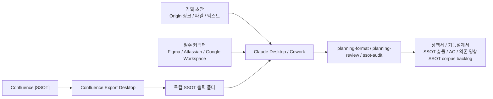

# planning-kit Windows 설치 가이드

> 기획팀 사용자용 설치 문서
> 작성일: 2026-05-10
> 최종 수정일: 2026-05-11
> 대상: Windows 10/11 사용자, Claude Desktop/Codex 미설치 상태의 기획팀 구성원
> 문서 상태: 초안 v0.2

---

## 1. 목표

이 문서는 깨끗한 Windows PC에서 `planning-kit`을 사용할 수 있도록 환경을 구성하는 절차를 설명합니다.

구성 목표는 다음과 같습니다.

- Confluence `[SSOT]` 영역의 SSOT 문서를 로컬 폴더로 동기화한다.
- Claude Desktop을 설치해 Cowork를 사용할 수 있게 한다.
- Codex를 선택 설치 경로로 제공한다.
- Claude Desktop/Codex에서 Figma, Atlassian, Google Workspace 커넥터를 필수 연결한다.
- 로컬 SSOT 폴더를 기준으로 `planning-format`, `planning-review`, 필요 시 `ssot-audit`를 실행한다.

권장 기본 경로는 **Confluence Export Desktop + Claude Desktop/Cowork + planning-kit**입니다. Codex는 선택 경로로 둡니다.

---

## 2. 전체 구성



| 구성 요소 | 역할 | 필수 여부 |
|---|---|---|
| Confluence Export Desktop | Confluence `[SSOT]` 문서를 로컬 Markdown SSOT 폴더로 가져오는 Windows 앱 | 필수 |
| 로컬 workspace 폴더 | 초안, SSOT, 산출물을 모아두는 작업 폴더 | 필수 |
| Claude Desktop | Cowork를 제공하는 Windows 앱 | 필수 권장 |
| Codex | `planning-kit`을 실행할 수 있는 대체 AI 작업 도구 | 선택 |
| Figma 커넥터 | Figma 링크가 입력될 때 디자인/화면 맥락을 읽기 위한 연결 | 필수 |
| Atlassian 커넥터 | Confluence/Jira 링크가 입력될 때 정책, 요구사항, 이슈 맥락을 읽기 위한 연결 | 필수 |
| Google Workspace 커넥터 | Google Docs/Sheets/Slides/Drive 링크가 입력될 때 문서 맥락을 읽기 위한 연결 | 필수 |
| planning-kit | 기획 초안을 정책서/기능설계서로 변환·review하고, 필요 시 SSOT corpus를 감사하는 플러그인 | 필수 |

---

## 3. 준비 및 설치 링크

기획팀 사용자는 아래 링크에서 필요한 항목을 준비합니다. Git은 사용자 PC에 필수로 설치하지 않습니다.

| 항목 | 링크 | 비고 |
|---|---|---|
| Confluence Export Desktop | https://github.com/inkwonjung-colosseum/confluence-export-desktop/releases/tag/v0.1.0 | `[SSOT]` export 앱 |
| 로컬 작업 폴더 | 사용자가 원하는 위치 | 이 문서에서는 `<작업폴더>`로 표기 |
| Claude Desktop | https://claude.com/download | Cowork 사용 |
| planning-kit 플러그인 repo | https://github.com/inkwonjung-colosseum/plugins | 앱 UI에 URL을 입력해 추가하는 경우 Git 설치 불필요 |
| Confluence API token | https://id.atlassian.com/manage-profile/security/api-tokens | `[SSOT]` 영역을 읽을 수 있는 Confluence 계정으로 발급 |
| Codex App | https://get.microsoft.com/installer/download/9PLM9XGG6VKS?cid=website_cta_psi | 선택. Microsoft Store 설치 |
| Figma 커넥터 | Claude Desktop/Codex 앱 내 connectors/integrations 설정 | Figma 링크 분석 필수 |
| Atlassian 커넥터 | Claude Desktop/Codex 앱 내 connectors/integrations 설정 | Confluence/Jira 링크 분석 필수 |
| Google Workspace 커넥터 | Claude Desktop/Codex 앱 내 connectors/integrations 설정 | Google Docs/Sheets/Slides/Drive 링크 분석 필수 |
| Git for Windows | https://git-scm.com/downloads/win | 선택 |

---

## 4. Confluence Export Desktop 설치

Confluence Export Desktop은 Confluence `[SSOT]` 영역의 SSOT 문서를 로컬 Markdown 폴더로 가져오는 Windows 앱입니다.

이 앱은 사용자 PC에 Python을 별도로 설치하지 않고 실행되며, API token은 Windows Credential Manager에 저장합니다. 앱 자체에 예약 실행과 트레이/백그라운드 스케줄러 런타임이 포함되어 있어 `[SSOT]`를 주기적으로 내려받는 용도로 사용합니다.

### 4.1 설치 파일 다운로드

아래 GitHub release 페이지에서 Windows 설치 파일을 다운로드합니다.

- https://github.com/inkwonjung-colosseum/confluence-export-desktop/releases/tag/v0.1.0
- 다운로드 파일: `ConfluenceExportDesktopSetup-0.1.0.exe`

### 4.2 설치 실행

다운로드한 `ConfluenceExportDesktopSetup-0.1.0.exe`를 실행해 설치합니다.

### 4.3 Confluence 연결 설정

앱에서 새 연결을 만들고 아래 값을 입력합니다.

| 항목 | 값 |
|---|---|
| Confluence URL | 조직에서 사용하는 Confluence 주소 |
| 사용자 계정 | Confluence 로그인 이메일 또는 계정 |
| API token | Atlassian 계정 보안 페이지에서 발급한 API token: https://id.atlassian.com/manage-profile/security/api-tokens |
| 대상 범위 | Confluence `[SSOT]` 영역 또는 `[SSOT]` 하위 space/page |
| 출력 폴더 | 사용자가 선택한 SSOT 출력 폴더 |

설정 후 `지금 내보내기` 또는 동등한 실행 버튼으로 수동 export를 한 번 실행합니다.

### 4.4 export 결과 확인

사용자가 지정한 SSOT 출력 폴더에 Markdown 파일이 생성되는지 확인합니다.

확인 기준:

- `.md` 파일이 생성되어 있다.
- 정책서/기능설계서 또는 Confluence `[SSOT]` 문서 제목이 파일명이나 본문에 보인다.
- 첨부 파일이 있으면 하위 폴더 또는 연결된 파일로 함께 내려온다.

---

## 5. SSOT 정기 동기화 설정

Confluence `[SSOT]`는 주기적으로 최신 상태로 내려받아야 합니다.

Windows 사용자는 Linux cron 대신 Confluence Export Desktop의 예약 실행을 기본으로 운영합니다. 팀에서 이를 `cron`이라고 부르더라도 실제 Windows 사용자 문서에서는 `정기 동기화`라고 표현합니다.

권장 운영:

| 항목 | 권장값 |
|---|---|
| 실행 주기 | 하루 1회 또는 업무 시작 전 1회 |
| 실행 대상 | Confluence `[SSOT]` 영역 |
| 출력 폴더 | 사용자가 지정한 SSOT 출력 폴더 |
| 실행 로그 | Confluence Export Desktop의 실행 이력/로그 확인 |
| 실패 시 조치 | 토큰 만료, 권한 변경, 네트워크 오류 여부 확인 |

정기 동기화 후에는 SSOT 폴더의 수정 시간이 최신인지 확인합니다.

---

## 6. Claude Desktop 설치

Claude Desktop은 Cowork를 쓰기 위한 기본 앱입니다.

### 6.1 Claude Desktop 다운로드

아래 공식 다운로드 페이지에서 Windows 버전을 설치합니다.

- https://claude.com/download

설치 후 Windows 시작 메뉴에서 `Claude`를 실행하고 Claude 계정으로 로그인합니다.

### 6.2 Cowork 사용 가능 여부 확인

Cowork는 Claude Desktop의 `Cowork` 탭에서 사용합니다. 최신 Claude Desktop이 필요하며, paid plan(Pro, Max, Team, Enterprise) 또는 조직에서 허용한 계정이 필요합니다.

---

## 7. Codex 선택 설치 경로

Codex를 사용하는 팀은 이 절차를 추가로 진행합니다. Claude Desktop/Cowork만 사용할 경우 이 섹션은 건너뛰어도 됩니다.

참고 공식 문서:

- https://developers.openai.com/codex/app/windows

Windows에서는 Codex App만 사용합니다.

Codex App은 Microsoft Store에서 설치합니다.

- https://get.microsoft.com/installer/download/9PLM9XGG6VKS?cid=website_cta_psi

기획팀 사용자는 이 경로를 기본으로 사용합니다.

1. Microsoft Store 링크에서 Codex App을 설치한다.
2. Codex App을 실행하고 ChatGPT/OpenAI 계정으로 로그인한다.

Codex App에 `planning-kit`을 추가하는 절차는 필수 커넥터 연결 후 진행합니다.

---

## 8. 필수 커넥터 연결

Claude Desktop/Cowork와 Codex는 설치와 로그인만으로 외부 링크 내용을 항상 읽을 수 있는 상태가 아닙니다. `planning-kit`에 Figma, Confluence/Jira, Google Docs/Sheets/Slides/Drive 링크를 입력하려면 먼저 각 앱에서 아래 커넥터를 필수로 연결합니다.

필수 커넥터:

| 커넥터 | 대상 링크 | 필요한 이유 |
|---|---|---|
| Figma | Figma file, FigJam, design/prototype 링크 | 화면 구성, 디자인 의도, 플로우를 링크에서 직접 확인하기 위해 필요 |
| Atlassian | Confluence, Jira 링크 | Origin/SSOT 문서, 요구사항, 이슈, 댓글 맥락을 링크에서 직접 확인하기 위해 필요 |
| Google Workspace | Google Docs, Sheets, Slides, Drive 링크 | 공유 문서, 표, 발표자료, 첨부 파일을 링크에서 직접 확인하기 위해 필요 |

운영 원칙:

- Claude Desktop/Cowork를 사용하는 사용자는 Claude Desktop의 connectors/integrations 설정에서 Figma, Atlassian, Google Workspace를 모두 연결한다.
- Codex App을 설치한 사용자는 Codex App의 connectors/integrations 설정에서도 Figma, Atlassian, Google Workspace를 모두 연결한다.
- 커넥터 연결은 `planning-kit` 첫 실행 전에 완료한다.
- 링크가 입력에 포함되는데 해당 커넥터가 연결되어 있지 않으면, AI가 링크 안의 실제 내용을 읽지 못하고 링크 문자열이나 사용자가 붙여넣은 텍스트만 기준으로 처리할 수 있다.
- 조직 보안 정책상 커넥터 연결 승인이 필요하면 관리자 승인 후 다시 연결 상태를 확인한다.

연결 확인 기준:

- Figma 링크를 열람할 수 있는 계정으로 Figma 커넥터가 연결되어 있다.
- Confluence `[SSOT]`, Confluence `[Origin]`, Jira를 열람할 수 있는 계정으로 Atlassian 커넥터가 연결되어 있다.
- Google Docs/Sheets/Slides/Drive 링크를 열람할 수 있는 계정으로 Google Workspace 커넥터가 연결되어 있다.

---

## 9. planning-kit 설치

`planning-kit`은 Claude Desktop Cowork와 Codex에서 같은 목적의 workflow를 제공합니다. 설치 방식은 실행 도구별로 다릅니다.

플러그인 링크:

- https://github.com/inkwonjung-colosseum/plugins

현재 운영 기준은 public GitHub repo 링크 기반입니다. 기획팀 사용자가 이 링크를 앱 UI에 입력해 추가하는 경우 Git을 설치할 필요는 없습니다.

### 9.1 Cowork에서 planning-kit 설치

Cowork에서는 Claude Desktop UI에서 plugin을 설치합니다.

1. Claude Desktop을 실행한다.
2. 왼쪽에서 `Cowork` 탭으로 이동한다.
3. `Customize` 메뉴를 연다.
4. plugin 추가 화면에서 아래 GitHub repo 링크를 입력한다.
5. `planning-kit`을 설치 또는 활성화한다.

Cowork에서 사용할 때는 입력창에서 `/`를 입력하거나 `+` 버튼을 눌러 `planning-format`, `planning-review`, `ssot-audit` 스킬을 선택합니다.

### 9.2 Codex App에서 planning-kit 설치

Codex App 선택 사용자는 앱의 plugin/skill 설정 화면에서 같은 플러그인 링크를 사용합니다.

1. Codex App을 실행한다.
2. `/plugins` 또는 plugin/skill 설정 화면을 연다.
3. 아래 GitHub repo 링크를 입력한다.
4. `planning-kit`을 설치 또는 활성화한다.

- https://github.com/inkwonjung-colosseum/plugins

Codex에서 사용할 때는 스킬을 다음처럼 호출합니다.

```text
$planning-format
$planning-review
$ssot-audit
```

조직 catalog 방식은 추후 도입 예정입니다.

---

## 10. planning-kit 첫 실행

### 10.1 Claude Desktop Cowork에서 실행

Cowork를 사용하는 경우 Claude Desktop에서 아래 흐름으로 실행합니다.

1. `Cowork` 탭을 연다.
2. 작업 폴더로 사용자가 선택한 `<작업폴더>`를 연결한다.
3. 초안 폴더와 SSOT 출력 폴더 접근을 허용한다.
4. Figma, Atlassian, Google Workspace 커넥터 연결 상태를 확인한다.
5. 입력창에서 `/` 또는 `+` 버튼으로 `planning-format` 스킬을 선택한다.
6. `planning-format`에는 Confluence `[Origin]` 링크 1개를 입력한다.
7. 이어서 `planning-review` 스킬을 선택하고 정책서 링크와 기능설계서 링크 2개를 입력한다.
8. SSOT 폴더 자체의 중복, 낮은 버전 참조, 내용 충돌이 의심되면 `ssot-audit`를 별도로 실행한다.

기본적으로 파일, 텍스트, 디렉터리 등 다른 입력 형태도 지원하지만 기획팀 권장 형태는 아래입니다.

Cowork 명령 예시:

```text
planning-format <Confluence Origin 링크>
```

```text
planning-review <정책서 링크> <기능설계서 링크>
```

```text
ssot-audit --ssot-include "<SSOT 출력 폴더>/**/*.md"
```

`planning-format` 출력:

- 정책서
- 기능설계서
- 입력 제외 항목
- 자체 검증 결과

### 10.2 planning-review 실행

SSOT 폴더를 기준으로 review합니다. Cowork에서는 `planning-review` 스킬을 선택한 뒤 정책서 링크와 기능설계서 링크를 함께 입력합니다.

```text
planning-review <정책서 링크> <기능설계서 링크>
```

확인할 항목:

- SSOT 충돌
- Acceptance Criteria 검증가능성
- 의존/영향 분석
- 입력 출처
- SSOT 출처

Codex를 사용하는 경우 같은 작업을 아래처럼 명령으로 입력합니다.

```text
$planning-format <Confluence Origin 링크>
$planning-review <정책서 링크> <기능설계서 링크>
```

### 10.3 ssot-audit 실행

SSOT 폴더 자체의 중복, 낮은 버전 참조, 내용 충돌을 점검해야 할 때만 별도로 실행합니다. 새 기획 산출물의 리뷰는 `planning-review`가 담당하고, `ssot-audit`는 기존 문서 corpus 유지보수 backlog를 분리하는 용도입니다.

Cowork 명령 예시:

```text
ssot-audit --ssot-include "<SSOT 출력 폴더>/**/*.md"
```

Codex 명령 예시:

```text
$ssot-audit --ssot-include "<SSOT 출력 폴더>/**/*.md"
```

`ssot-audit` 출력:

- SSOT 인벤토리
- 낮은 버전(`< v0.8`) 제외 문서
- 구조 품질 발견/권고
- 내용 품질 발견/권고
- 개선 backlog

---

## 11. 기획팀 표준 운영 루틴

```text
1. Confluence Export Desktop 정기 동기화가 성공했는지 확인한다.
2. SSOT 출력 폴더에 최신 [SSOT] 문서가 있는지 확인한다.
3. Claude Desktop/Cowork 또는 Codex에서 Figma, Atlassian, Google Workspace 커넥터 연결 상태를 확인한다.
4. 개인 초안 또는 Confluence [Origin] 링크를 drafts 폴더에 정리한다.
5. Claude Desktop Cowork 또는 Codex에서 planning-format으로 정책서와 기능설계서를 생성한다.
6. [TBD], 입력 제외 항목, 자체 검증 결과를 확인한다.
7. planning-review로 로컬 SSOT 기준 충돌과 의존 영향을 점검한다.
8. SSOT corpus 자체가 불안정하면 ssot-audit로 구조·내용 backlog를 분리한다.
9. 발견 항목을 수정하거나 기획팀/실무 리뷰 안건으로 남긴다.
10. 정리된 결과를 Confluence [SSOT]에 업데이트한다.
```

---

## 12. 문제 해결

| 증상 | 확인할 것 | 조치 |
|---|---|---|
| Claude Desktop 설치 링크를 못 찾음 | 공식 다운로드 페이지 여부 | https://claude.com/download 에서 Windows 버전 설치 |
| Cowork 탭이 보이지 않음 | Claude Desktop 최신 버전, paid plan, 조직 기능 허용 여부 | Claude Desktop 업데이트 후 조직 관리자에게 Cowork 활성화 확인 |
| Cowork가 실행되지 않음 | 관리자 권한 설치, Virtual Machine Platform, 보안 정책 | IT 담당자에게 Claude Desktop Windows 배포 문서 기준 확인 요청 |
| Cowork에서 `planning-kit`이 보이지 않음 | GitHub repo 링크 입력과 설치 여부 | `Customize`에서 플러그인 링크를 다시 입력하고 설치 상태 확인 |
| `planning-kit` 스킬이 보이지 않음 | Cowork plugin 설치/활성화 여부 | `Customize`에서 설치 상태 확인 |
| Codex App이 실행되지 않음 | 앱 설치 상태, ChatGPT/OpenAI 로그인, 조직 권한 | Microsoft Store에서 Codex App 업데이트/재설치 |
| 링크를 줬는데 내용 분석이 안 됨 | Figma, Atlassian, Google Workspace 커넥터 연결 여부와 링크 권한 | 앱 connectors/integrations 설정에서 필요한 커넥터를 연결하고 같은 계정으로 링크 열람 권한 확인 |
| Confluence export가 실패함 | API token, Confluence 권한, 네트워크 | 토큰 재발급, `[SSOT]` 영역 읽기 권한 확인 |
| SSOT 폴더가 비어 있음 | export 대상과 출력 폴더 | Confluence Export Desktop 작업 설정 확인 후 수동 실행 |
| `planning-review`가 SSOT를 못 찾음 | SSOT 출력 폴더와 현재 연결된 작업 폴더 | Confluence Export Desktop에 지정한 SSOT 출력 폴더를 다시 확인 |
| review 결과가 오래된 기준을 참조함 | 정기 동기화 성공 여부 | Confluence Export Desktop 로그 확인 후 재동기화 |
| `ssot-audit` 결과에 낮은 버전 문서가 많이 나옴 | v0.8 미만 문서가 최신 기준처럼 남아 있는지 | 최신 canonical 문서를 만들거나 낮은 버전 문서 링크를 정리 |

---

## 13. 설치 완료 기준

아래 항목이 모두 되면 기획팀 사용 준비가 끝난 상태입니다.

- Claude Desktop이 실행되고 Cowork 탭에 접근할 수 있다.
- Figma, Atlassian, Google Workspace 커넥터가 Claude Desktop/Cowork에 연결되어 있다.
- Codex App 선택 사용자는 Figma, Atlassian, Google Workspace 커넥터가 Codex App에도 연결되어 있다.
- Cowork에 `planning-kit` 플러그인이 설치되어 있다.
- Codex App 선택 사용자는 Codex App에서 `planning-kit`이 보인다.
- SSOT 출력 폴더에 Confluence `[SSOT]` Markdown 문서가 내려와 있다.
- `planning-format`으로 정책서/기능설계서가 생성된다.
- `planning-review`가 로컬 SSOT 기준으로 실행된다.
- 필요 시 `ssot-audit`가 로컬 SSOT 폴더를 기준으로 실행된다.
