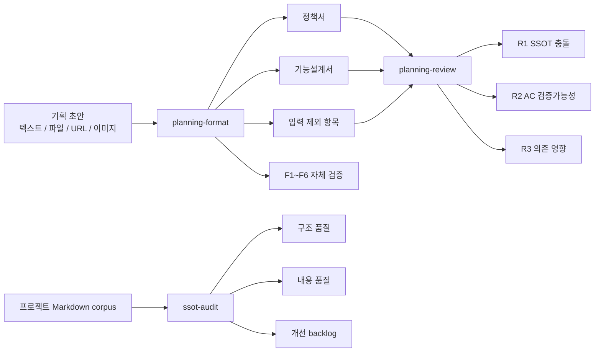
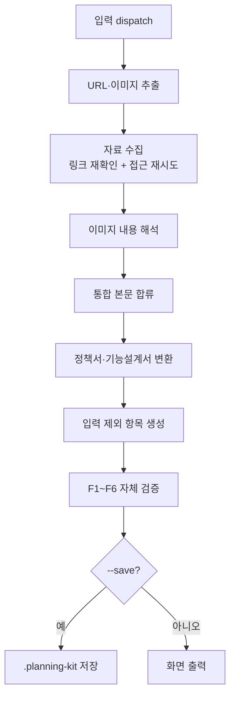
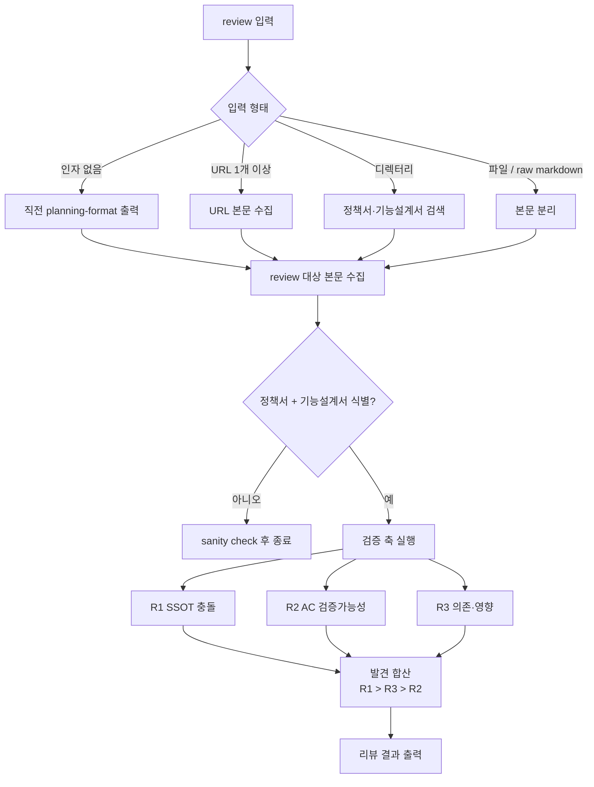
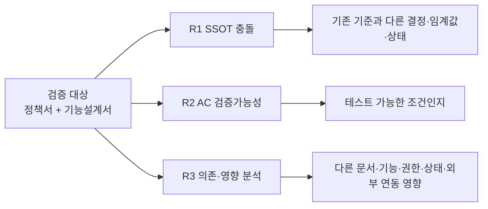
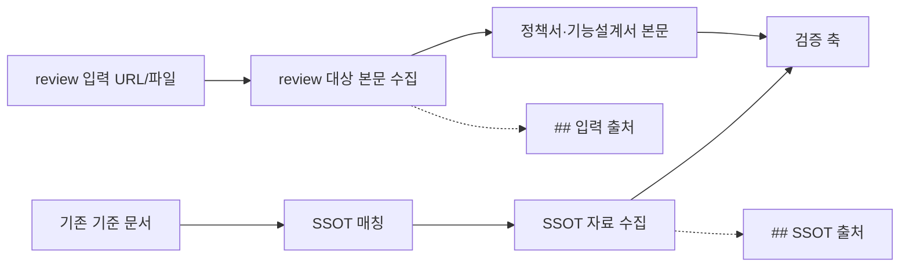
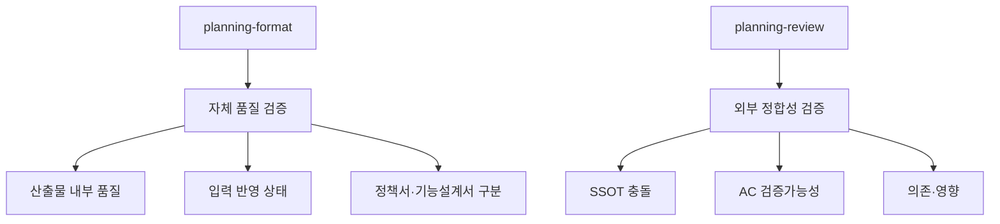
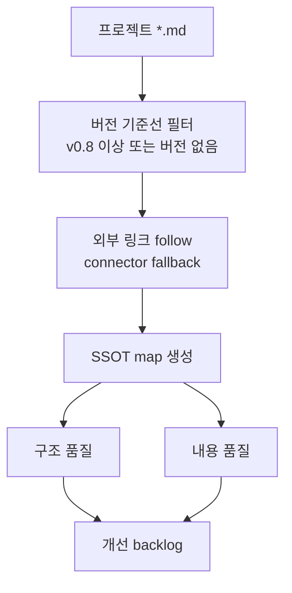

# planning-kit 상세 workflow

> workflow 상세 설명 문서
> 작성일: 2026-05-10
> 최종 수정일: 2026-05-11
> 대상: planning-kit 실행 담당, 기획/개발/디자인/QA/운영 리뷰어
> 문서 상태: 초안 v0.2

---

## 1. 전체 workflow

`planning-kit`은 기본적으로 변환과 리뷰 두 단계로 동작하고, 필요할 때 SSOT corpus 자체를 별도로 감사합니다.

1. `planning-format`: 자유로운 기획 초안을 정책서와 기능설계서로 구조화한다.
2. `planning-review`: 구조화된 산출물이 외부 기준과 맞는지 점검한다.
3. `ssot-audit`: 현재 프로젝트 Markdown SSOT corpus의 구조·내용 품질을 점검한다.



핵심 메시지:

- `planning-format`은 문서를 만든다.
- `planning-review`는 만든 문서가 외부 기준과 맞는지 검증한다.
- `ssot-audit`는 기존 SSOT 체계 자체의 중복, 부재, 낮은 버전 참조, 내용 충돌을 점검한다.
- AI가 최종 승인하지 않는다. AI는 구조화, 누락 탐지, 충돌 후보 표시를 돕는다.
- 최종 v1.0 확정은 기획팀과 실무팀 리뷰 이후 Confluence `[AI]`에서 한다.

---

## 2. planning-format 흐름

`planning-format`은 초안을 받아 정책서와 기능설계서 두 본문으로 변환합니다. 섞여 있는 기획 초안을 리뷰 가능한 두 문서로 나누는 단계입니다.



### 2.1 입력 수집

입력은 텍스트, Markdown 파일, 디렉터리, URL, 이미지가 될 수 있습니다. URL 입력은 1개 이상 받을 수 있고, 텍스트나 파일 본문 안에 포함된 URL과 이미지도 자동으로 추출합니다.

핵심 동작:

- 초안은 꼭 완성된 PRD일 필요가 없다.
- Confluence 링크, Google Docs, Figma 링크, 이미지 캡처처럼 흩어진 자료도 입력으로 사용할 수 있다.
- 링크 확인이 실패해도 조용히 사라지지 않고 출처 목록에 실패 사유가 남는다.

### 2.2 링크 자료 수집과 접근 재시도

URL 본문 안에서 다시 URL이 발견되면 그 링크도 이어서 확인합니다. 로그인, 권한, timeout 등으로 바로 읽지 못하는 자료는 사용 가능한 연결 도구를 통해 한 번 더 접근을 시도합니다.

핵심 동작:

- 성공한 링크만 근거가 되는 것이 아니라, 실패한 링크도 "접근하지 못한 근거"로 남는다.
- 링크 확인 순서는 안정적으로 유지되어 나중에 같은 입력을 다시 확인하기 쉽다.
- 접근 재시도는 사람 대신 최종 판단하는 기능이 아니라, 접근 가능한 근거를 최대한 모으는 기능이다.

### 2.3 정책서와 기능설계서 변환

통합 본문이 만들어지면 `planning-format`은 내용을 두 문서로 나눕니다.

| 문서 | 들어가는 내용 |
|---|---|
| 정책서 | 결정 기준, 허용/금지 규칙, 예외, 승인 기준, 권한, 상태 처리 기준 |
| 기능설계서 | 사용자 흐름, 화면/입력 항목, 시스템 동작, 메시지, 검증 조건 |

정책과 기능이 섞여 있으면 개발팀이 무엇을 구현해야 하는지, 기획팀이 무엇을 결정해야 하는지 흐려집니다. `planning-format`의 첫 번째 가치는 이 둘을 분리하는 데 있습니다.

### 2.4 입력 제외 항목

입력 제외 항목은 버려진 내용이 아닙니다. 본문에 바로 반영하기 어려운 조각을 이유와 함께 남기는 추적 장치입니다.

대표적인 의미:

- 다른 기능 범위로 보인다.
- 근거가 부족하다.
- 라벨 매핑이 불명확하다.
- 자료 접근 실패로 본문에 합류하지 못했다.
- 너무 상세해서 본문에서는 축약했다.
- 기존 문서와 충돌할 가능성이 있다.

입력 제외 항목은 AI가 놓친 목록이 아니라, 사람이 확인해야 할 대기열입니다.

### 2.5 자체 품질 검증

`planning-format`은 변환 직후 자체 품질 검증을 수행합니다. 이 검증은 외부 SSOT를 보지 않고, 산출물 내부 품질과 입력 반영 상태를 봅니다.

| 항목 | 질문 |
|---|---|
| F1 섹션 충실도 | 필요한 섹션이 비어 있거나 `[TBD]`가 과도하지 않은가? |
| F2 라벨 cross-bleed | 정책서에 화면 동작이 섞이거나 기능설계서에 정책 판단이 섞이지 않았는가? |
| F3 용어 일관성 | 같은 개념을 여러 이름으로 부르지 않는가? |
| F4 정책-기능 매핑 | 정책 기준과 기능 동작이 서로 연결되는가? |
| F5 누락 | 입력, 자료 접근 실패, `[TBD]`에서 빠진 항목이 없는가? |
| F6 Markdown syntax | 표, 헤더, 코드 펜스 등 문법이 깨지지 않았는가? |

---

## 3. planning-review 흐름

`planning-review`는 `planning-format` 산출물을 외부 기준으로 점검합니다. 문서가 만들어진 뒤, 기존 기준과 테스트 가능성, 주변 영향까지 보는 단계입니다.



### 3.1 review 입력 방식

`planning-review`는 여러 입력 방식을 지원합니다.

| 입력 | 사용 상황 |
|---|---|
| 인자 없음 | 직전 turn의 `planning-format` 결과를 바로 리뷰 |
| 디렉터리 | `planning-format --save`로 저장한 결과를 리뷰 |
| 단일 파일 | 같은 폴더의 sibling 파일까지 함께 읽어 정책서·기능설계서 쌍을 리뷰 |
| 두 파일 | 정책서와 기능설계서를 명시적으로 리뷰 |
| raw markdown | 두 본문이 들어 있는 markdown을 직접 리뷰 |
| URL 1개 이상 | Confluence, Google Docs 등 외부 문서에서 두 본문을 읽어 리뷰 |

0.2.6부터 `planning-review`도 URL root input을 직접 받을 수 있습니다. 정책서와 기능설계서가 서로 다른 URL에 있어도 review 입력으로 줄 수 있습니다.
0.2.7부터 단일 파일 입력은 해당 파일만 보지 않고 같은 폴더 sibling 파일을 non-recursive로 함께 읽어 한 쌍을 찾습니다. 여러 기능 파일이 섞여 1쌍으로 좁힐 수 없으면 임의 병합하지 않고 sanity check로 종료합니다.

### 3.2 검증 축



| 축 | 보는 것 | 의미 |
|---|---|---|
| R1 SSOT 충돌 | 기존 기준 문서와 새 산출물의 표기, 결정, 임계값 차이 | "기존 기준과 새 기획이 어긋나는지 봅니다." |
| R2 AC 검증가능성 | 정량성, 상태, 행위자, 결과 관찰 가능성 | "QA와 개발이 테스트할 수 있는 문장인지 봅니다." |
| R3 의존·영향 | 정책 변경, 상태 전이, 권한·역할, 외부 의존 | "이 변경 때문에 같이 손봐야 할 주변 문서와 기능을 봅니다." |

같은 발견이 여러 축에 걸치면 한 번만 기록합니다. 우선순위는 `R1 > R3 > R2`입니다. R1은 기존 기준과의 직접 충돌이므로 가장 강한 신호로 봅니다.

---

## 4. 입력 자료 수집과 SSOT 자료 수집의 경계

`planning-review`에서 가장 헷갈리기 쉬운 부분은 review 대상 본문을 만들기 위한 자료 수집과, 기존 기준을 확인하기 위한 SSOT 자료 수집의 차이입니다.



| 구분 | 목적 | 출력 위치 |
|---|---|---|
| 입력 자료 수집 | review 대상 정책서·기능설계서 본문을 만들기 위해 입력 URL과 이미지에서 내용을 수집 | `## 입력 출처` |
| SSOT 자료 수집 | 기존 기준과 비교하기 위해 매칭된 SSOT 문서와 그 안의 링크를 확인 | `## SSOT 출처` |

핵심 동작:

- 입력으로 준 URL 자체가 곧 기존 기준 문서가 되는 것은 아니다.
- 입력 자료 수집과 SSOT 자료 수집은 목적과 출처 표가 분리된다.
- 같은 URL이 입력과 SSOT 양쪽에 등장해도 역할이 다르면 각각 기록될 수 있다.

---

## 5. 자체 검증과 외부 검증의 차이

`planning-format`과 `planning-review`가 모두 "검증"을 말하지만 검증 범위가 다릅니다.



| 구분 | 자체 검증 | 외부 검증 |
|---|---|---|
| 실행 위치 | `planning-format` 안 | `planning-review` 안 |
| 기준 | 입력 본문과 산출물 자체 | 산출물 + 외부 기준 문서 |
| 주요 질문 | 문서가 내부적으로 잘 정리됐는가? | 기존 기준과 맞고 테스트 가능하며 영향이 정리됐는가? |
| 대표 출력 | 자체 검증 결과, 입력 제외 항목 | 리뷰 결과, 입력 출처, SSOT 출처, 축별 발견 |

---

## 6. SSOT corpus 감사

`ssot-audit`는 새 기획 산출물을 리뷰하는 도구가 아니라, 기존 문서 corpus가 유지보수 가능한 상태인지 보는 도구입니다.



주요 확인 항목:

- canonical 문서가 중복되거나 없는가
- archive, draft, `v0.8` 미만 낮은 버전 문서를 최신 기준처럼 참조하는가
- 같은 정책/상태/권한/임계값이 문서마다 다르게 쓰이는가
- 용어, 미결 표현, 검증 조건, 설명 없는 중복이 정리되어 있는가

`ssot-audit` 결과는 화면 output only이며, 문서를 자동 수정하지 않습니다.

---

## 7. 출력물 읽는 법

### 7.1 planning-format 출력

본문뿐 아니라 아래 신호를 함께 확인합니다.

| 출력 | 읽는 법 |
|---|---|
| 정책서 | 기획팀이 결정해야 할 기준과 규칙 |
| 기능설계서 | 개발/디자인/QA가 구현·검증해야 할 동작 |
| 출처 목록 | 어떤 입력과 링크가 근거로 합류했는지 |
| 입력 제외 항목 | 본문에 넣지 않은 이유와 후속 확인 대상 |
| 자체 검증 결과 | 리뷰 전에 문서 자체에서 보완해야 할 항목 |

### 7.2 planning-review 출력

| 출력 | 읽는 법 |
|---|---|
| 입력 처리 | review 대상 본문을 어떻게 만들었는지 |
| 리뷰 결과 | 전체 통과 또는 발견 건수 |
| 입력 출처 | review 대상 입력을 만드는 데 사용한 URL·이미지 |
| SSOT 출처 | 외부 기준 비교에 사용한 SSOT 링크 확인 결과 |
| SSOT 충돌 | 기존 기준과 새 기획의 직접 어긋남 |
| 검증가능성 | 테스트 가능한 요구사항으로 바꿔야 할 문장 |
| 영향 분석 | 같이 수정하거나 확인해야 할 주변 문서·기능 |

### 7.3 ssot-audit 출력

| 출력 | 읽는 법 |
|---|---|
| SSOT 인벤토리 | 현재 기준 후보 문서의 역할 분포 |
| SSOT 제외 문서 | `v0.8` 미만이라 corpus 비교에서 빠진 문서 |
| 외부 출처 | 외부 링크 follow와 이미지 처리 결과 |
| 구조 품질 | canonical, archive/낮은 버전 참조, 문서 역할 문제 |
| 내용 품질 | 정책값, 상태, 권한, 임계값, 용어, 검증 조건 문제 |
| 개선 backlog | 기존 SSOT 체계에서 정리해야 할 구조/내용 작업 |

---

## 8. 예시 workflow

```text
1. 기획자가 Confluence [Origin]에 개인 초안을 올린다.
2. 기존 SSOT corpus가 불안정하거나 오래된 문서가 섞여 있으면 ssot-audit로 backlog를 먼저 확인한다.
3. planning-kit 실행 담당이 Origin 링크를 planning-format에 입력한다.
4. planning-format이 정책서, 기능설계서, 입력 제외 항목, 자체 검증 결과를 만든다.
5. 실행 담당과 기획팀이 [TBD]와 입력 제외 항목을 확인한다.
6. formatting 결과를 Confluence [AI]에 올린다.
7. planning-review로 SSOT 충돌, AC 검증가능성, 의존 영향을 점검한다.
8. 발견 항목을 수정하거나 리뷰 안건으로 남긴다.
9. 기획팀 리뷰와 실무 리뷰를 거쳐 v1.0을 확정한다.
```
