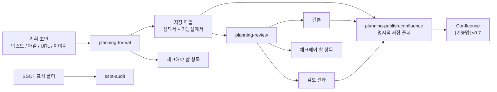
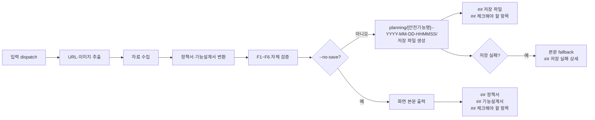
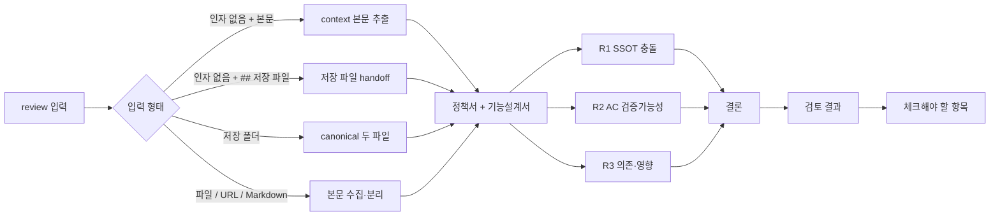
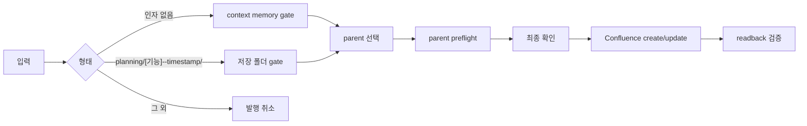

# planning-kit 상세 workflow

> workflow 상세 설명 문서
> 최종 수정일: 2026-05-12
> 기준 버전: 0.2.14
> 대상: planning-kit 실행 담당, 기획/개발/디자인/QA/운영 리뷰어

---

## 1. 전체 workflow

`planning-kit`은 변환, 리뷰, 후보 발행 세 단계로 동작하고, 필요할 때 기준 문서 묶음 자체를 별도로 감사합니다.

핵심 메시지:

- `planning-format`은 문서를 만들고 기본 저장 파일을 남깁니다.
- `planning-review`는 저장 파일 또는 두 본문을 기준 문서와 비교하고 결론/검토 결과를 먼저 보여줍니다.
- `planning-publish-confluence`는 context memory 또는 명시적 저장 폴더만 발행 후보로 사용합니다.
- 최종 v1.0 확정은 기획팀과 실무팀 리뷰 이후 Confluence `[SSOT]`에서 합니다.

## 2. planning-format 흐름

0.2.14부터 `planning-format`은 저장 기본값입니다. `--no-save`를 지정한 경우에만 저장하지 않고 정책서·기능설계서 전문을 화면에 펼칩니다.

기본 저장 성공 출력은 `# [기능명]` 헤더 다음에 `## 저장 파일`, `## 체크해야 할 항목`만 둡니다. 저장 파일에는 체크리스트, 출처/누락 요약, 상세 추적, 저장 실패 상세를 쓰지 않습니다.

## 3. planning-review 흐름

0개 인자 실행에서는 직전 `planning-format` 출력에서 본문 또는 저장 파일 handoff를 찾습니다.

저장 파일 handoff 허용 형식은 `- 정책서: <path>`, `- 기능설계서: <path>`, `- [정책서](<path>)`, `- [기능설계서](<path>)`입니다. 두 파일이 정확히 1개 `planning/[안전기능명]--YYYY-MM-DD-HHMMSS/` 폴더를 가리키지 않으면 임의 선택하지 않습니다.

## 4. planning-publish-confluence 흐름

저장 폴더 입력은 repo root 기준 direct child만 허용합니다. `planning/foo/`, `planning/drafts/...`, 중첩 폴더, URL, 임의 `.md` 파일은 거부합니다. 저장 폴더에서 읽는 것은 canonical 정책서·기능설계서 두 파일뿐이며, `## 저장 파일`, `## 체크해야 할 항목`, `## 검토 결과`, `## 저장 실패 상세` 같은 report section은 child page body로 발행하지 않습니다.

## 5. SSOT 경계

`planning/**`과 `.planning-kit/**`은 review 대상 입력이나 발행 후보 입력으로는 사용할 수 있지만, 기준 문서 묶음 근거로는 쓰지 않습니다. 기준 문서 묶음은 폴더명에 독립 `SSOT` 표시가 있는 하위 폴더의 Markdown만 사용합니다.
