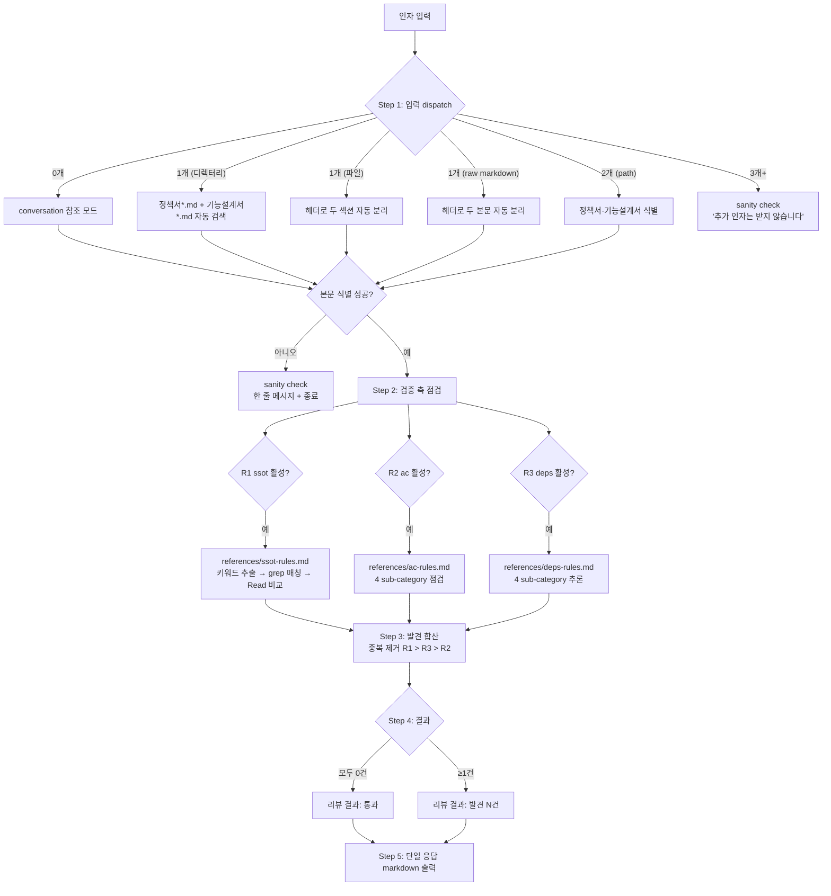
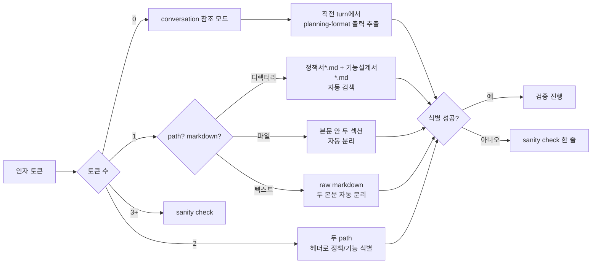
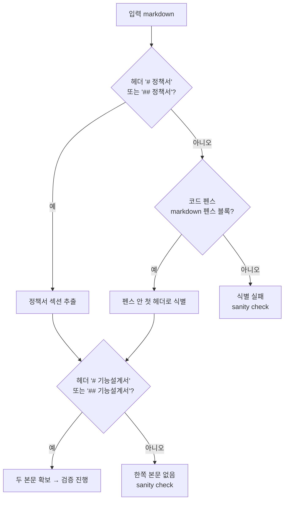
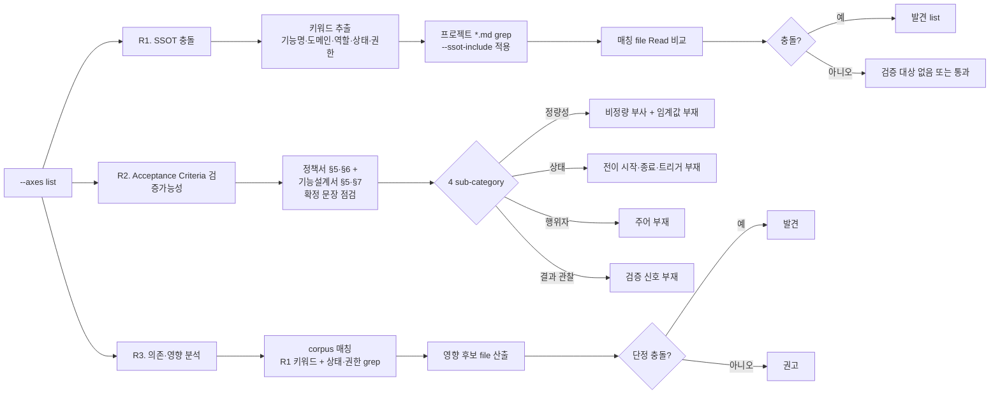
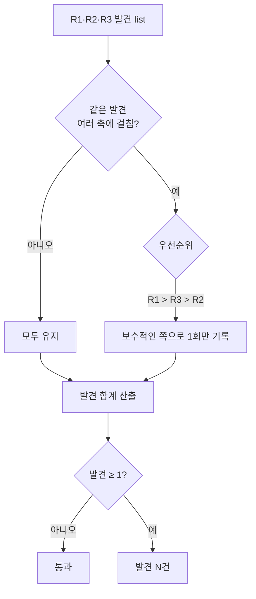
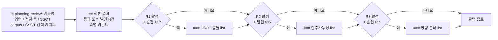
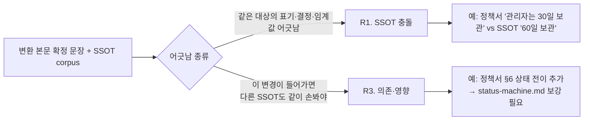
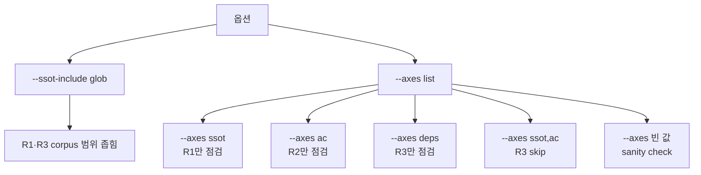

# planning-review workflow

`/planning-kit:planning-review` 한 호출의 전체 흐름을 다이어그램으로 정리한 문서. 동작 명세는 `skills/planning-review/SKILL.md`, lookup data는 `skills/planning-review/references/ssot-rules.md`·`ac-rules.md`·`deps-rules.md`에 있다.

본 스킬은 외부 검증만 수행. 변환·자체 품질 점검은 `planning-format`이 책임 — 자세한 변환 흐름은 `docs/planning-format-workflow.md`.

## 1. 전체 시퀀스

## 2. 입력 dispatch (Step 1)

## 3. 본문 분리 패턴

## 4. 검증 축 (Step 2)

## 5. 발견 합산 (Step 3)

## 6. 단일 응답 출력 (Step 5)

규칙:
- 활성 안 한 축의 sub-section은 통째 생략.
- `SSOT 검색 키워드` 줄은 R1 활성 시에만.
- `SSOT corpus` 카운트 줄은 R1 또는 R3 활성 시에만 (corpus 공유).

## 7. R1 vs R3 차이

R1·R3 모두 SSOT corpus를 보지만 관점이 다르다. 같은 발견이 양쪽에 걸리면 R1로 1회만 기록 (R1이 더 단정적).

## 8. 옵션 영향

## 9. 참고 파일

| 파일 | 역할 |
|---|---|
| `skills/planning-review/SKILL.md` | 동작 시퀀스 골격 (Step 1~5) |
| `skills/planning-review/references/ssot-rules.md` | R1 SSOT 충돌 점검 절차·매칭·발견 형식 |
| `skills/planning-review/references/ac-rules.md` | R2 Acceptance Criteria 4 sub-category 기준 |
| `skills/planning-review/references/deps-rules.md` | R3 의존·영향 4 sub-category 기준 + 발견·권고 분류 |
| `docs/planning-format-workflow.md` | planning-format 변환·자체 검증 워크플로 |
| `docs/prd/prd-0.2.0.md` | 본 스킬 분할 + Google 라우팅 fix PRD |
