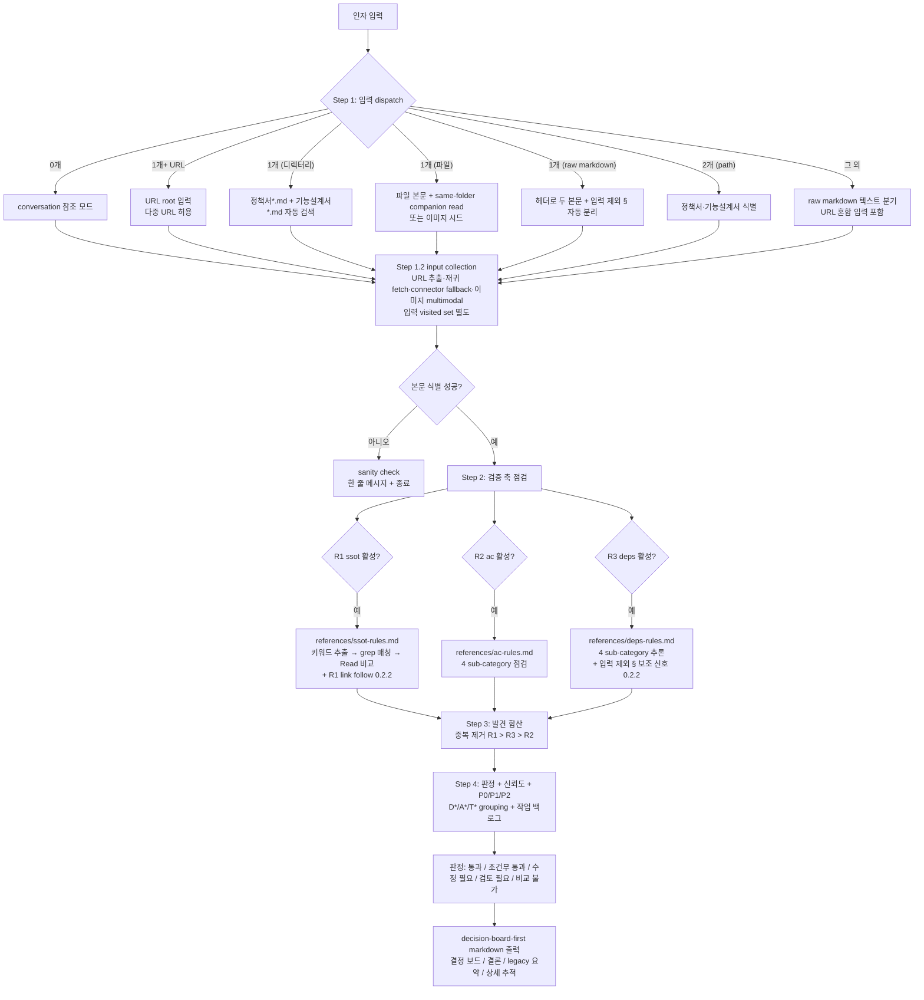
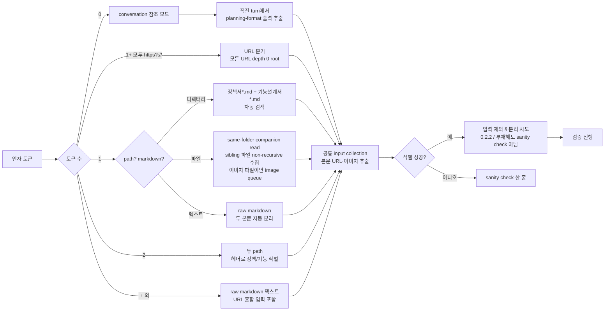
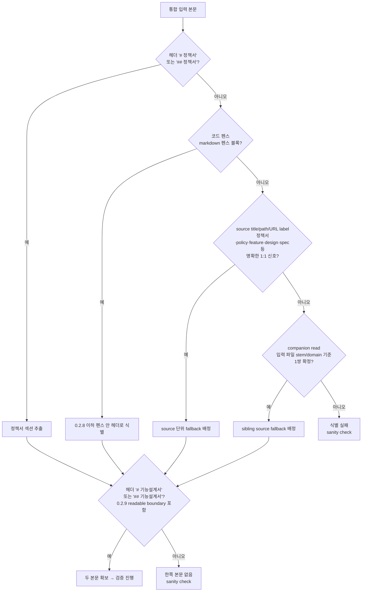
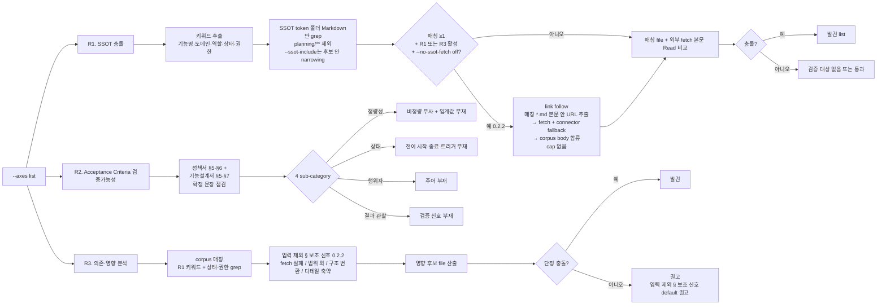
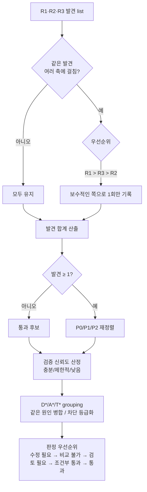
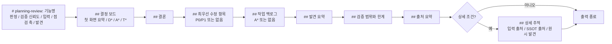
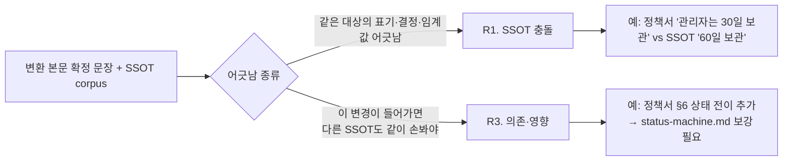
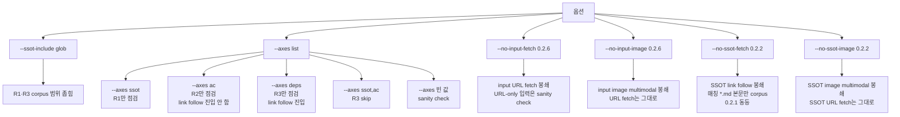

# planning-review workflow

`/planning-kit:planning-review` 한 호출의 전체 흐름을 다이어그램으로 정리한 문서. 동작 명세는 `skills/planning-review/SKILL.md`, lookup data는 `skills/planning-review/references/ssot-rules.md`·`ac-rules.md`·`deps-rules.md`와 `skills/planning-format/references/connector-routing.md`·`conversion-rules.md`에 있다.

본 스킬은 외부 검증만 수행. 변환·자체 품질 점검은 `planning-format`이 책임 — 자세한 변환 흐름은 `docs/planning-format-workflow.md`.

## 1. 전체 시퀀스

## 2. 입력 dispatch (Step 1)

공통 input collection(0.2.6):

- URL root와 본문 URL은 `planning-format` Step 1~5처럼 BFS 재귀 fetch한다. 1차 WebFetch는 필수이며 connector fallback은 `connector-routing.md`를 공유 적재한다.
- input visited set은 SSOT corpus link follow visited set과 분리한다.
- `--no-input-fetch`는 input collection URL fetch만 봉쇄한다. URL-only 입력이면 본문 식별 불가 sanity check로 종료한다.
- input image queue는 이미지 파일 인자, 디렉터리 이미지, markdown image/HTML img, fetch `image/*`, data URI 5경로를 쓴다. `--no-input-image`는 이 multimodal 처리만 봉쇄한다.

단일 파일 companion read(0.2.7):

- 입력 파일의 parent directory를 scan 범위로 잡고, 하위 폴더는 읽지 않는다.
- 같은 폴더의 읽을 수 있는 UTF-8 텍스트 파일과 지원 이미지 파일을 input collection에 추가한다.
- 숨김 파일, binary, dependency/build/cache 성격 파일은 읽지 않는다.
- source title/path/H1/본문 헤더와 입력 파일의 기능명/stem/domain 유사도로 정책서·기능설계서 후보를 좁힌다.
- 후보가 1쌍이면 리뷰하고, 여러 기능이 섞여 1쌍으로 확정할 수 없으면 sanity check로 종료한다.

## 3. 본문 분리 패턴

## 4. 검증 축 (Step 2)

## 5. 발견 합산 (Step 3)

## 6. 단일 응답 출력 (Step 5)

규칙:
- 활성 안 한 축의 sub-section은 통째 생략.
- `입력 처리` 줄은 conversation 본문 사용, local/raw 본문 사용, 또는 URL root/fetch/image 카운트 중 하나로 표기.
- 전체 리포트를 코드 펜스로 감싸지 않는다.
- 헤더 요약 다음에는 항상 `## 결정 보드`를 출력한다. 항목이 없는 subsection은 heading 아래 본문을 정확히 `없음`으로 표시한다.
- 결정 보드는 `결론`, `오늘 결정`, `릴리즈 차단`, `바로 수정(결정 불필요)`, `결정 후 반영` 순서의 첫 화면 요약을 우선한다.
- D*는 권한 있는 결정 필요자의 판단이 필요한 항목, A*는 문서/구현 작업, T*는 독립 차단 추적이다. 같은 원인의 R2/R3 또는 R1/R3 finding은 상단에서 하나로 묶는다.
- full 입력 출처, full SSOT 출처, 축별 원시 발견은 조건 충족 시 하단 `## 상세 추적`으로 이동한다.
- 원시 R* ID는 상단 결정 보드와 legacy summary에서 접고, `## 상세 추적`의 `### 결정 보드 연결 맵`과 축별 원시 발견 목록에서 보존한다.
- P0/P1이 없으면 `## 최우선 수정 항목`은 빈 표가 아니라 `없음`이다.
- 작업 단위가 없으면 `## 작업 백로그`도 `없음`이다.
- SSOT 0건/all-placeholder/include 경계 밖은 `검증 범위와 한계`와 `## 상세 추적`에 원인을 남긴다.
- `## 최우선 수정 항목`과 `## 작업 백로그`는 0.2.x 호환용 top-level heading으로 유지한다. 각 섹션 첫 줄에는 결정 보드가 실제 판단 기준이라는 호환용 요약 안내문을 둔다.

## 7. R1 vs R3 차이

R1·R3 모두 SSOT corpus를 보지만 관점이 다르다. 같은 발견이 양쪽에 걸리면 R1로 1회만 기록 (R1이 더 단정적).

## 8. 옵션 영향

## 9. 참고 파일

| 파일 | 역할 |
|---|---|
| `skills/planning-review/SKILL.md` | 동작 시퀀스 골격 (Step 1~5) |
| `skills/planning-review/references/ssot-rules.md` | R1 SSOT 충돌 점검 절차·매칭·발견 형식 + link follow (0.2.2) + input/SSOT fetch 경계 (0.2.6) |
| `skills/planning-review/references/ac-rules.md` | R2 Acceptance Criteria 4 sub-category 기준 |
| `skills/planning-review/references/deps-rules.md` | R3 의존·영향 4 sub-category 기준 + 발견·권고 분류 + 입력 제외 § 보조 신호 (0.2.2) |
| `skills/planning-format/references/connector-routing.md` | input fetch와 SSOT link follow 공유 적재 — 인증 휴리스틱·MCP 카탈로그·Google Workspace tool 시퀀스·fallback 케이스 |
| `skills/planning-format/references/conversion-rules.md` | input image multimodal·통합 본문 합류 룰 공유 참조 |
| `docs/planning-format-workflow.md` | planning-format 변환·자체 검증 워크플로 |
| `docs/prd/prd-0.2.0.md` | 본 스킬 분할 + Google 라우팅 fix PRD |
| `docs/prd/prd-0.2.2.md` | R1 link follow + 입력 제외 § R3 보조 신호 PRD |
| `docs/prd/prd-0.2.6.md` | planning-review 다중 URL input collection parity PRD |
| `docs/prd/prd-0.2.7.md` | planning-review 단일 파일 companion read + ssot-audit PRD |
