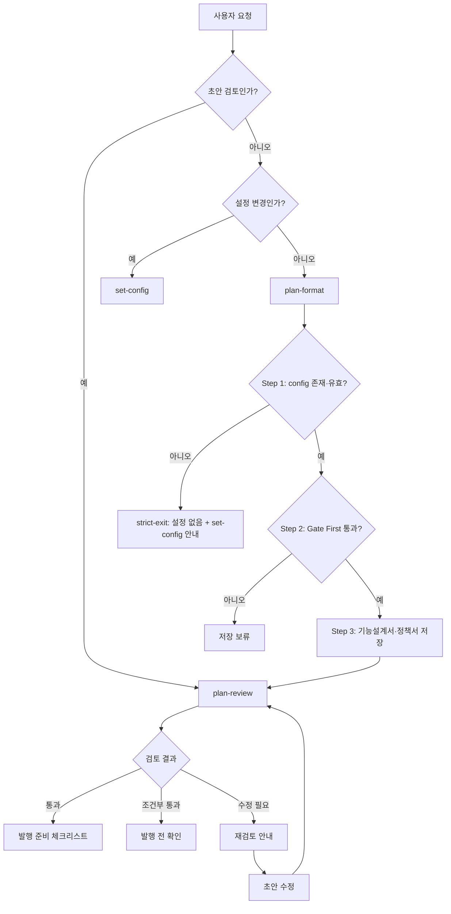

# product-team-kit 기능 정의서

- 문서 상태: 초안
- 기준일: 2026-05-06
- 대상 버전: product-team-kit 0.6.1
- 관련 PRD: [prd.md](./prd.md)
- 관련 문서: [README](../README.md), [skills-workflow.md](./skills-workflow.md)

## 1. 기능 맵

| 영역 | 기능 | 목적 |
|---|---|---|
| 설정 | set-config | `.product-team-kit/config.json`을 대화형으로 생성/갱신한다. |
| 초안 생성 | Step 1 strict-exit | `.product-team-kit/config.json` 미존재·검증 실패 시 즉시 종료, set-config 안내. |
| 입력 처리 | 입력 dispatch | 직접 텍스트, 파일, 디렉터리, 혼합 입력을 기획 입력으로 읽는다. |
| 초안 생성 | Gate First | 초안 생성 가능 여부를 판단한다. |
| 초안 생성 | 문서 분리 | 입력을 기능설계서와 정책서로 나눈다. |
| 초안 생성 | 로컬 저장 | 두 문서를 timestamp 폴더에 저장한다. |
| 발행 전 검토 | 검토 대상 확정 | 기능설계서/정책서 bundle을 검토 대상으로 확정한다. |
| 발행 전 검토 | Product Docs SSOT 근거 | 관련 Markdown과 linked local resource를 직접 읽는다. |
| 발행 전 검토 | review | 충돌, 명확성, 용어 일관성, 4역할 넘김 가능성을 보수적으로 판정한다. |
| 플랫폼 | Claude Code / Codex 지원 | 같은 `skills/`를 양쪽 manifest에서 사용한다. |

## 2. set-config

`set-config`는 사용처 프로젝트 루트의 `.product-team-kit/config.json`만 생성하거나 갱신한다. cwd의 git root가 있으면 git root를 기준으로 하고, 없으면 cwd를 기준으로 한다.

수집하는 키:

| 키 | 저장 방식 | 의미 |
|---|---|---|
| `version` | 항상 `1`로 고정 | config schema 버전 |
| `outputRoot` | 단일 폴더명만 허용 | 초안 저장 root와 SSOT 제외 root |
| `ssot.include` | 빈 값이면 key 제거 | plan-review SSOT allow-list glob. 제거 시 기본 `Product Team Space/Product Department/Colonova Product/_AI_ 정책서 & 기능설계서/**/*.md` 사용 |
| `ssot.exclude` | 빈 값이면 key 제거 | plan-review SSOT 추가 제외 glob |

검증 거부값은 저장하지 않고 같은 키에서 재입력받는다. 저장은 `.product-team-kit/config.json.tmp` 작성 후 rename하는 atomic write로 수행한다.

## 3. plan-format

### 3.1 Step 1 — Strict-exit (config 확인)

`<project-root>/.product-team-kit/config.json` 부재, JSON 파싱 실패, `version` 미일치, `outputRoot` 검증 거부 시 즉시 종료한다. 종료 출력은 "설정 없음" 템플릿이며 Claude Code/Codex 양쪽 set-config 호출 안내를 포함한다. 비치명 검증 거부 (unknown key, ssot 배열 element 비문자열)는 default fallback + `[설정 경고]`로 처리하고 step 2로 진행한다.

### 3.2 Step 2 — 입력 dispatch와 Gate First

입력 dispatch:

| 입력 종류 | 처리 방식 | 출력에 남길 정보 |
|---|---|---|
| 직접 텍스트 | 입력 본문 전체를 기획 입력으로 사용 | `사용자 입력` |
| 기존 파일 경로 | UTF-8 텍스트를 읽어 기획 입력으로 사용 | `로컬 확인: <파일경로>` |
| 기존 디렉터리 경로 | 읽을 수 있는 텍스트 파일을 상대경로 오름차순으로 통합 | 읽은 텍스트 파일 수 |
| 없는 path-like 입력 | 경로 오류로 종료하지 않고 직접 텍스트로 처리 | `사용자 입력` |
| 주제 + 경로 혼합 | 사용자 문장과 로컬 파일/디렉터리 내용을 함께 사용 | 사용자 입력과 로컬 확인 정보 |

디렉터리 입력은 `.git`, `node_modules`, `<outputRoot>`, `dist`, `build`, `coverage`, `.cache`, `vendor`, `__pycache__`를 제외한다. 입력 크기 상한은 두지 않으며, 검증 정확도를 위해 무거워도 끝까지 읽는다.

Gate First 조건은 모두 식별되어야 한다.

| 조건 | 설명 |
|---|---|
| 기능 목적 또는 기능명 | 기능명, 문제, 목적 중 한 문장 요약 가능 |
| 적용 대상 또는 업무 범위 | 사용자, 역할, 조직, 업무 대상, 포함 범위 중 확인 가능 |
| 핵심 사용자 행동과 기대 결과 | 사용자 행동 1개와 사용자에게 보이는 결과 1개 이상 |
| 주요 조건 / 정책 / 제약 | 허용, 금지, 조건, 예외, 제한, 판단 기준 중 업무 판단 기준 1개 이상 |

조건 미충족 시 저장 보류를 반환하고 파일을 만들지 않는다. 입력이 디자인, API, DB, QA, 운영, 개발 작업 상세에 치우쳐 제품·업무 판단 정보가 부족한 경우도 저장 보류로 통합 처리한다 (보류 출력의 `이유` 필드와 `[제외된 상세 유형]` sub-block에 성격 명시).

### 3.3 Step 3 — 문서 분리

dispatch에서 기능명·역할명·용어·라벨을 고정한 뒤 기능설계서 worker와 정책서 worker가 각 문서 본문을 작성한다. main은 두 결과를 merge하고, 중복·marker·빈 골격 신호를 확인한 뒤 저장한다. 병렬 worker 호출이 불가능한 환경에서는 같은 결과 형식으로 단일 패스 fallback을 사용한다.

| 입력 성격 | 귀속 문서 |
|---|---|
| 화면, 사용자 흐름, 진입점, 입력 항목, UI, 기능 동작, 사용자에게 보이는 결과, 가능 행위 | 기능설계서 |
| 업무 판단 기준, 규칙, 조건, 제한, 정책, 원칙, 예외 승인 기준, 상태 처리 기준 | 정책서 |

상태, 권한, 예외, 조건처럼 양쪽에 걸리는 항목은 정책서에 판단 기준을 두고 기능설계서에는 사용자에게 보이는 결과와 가능 행위를 둔다. 같은 상태표, 권한표, 예외목록을 양쪽에 중복하지 않는다.

### 3.4 Step 3 — 로컬 저장

저장 경로는 현재 작업 디렉터리 또는 입력 파일/디렉터리의 프로젝트 루트를 기준으로 한다.

```text
<outputRoot>/[안전기능명]--YYYY-MM-DD-HHMMSS/[안전기능명]_기능설계서.md
<outputRoot>/[안전기능명]--YYYY-MM-DD-HHMMSS/[안전기능명]_정책서.md
```

`<outputRoot>` default는 `planning`. 안전기능명은 NFC 정규화, 공백→하이픈, 금지 문자 제거, 50자/120 bytes char-boundary truncation을 적용한다 (multi-byte char 경계에서 round-down). 충돌 시 `--01`~`--99` suffix를 순차 시도하며 `--99`까지 충돌하면 저장 실패다. 두 파일은 같은 staging folder에 먼저 작성하고, 두 파일 존재 검증이 끝난 뒤 staging folder를 target folder로 rename한다. 기존 target folder는 덮어쓰지 않는다.

### 3.5 plan-format 결과

| 결과 | 조건 | 후속 행동 |
|---|---|---|
| 설정 없음 | config.json 부재·JSON 파싱 실패·version 미일치·outputRoot 거부 | set-config 실행 후 다시 호출 |
| 저장 완료 | Gate First 통과와 두 파일 저장 성공 | 생성된 폴더로 `plan-review` 실행 |
| 저장 보류 | 제품·업무 판단 정보 부족 (디자인/개발 heavy 입력 포함) | 부족 항목 보강 후 다시 실행 |
| 저장 실패 | staging folder 생성 실패, `--99` 충돌, 파일 쓰기/검증/rename 실패 | 남은 staging/target 경로와 저장 환경 확인 후 재실행 |

## 4. plan-review

### 4.1 검토 대상 확정

`plan-review`는 먼저 `<project-root>/.product-team-kit/config.json`을 확인한다. config 파일 없음, JSON 파싱 실패, `version` 미일치, `outputRoot` 검증 거부는 즉시 종료하고 `set-config` 실행을 안내한다.

그 다음 초안 폴더 또는 기능설계서/정책서 파일을 입력으로 받는다. 폴더 입력이면 기능설계서와 정책서를 함께 읽고, 단일 파일 입력이면 같은 폴더에서 짝문서를 찾는다.

지원 문서 타입이 아니면 `올바른 검토 대상이 아님`으로 종료한다. 짝문서가 없으면 단일 검토를 진행하고 `검증 한계`에 `짝문서 없음`을 기록한다. 검토 대상이 명시적으로 짝문서의 판단에 의존하면 그 부재를 `필수 수정` 또는 `발행 전 확인`으로 올린다.

### 4.2 Product Docs SSOT 근거 기록

Product Docs SSOT는 `<outputRoot>/`을 제외한 현재 프로젝트의 제품 정책, PRD/요구사항, 기능/화면 설계, 운영/QA 판단 Markdown과 그 Markdown이 상대경로로 참조한 로컬 resource다.

근거에서 제외하는 항목:

- `<outputRoot>/`, `.git/`, dependency/vendor/build/cache/generated 경로
- 코드, 설정 파일
- 외부 URL
- Markdown에서 참조하지 않은 독립 resource

근거 기록은 사람용 리포트 하단의 `읽은 근거`, `읽지 않은 관련 후보`, `제외 후보`, `검증 한계`로 남긴다. 핵심 근거를 확보하지 못하면 최종 결과는 보수적으로 낮춘다.

### 4.3 review gate

| 판정 | 의미 |
|---|---|
| 통과 | 충돌, 필수 수정, 발행 전 확인, 검증 한계가 없고 후속 역할이 착수 가능 |
| 조건부 통과 | 발행 전 기획자가 확인하거나 수용하면 진행 가능 |
| 수정 필요 | 충돌, 누락, 근거 없는 가정, `착수 전 보강 필요` 역할 때문에 문서 수정 필요 |
| 올바른 검토 대상이 아님 | 기능설계서/정책서 초안이 아닌 입력 |

최종 취합은 `수정 필요 > 조건부 통과 > 통과` 순서로 보수적으로 결정한다.

### 4.4 역할별 착수 가능성

| 역할 | 확인 관점 |
|---|---|
| 디자인 | 화면 목록, 진입/이탈 흐름, 주요 상태, 권한별 UI 차이, 문구/라벨 |
| 개발 | 상태, 권한, 예외, 업무 데이터, 연동 경계, 감사 로그, 실패 처리 |
| QA | 전제조건, 기대 결과, 권한별 케이스, negative/edge case, 확인 가능한 결과 |
| 운영 | 수동 처리, 예외 대응, 안내/공지, 권한 부여, 로그 확인, 전환 영향 |

착수 상태는 `착수 가능`, `확인 후 착수 가능`, `착수 전 보강 필요`, `해당 없음`으로 표시한다. 하나라도 `착수 전 보강 필요`이면 최종 결과는 `수정 필요`다.

### 4.5 plan-review 결과

| 결과 | 포함해야 하는 정보 |
|---|---|
| 통과 | 판정, 한 줄 결론, 먼저 할 일, 역할별 착수 가능성, 충돌 없음, 발행 준비 체크리스트 |
| 조건부 통과 | 발행 전 확인 항목, 조건 수용 후 처리, 발행 준비 체크리스트 |
| 수정 필요 | 먼저 고칠 항목, 필수 수정 항목, 재검토 안내 체크리스트 |
| 올바른 검토 대상이 아님 | 지원 대상 문서 타입과 올바른 입력 안내 |

## 5. 플랫폼 지원

| 플랫폼 | 호출 방식 | 기준 파일 |
|---|---|---|
| Claude Code | `/product-team-kit:set-config`, `/product-team-kit:plan-format`, `/product-team-kit:plan-review` | `.claude-plugin/plugin.json` |
| Codex | `$set-config`, `$plan-format`, `$plan-review` | `.codex-plugin/plugin.json` |

두 플랫폼은 같은 `skills/` 디렉터리를 사용한다. 스킬 추가나 계약 변경 시 README, manifest, skill metadata, workflow 문서를 함께 갱신해야 한다.

## 6. 전체 동작 흐름



## 7. 변경 관리 기준

- 새 스킬은 PRD의 제공 범위와 제외 범위를 먼저 갱신한 뒤 추가한다.
- 스킬 계약 변경은 `skills/*/SKILL.md`, `references/`, README, `docs/skills-workflow.md`에 같은 의미로 반영한다.
- 다이어그램은 `docs/diagrams/product-team-kit-workflow.source.json`을 source로 사용한다.
- 외부 발행 기능을 추가하려면 현재의 수동 handoff 경계를 별도 요구사항으로 재검토한다.
