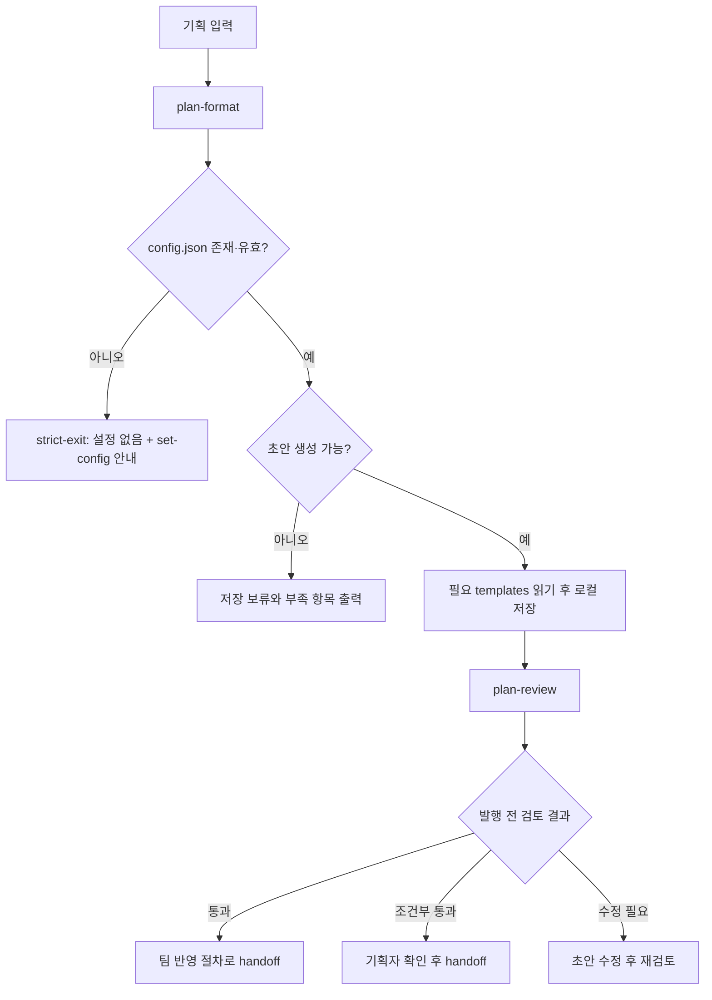

# product-team-kit PRD

- 문서 상태: 초안
- 기준일: 2026-05-07
- 대상 버전: product-team-kit 0.7.5
- 관련 기능 문서: [feature-definition.md](./feature-definition.md)
- 관련 문서: [README](../README.md), [skills-workflow.md](./skills-workflow.md)

## 1. 한 줄 요약

`product-team-kit`은 비구조 기획 입력을 로컬 기능설계서와 정책서 초안으로 정리하고, 팀 문서 반영 전에 Product Docs SSOT 근거로 충돌과 용어 일관성을 검토하는 제품팀 도구다.

## 2. 문제 정의

기획 노트, 회의록, AI 대화 결과, 문서 스크랩은 형식과 상세 수준이 제각각이다. 이 상태로 팀 문서에 반영하면 정책 판단, 화면 동작, 예외 처리, 권한 기준이 한 문서 안에 섞이거나 근거 없는 가정이 확정 규칙처럼 남을 수 있다.

또한 초안 생성과 발행 전 검토가 분리되어 있지 않으면, AI가 만든 문서가 기존 Product Docs SSOT와 충돌하는지 확인하지 못한 채 후속 반영 단계로 넘어갈 위험이 있다.

## 3. 목표

- 기획 입력을 기능설계서와 정책서 두 초안으로 안정적으로 분리한다.
- 사용처 프로젝트별 `.product-team-kit/config.json`으로 초안 저장 위치와 SSOT 검색 범위를 조정하고, `CLAUDE.md`/`AGENTS.md` 안내 블록으로 agent가 해당 범위를 먼저 확인하게 한다.
- config, 입력, templates, references, SSOT corpus를 필요한 단계에서만 읽어 불필요한 선행 context 사용을 줄인다.
- 입력이 부족한 경우 문서를 만들지 않고 부족 항목만 알려준다.
- 생성된 초안이 공식 팀 문서가 아니라 로컬 검토 대상임을 명확히 한다.
- 발행 전 검토에서 Product Docs SSOT 충돌과 용어 일관성을 보수적으로 판단한다.
- Claude Code와 Codex 양쪽에서 같은 스킬 계약으로 사용할 수 있게 한다.

## 4. 대상 사용자

| 사용자 | 필요 |
|---|---|
| 기획자 / PM | 비구조 기획 자료를 기능설계서와 정책서 초안으로 빠르게 정리 |
| 제품 문서 담당자 | 초안이 기존 정책, PRD, 기능 문서와 충돌하는지 확인 |
| 후속 반영 담당자 | 대화 맥락 없이 문서만 보고 검토 결과와 충돌 여부를 확인 |
| AI 도구 사용자 | Claude Code와 Codex에서 같은 플러그인을 일관되게 호출 |

## 5. 범위

### 제공 범위

- 직접 텍스트, 파일, 디렉터리 기반 기획 입력 처리
- `set-config`를 통한 `.product-team-kit/config.json` 생성/갱신과 `CLAUDE.md`/`AGENTS.md` 안내 블록 자동 생성/갱신
- Lazy read 기반 실행: 종료 분기에서 쓰지 않는 templates, references, SSOT corpus를 읽지 않음
- Gate First 기반 초안 생성 가능성 판정
- 기능설계서와 정책서 동시 생성
- `<outputRoot>/[안전기능명]--YYYY-MM-DD-HHMMSS/` 저장 규칙 (`outputRoot` 기본값: `planning`)
- Product Docs SSOT 근거 기반 2축(SSOT 충돌·용어 일관성) 발행 전 검토
- `통과`, `조건부 통과`, `수정 필요`, `올바른 검토 대상이 아님` 판정

### 제외 범위

- PRD 자동 생성 스킬
- 상위설계서 생성
- Confluence, Jira, Google Docs 등 외부 시스템 자동 게시
- Product Docs SSOT 문서 자동 수정
- 외부 URL 기반 근거 검증
- 코드, API, DB schema, QA 확인 케이스, 운영 런북 생성
- 질문을 반복하는 인터뷰 루프

## 6. 핵심 사용자 흐름

## 7. 제품 요구사항

| ID | 요구사항 | 수용 기준 |
|---|---|---|
| PRD-01 | 사용자는 기획 입력을 직접 텍스트, 파일, 디렉터리로 제공할 수 있다. | 입력 처리 결과에 출처와 제외 항목이 표시된다. |
| PRD-02 | 사용자는 `.product-team-kit/config.json`을 대화형으로 만들거나 갱신할 수 있고, 같은 root의 agent 안내 파일도 자동으로 정렬된다. | `set-config`가 `outputRoot`, `ssot.include`, `ssot.exclude`를 한 번의 질문 묶음으로 확인하고, 다른 값이 필요한 키만 batch로 입력받은 뒤 저장 전 검증·저장 확인을 거쳐 `version: 1`로 저장한다. 저장 성공 후 `CLAUDE.md`와 `AGENTS.md` product-team-kit 관리 블록을 선택 없이 항상 생성·갱신한다. |
| PRD-03 | 입력이 부족하거나 config가 없으면 파일을 만들지 않는다. | config 부재·검증 실패 시 strict-exit으로 set-config 안내, 정보 부족 시 기능 목적/적용 범위/사용자 행동/주요 조건 중 부족한 항목을 출력한다. |
| PRD-04 | 충분한 입력은 기능설계서와 정책서 두 문서로 분리한다. | 화면/흐름/사용자 결과는 기능설계서, 규칙/조건/예외/제한은 정책서에 배치된다. |
| PRD-05 | 저장된 초안은 공식 팀 문서가 아님을 표시한다. | 산출물과 출력에 로컬 초안, 팀 문서 미반영, 공식 팀 문서 아님이 드러난다. |
| PRD-06 | 발행 전 검토는 Product Docs SSOT를 근거로 2축을 점검한다. | `<outputRoot>/` 산출물, 코드, 설정, 외부 URL은 SSOT 근거에서 제외되고, SSOT 충돌과 용어 일관성이 함께 판정된다. 마커 자체로는 결과를 낮추지 않는다. |
| PRD-07 | 검토 결과는 기획팀이 바로 행동할 수 있어야 한다. | 판정, 한 줄 결론, 먼저 할 일, 기준 문서 충돌이 상단에 표시된다. |
| PRD-08 | 검토는 보수적으로 취합한다. | 필수 수정 항목이 있으면 최종 결과는 `수정 필요`다. |
| PRD-09 | Claude Code와 Codex에서 같은 제품 계약을 유지한다. | 양쪽 manifest가 같은 이름, 버전, 스킬 경로를 가리킨다. |
| PRD-10 | 각 스킬은 필요한 단계에서만 파일을 읽는다. | config 실패 시 입력/templates/references를 읽지 않고, 저장 보류 시 storage contract를 읽지 않으며, plan-review는 상단 인덱스 스캔을 거쳐 축소된 SSOT corpus만 읽는다. plan-format은 디렉터리 입력에서 기본 제외 경로를 적용한 뒤 입력 크기·파일 개수 상한을 두지 않고 읽기 대상 텍스트 전체 확인 후 source index와 gate 근거 맵으로 압축하며, 전체 확인 실패 시 일부 근거만으로 저장하지 않는다. |

## 8. 성공 기준

| 기준 | 측정 방법 |
|---|---|
| 저장 보류 정확도 | 부족 입력에서 초안 파일이나 폴더가 생성되지 않는다. |
| 문서 분리 품질 | 정책 판단과 화면 동작이 한 문서에 중복되지 않는다. |
| 검토 실행 가능성 | 검토 결과만 보고 기획자가 먼저 할 일을 판단할 수 있다. |
| 발행 안전성 | Product Docs SSOT 충돌과 근거 부족이 `통과`로 완화되지 않는다. |
| 읽기 효율성 | 종료 분기에서 사용하지 않는 templates, references, SSOT corpus를 선행 read하지 않는다. |
| 마커 노이즈 차단 | plan-format이 채운 마커(`[미정]`/`[가정]`/`[확인 필요]`/`[충돌 후보]`)만으로 plan-review 결과가 낮춰지지 않는다. |
| 플랫폼 일관성 | Claude Code와 Codex 문서, manifest, README의 스킬명과 버전이 일치한다. |

## 9. 비기능 요구사항

- 로컬 우선: 입력, 초안, 검토는 현재 프로젝트의 로컬 파일을 기준으로 한다.
- 단계별 읽기: 각 스킬은 분기가 확정된 뒤 필요한 파일만 읽고, plan-review B worker(용어 일관성)에는 main이 확정한 검토 대상 본문과 해당 축 기준만 전달한다. SSOT corpus는 main A축 점검에서만 사용한다.
- 무제한 입력 처리: plan-format은 디렉터리 입력에서 기본 제외 경로를 적용한 뒤 입력 크기와 파일 개수 상한을 두지 않는다. truncate, 첫 N개 파일만 읽기, 샘플링은 금지하고, 읽기 대상 텍스트 전체를 확인하지 못하면 저장 보류로 종료한다.
- 안전한 쓰기: 두 문서를 같은 staging folder에 먼저 작성하고 검증 후 target folder로 rename한다. 기존 target은 덮어쓰지 않으며 충돌 시 collision suffix `--01`~`--99`로 새 폴더를 확보한다.
- 근거 제한: 외부 URL이나 코드 파일을 Product Docs SSOT 근거로 사용하지 않는다.
- 문서 가독성: 기획팀이 먼저 읽을 수 있는 한국어 리포트를 우선한다.
- 도구 중립성: Python, Node.js, 별도 CLI helper 설치를 전제하지 않는다.

## 10. 릴리스 경계

현재 제품은 `set-config`, `plan-format`, `plan-review`를 공개 범위로 가진다. 새 스킬을 추가하려면 PRD의 제외 범위를 먼저 갱신하고, README, manifest, workflow 문서, 다이어그램, 품질 기준을 함께 변경해야 한다.

## 11. 미정 / 확인 필요

| 항목 | 확인 필요 이유 |
|---|---|
| PRD 자동 생성 스킬 제공 여부 | 현재 제품 범위에서는 제외되어 있으나, 제품팀 문서 체계상 별도 스킬로 둘지 결정이 필요하다. |
| 외부 발행 handoff 세부 절차 | 플러그인은 외부 시스템에 직접 쓰지 않으므로, 팀별 수동 반영 절차 문서가 별도로 필요하다. |
| product-team-kit 자체의 Product Docs SSOT 위치 | 현재 repo 문서는 플러그인 운영 문서에 가깝기 때문에, 장기적으로 제품 문서와 운영 문서의 경계를 정할 필요가 있다. |
