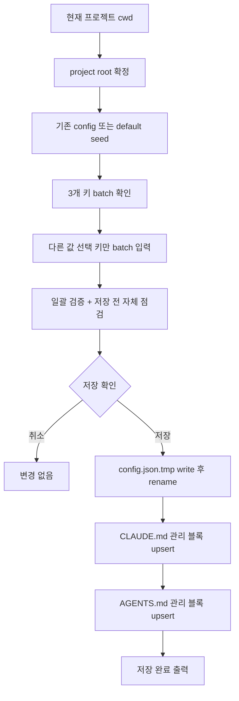
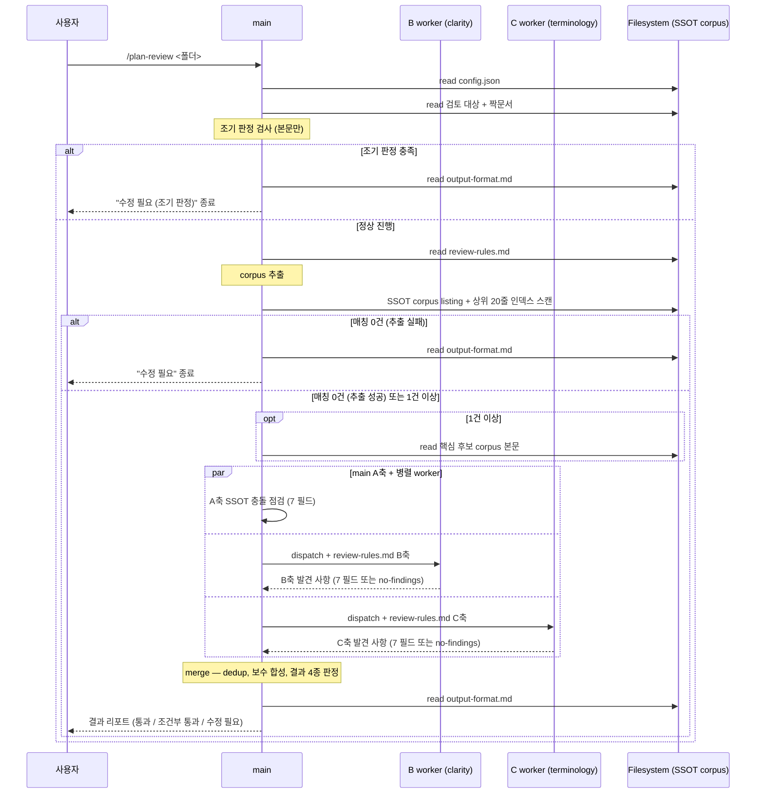
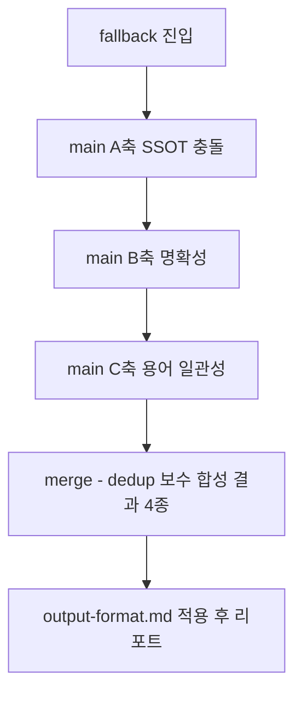

# product-team-kit 스킬 워크플로 상세

`skills-workflow.md`를 보강하는 구현 디테일 문서다. 분기별 lazy read 순서, dispatch 분류 기준, marker 정의, plan-format main 검증 항목, plan-review main + 2 worker 분담, SSOT corpus 인덱스 스캔, merge 합성 규칙, 병렬 시퀀스, fallback 동작을 정리한다.

상위 개요와 결정 트리는 [`./skills-workflow.md`](./skills-workflow.md)에 있다. 이 문서는 SKILL.md 단일 진실 소스를 깨지 않으며, 차이가 보이면 SKILL.md가 우선이다.

## 0. set-config 상세

`set-config`는 cwd의 git root 또는 cwd를 `<project-root>`로 잡고 `.product-team-kit/config.json`을 저장한다. `outputRoot`, `ssot.include`, `ssot.exclude`는 한 번의 질문 묶음으로 확인하고 다른 값이 필요한 키만 batch로 입력받는다. config 저장이 성공하면 같은 root의 `CLAUDE.md`와 `AGENTS.md` product-team-kit 관리 블록도 선택 없이 항상 생성·갱신한다.



Agent 안내 파일 규칙:

- `AGENT.md` 단수 파일은 만들지 않는다.
- 파일이 없으면 product-team-kit 관리 블록만 포함해 생성한다.
- 기존 관리 블록이 있으면 `<!-- product-team-kit:start -->` / `<!-- product-team-kit:end -->` 사이만 교체한다.
- 관리 블록이 없으면 파일 끝에 append한다.
- marker가 한쪽만 있으면 임의 복구하지 않고 해당 파일을 변경하지 않은 뒤 `agent-guide-write` 실패로 보고한다.

## 1. plan-format 상세

### 1.1 입력 dispatch 표

`<기획 입력 | 파일 | 디렉터리>` 인자 한 개. 기능명은 별도 인자로 받지 않고 본문/파일명/디렉터리명에서 추출한다.

| 입력 종류 | 판정 | 첫 행동 | 출처 표기 |
|---|---|---|---|
| 빈 입력 / 최소 입력 | 입력 없음 또는 기능명/키워드만 | 정보 부족 보류 | `사용자 입력` |
| 직접 텍스트 | 경로로 해석 불가 | 입력 본문 전체 사용 | `사용자 입력` |
| 기존 파일 경로 | 파일 존재 | UTF-8 텍스트 사용 | `로컬 확인: <파일경로>` |
| 기존 디렉터리 경로 | 디렉터리 존재 | 기본 제외 경로를 뺀 하위의 모든 읽을 수 있는 UTF-8 텍스트 파일을 상대경로 오름차순으로 통합 | `로컬 확인: <디렉터리경로> (읽은 텍스트 파일 N개)` |
| 없는 path-like | `/`·확장자·구분자 포함하나 미존재 | 직접 텍스트로 폴백 | `사용자 입력` |
| 주제 + 경로 혼합 | 문장 + 기존 경로 포함 | 사용자 문장 + 로컬 경로 내용 함께 사용 | `사용자 입력` + `로컬 확인: <경로>` |

디렉터리 입력 처리:

- 기본 제외 경로: `.git`, `node_modules`, `dist`, `build`, `coverage`, `.cache`, `vendor`, `__pycache__`
- 바이너리·권한 오류·UTF-8 디코딩 실패 → 실행 막지 않고 `[입력 제외 항목]`에 경로·이유 기록
- 기존 `_기능설계서.md` / `_정책서.md`는 참고 입력일 뿐 보류 사유 아님. 새 산출물은 항상 새 timestamp 폴더에 저장
- `<outputRoot>` 자체나 그 하위 입력도 사용자가 제공한 입력이면 일반 입력처럼 읽음

입력 크기·파일 개수 상한 없음은 의도된 계약이다. 기본 제외 경로 적용 후 남은 읽기 대상 텍스트는 truncate, 첫 N개 파일만 읽기, 일부 파일 샘플링 없이 모두 확인한다. 읽기 대상 텍스트 전체를 확인한 뒤 source index(경로/제목/heading/기능 후보/정책 후보/제외 후보)와 gate 근거 맵(기능 목적, 적용 대상, 핵심 행동, 기대 결과, 업무 판단 기준)을 만든다. 도구 실패나 환경 한계로 읽기 대상 텍스트 전체를 확인하지 못하면 일부 근거만으로 저장하지 않고 저장 보류로 종료한다.

다기능 입력 처리:

- 명시 주제, 파일명, 디렉터리명, 반복 등장 제목 순서로 주 기능 하나를 선택한다.
- 선택되지 않은 기능 후보는 본문에 섞지 않고 원본 문서 피드백 또는 입력 제외 항목으로 남긴다.
- 서로 독립적인 기능 후보 중 주 기능을 보수적으로 고를 수 없으면 저장 보류다. 한 호출에서 여러 timestamp 폴더를 만들지 않는다.

### 1.2 분류 기준 (귀속 라벨)

dispatch가 입력 단편마다 4개 라벨 중 하나를 부여: `feature` / `policy` / `both` / `excluded`.

| 입력 성격 | 귀속 문서 | 라벨 |
|---|---|---|
| 화면, 사용자 흐름, 진입점, 입력 항목, UI, 기능 동작, 사용자에게 보이는 결과, 가능 행위 | 기능설계서 | `feature` |
| 업무 판단 기준, 규칙, 조건, 제한, 정책, 원칙, 예외 승인 기준, 상태 처리 기준 | 정책서 | `policy` |
| 상태·권한·예외처럼 양쪽에 걸리는 항목 | 정책서(판단 기준) + 기능설계서(사용자 결과·가능 행위). 같은 표 중복 금지 | `both` |
| 디자인·개발·QA·운영 상세 | 본문 제외, 최소 맥락만 원본 문서 피드백에 한 줄 요약 | `excluded` |

**라벨 cross-bleed 금지**: 정책서 본문에 화면 동작·입력 방식·사용자 노출 결과 작성 금지. 기능설계서 본문에 허용/금지/조건/예외 판단 기준 작성 금지.

### 1.3 Marker 4종

`plan-review/references/review-rules.md`의 분류(필수 수정 / 발행 전 확인 / 참고)와 직결. 정의·표기·범위 변경 시 cross-skill 검증 필요.

| Marker | 의미 | 사용 시점 | 비고 |
|---|---|---|---|
| `[미정]` | 결정되지 않은 필수 판단 | 사용자가 모름, 공백/무응답/`모름`/`정하지 않음` | 빈 칸 전부가 아니라 문서 확정 영향 결정사항만 |
| `[가정]` | 입력 근거로 제한적으로 추론한 내용 | gate 통과 후 세부 보강용 | 확정 사실처럼 쓰지 않음 |
| `[확인 필요]` | 결정자 답변/후속 확인 필요 | gate 통과 후 세부 보강용 | 이유·결정 주체·후속 확인 방법 함께 |
| `[충돌 후보]` | 입력 내부 모순/중복/상충 | dispatch 시 발견 | 저장 차단 사유 아님. SSOT 충돌은 plan-review 책임 |

별도로 `해당 없음`은 marker 4종이 아닌 **셀 fill 문구**다. 입력에 명백히 해당 정보가 없을 때 빈 셀 대신 사용한다. 분류·합산·`미결 사항` 색인 대상이 아니며 `plan-review` review-rules 분류에도 들어가지 않는다.

규칙:

- 결정이 쓰이는 본문 문장 또는 표 셀에 inline 표시
- 문서당 marker 1건 이상 → `미결 사항` 섹션 (기능설계서 `## 8. 미결 사항`, 정책서 `## 10. 미결 사항`) 표에 항목 색인 (인덱스·항목·설명) 채움. marker 0건이면 row 1 의 항목·설명 셀을 `해당 없음`으로 채우고 인덱스 컬럼은 `1` 유지 (row·섹션 삭제 금지). 별도 `## 미확정·가정·확인 필요` 섹션은 만들지 않음
- 두 문서 marker 합산을 화면 출력 `[미확정·가정 항목]` / `확인 필요 질문` 섹션에 1회만 반영. 0건이면 화면 출력 섹션 생략 (본문 미결 사항 표는 위 규칙대로 유지)
- gate 통과 전 부족분 채우는 용도로 쓰지 않음 (gate fail이면 보류, marker로 우회 금지)
- `[확인 필요]`(inline) ≠ `확인 필요 질문`(출력 섹션 헤더)

### 1.4 main 검증 4가지

Step 4 본문 작성 후 저장 절차 진입 전 main이 수행한다. 모두 통과 시에만 `references/storage-contract.md`를 읽는다.

| 검사 | 실패 시 동작 |
|---|---|
| 빈 골격 검사 | 각 문서 섹션 1~5에 입력 근거 기반의 substance(marker·`해당 없음`이 아닌 문장 또는 표 셀)가 없으면 검증 실패 보류 분기로 전환. 다음 헤더부터 `Step 5: 보류 출력`로 단축하고 `output-contract.md` "저장 보류" 템플릿 출력 (`이유` 필드에 "step 4 검증 실패 — 빈 골격" 명시). 부족 항목에 빈 골격 분석 결과 추가 (예: "정책서 본문이 빈 골격 — policy 라벨 단편 부족") |
| 구조 일치 검사 | 기능설계서 1~8 (8=미결 사항), 정책서 1~10 (10=미결 사항) 섹션 헤더(번호·제목)와 admonition metadata 필드가 템플릿과 1:1인지 기계적으로 확인. 표는 컬럼명·컬럼 순서·컬럼 수가 템플릿과 동일해야 하며, 비어 있는 row·셀은 marker(`[미정]`/`[확인 필요]`) 또는 `해당 없음` fill 문구로 채움 (빈 셀 금지, row·컬럼 자체 삭제 금지). 섹션·metadata·표 컬럼이 어긋나면 1회 **국소 수정 retry** (어긋난 섹션·metadata·표 컬럼만 수정, 본문 재생성 금지), 2회 어긋나면 검증 실패 보류 fallback (`Step 5: 보류 출력` 단축, `이유` 필드에 "step 4 검증 실패 — 구조 불일치" 명시) |
| 중복 검사 | 같은 항목이 양쪽 문서에 중복 등장하면 전체 문서를 재작성하지 않고 위반 문장·행·셀만 국소 repair. 분류 기준 표에 따라 한쪽에만 남기고 다른 쪽 중복은 삭제 또는 이동 |
| 라벨 범위 검사 (cross-bleed) | 정책서의 화면 동작 또는 기능설계서의 판단 기준처럼 라벨 범위 위반이 있으면 전체 문서를 재작성하지 않고 위반 문장·행·셀만 이동·삭제·재서술 |

저장 절차: staging folder 생성 → 두 final 파일 **병렬 write** (단일 메시지에 동시 발행) → verify → rename → verify. verify·rename·종료 verify는 순차 유지. main이 일괄 처리.

### 1.5 분기별 실제 읽기 순서

| 분기 | 읽기 순서 |
|---|---|
| config fail | `config.json` → `output-contract.md` → 종료 |
| gate 보류 | `config.json` → 입력 → `output-contract.md` → 종료 |
| 검증 실패 보류 | `config.json` → 입력 → `templates/*` (병렬) → main 직접 작성·main 검증 실패 (빈 골격 또는 구조 불일치 retry 2회 fail) → `output-contract.md` → 종료 (`storage-contract.md` 안 읽음) |
| 정상 저장 | `config.json` → 입력 → `templates/*` (병렬) → main 직접 작성·main 검증 → `storage-contract.md` → 두 파일 병렬 저장 → `output-contract.md` → 종료 |

종료 분기에서 안 쓰는 파일을 읽으면 토큰 낭비이며 **금지**.

## 2. plan-review 상세

### 2.1 main vs worker 분담

A축은 SSOT corpus를 main이 보유·사용하므로 main이 직접 점검. B/C는 본문만 보면 되므로 worker로 분리해 병렬 호출.

| 책임 | 입력 | 출력 |
|---|---|---|
| main (A축 SSOT 충돌) | dispatch 결과 + SSOT corpus 본문 + `review-rules.md` A축 | 7 필드 발견 사항 list |
| `plan-review-clarity-worker` (B축) | dispatch 결과(본문만) + B축 inline | 7 필드 발견 사항만 |
| `plan-review-terminology-worker` (C축) | dispatch 결과(본문만) + C축 inline | 7 필드 발견 사항만 |

worker는 합성·결과 4종 판정·리포트 작성 안 함. 본문 수정·파일 write 안 함. 모두 main의 merge가 일괄 처리.

발견 0건 worker는 응답 끝에 `<!-- worker-flag: no-findings -->` 한 줄 명시.

### 2.2 발견 사항 7 필드 형식

main A축과 2 worker 모두 같은 7 필드 표 형식으로 반환.

상세 필드명·예시는 `references/review-rules.md`의 `## 발견 사항 필드`를 단일 진실 소스로 따른다. 형식 어긋나면 1회 retry, 2회 어긋나면 `검증 한계`에 기록 후 보수 합성. main A축은 main이 직접 작성하므로 retry 대상 아님.

### 2.3 SSOT corpus 후보 인덱스 스캔

corpus 매칭 후보가 1개 이상이면 전문 read 전에 인덱스 스캔으로 축소.

```
1. 후보 파일 listing                       (review-rules.md SSOT corpus 선택 규칙)
2. 후보 파일 상위 20줄 Bash 1회 호출 일괄 read
3. archive / deprecated / 낮은 버전 / 키워드 미매칭 → 과거 맥락 분류, 전문 read 제외
4. 핵심 후보만 전문 read
```

상세는 `review-rules.md` 규칙 4.5.

매칭 0건 분기:

| 케이스 | 처리 |
|---|---|
| (a) corpus 추출 성공 + 매칭 0건 | A축 `검증 대상 없음` + B/C worker 본문 점검 진행 |
| (b) corpus 추출 실패 | worker spawn 없이 즉시 `수정 필요`로 종료 |

### 2.4 merge·dedup·보수 합성 규칙

출력은 2층. 상단 통합 list는 dedup·보수 합성 적용. 하단 agent별 원본 블록은 raw 그대로 노출 (dedup·재합성 금지). 자세한 출력 구조는 `references/output-format.md`의 `## 출력 2층 구조`.

main A축 발견 + 2 worker(B/C) 발견 합치기. `references/review-rules.md`의 `## 합성 규칙` + `## 결과 4종 기준` + `## 보수 합성 우선순위` 적용.

| 단계 | 규칙 | 적용 면 |
|---|---|---|
| dedup | 위치 + 제목 + 근거 정규화 (NFC) | 상단 통합 |
| 분류 합성 | 보수 분류 (필수 수정 > 발행 전 확인 > 참고) | 상단 통합 |
| 결과 4종 판정 | 수정 필요 > 조건부 통과 > 통과 우선순위 | 판정 헤더 |
| 통과 조건 | main A축 발견 0건 + 2 worker 모두 `<!-- worker-flag: no-findings -->` | 판정 헤더 |
| raw 노출 | dedup·재합성 없이 agent 출력 그대로 | 하단 agent 원본 |

현재 대화 컨텍스트는 근거 아님. 대화에서 알게 된 배경·의도·작성 당시 판단은 검토 대상 파일 또는 SSOT 근거에 없으면 근거 부족.

### 2.5 분기별 실제 읽기 순서

| 분기 | 읽기 순서 |
|---|---|
| config 치명 | `config.json` → `output-format.md` → 종료(`set-config` 안내) |
| 입력 타입 fail (상위설계서 등) | `config.json` → 본문(타입 확인) → `output-format.md` → 종료 |
| 조기 판정 (수정 필요) | `config.json` → 본문/짝문서 → `output-format.md` → 종료 (review-rules·SSOT corpus·worker 안 함) |
| SSOT corpus 추출 실패 | `config.json` → 본문/짝문서 → `review-rules.md` → `output-format.md` → 종료 (worker spawn 안 함) |
| SSOT 매칭 0건 | `config.json` → 본문/짝문서 → `review-rules.md` → corpus listing 후 0건 확인 → main A축 `검증 대상 없음` + 2 worker(B/C) 본문 점검 → merge → `output-format.md` |
| 정상 | `config.json` → 본문/짝문서 → `review-rules.md` → corpus listing → corpus 본문 read → main A축 점검 + 2 worker(B/C) → merge → `output-format.md` |

### 2.6 main + 2 worker 병렬 시퀀스



### 2.7 fallback (병렬 호출 불가 환경)

Codex, MCP 단일 패스 환경 등 Agent 병렬 호출이 불가능하면 단일 패스 fallback. main이 3축을 순차 점검한다.



결과 형식은 병렬 호출 결과와 동일해야 한다.

## 3. SSOT 근거 경계 (상세)

[`./skills-workflow.md`](./skills-workflow.md)의 "SSOT 근거 경계" 표 외 corpus listing 절차를 보충.

```
1. config 확정          → outputRoot, ssot.include, ssot.exclude
2. include glob 적용    → 미지정/빈 배열이면 default
                         (Product Team Space/Product Department/Colonova Product/_AI_ 정책서 & 기능설계서/**/*.md)
3. exclude glob 누적    → default 제외(.git/, vendor/, node_modules/, build/, dist/, .cache/, generated/)
                         + <outputRoot>/** 자동 추가
                         + ssot.exclude 사용자 값
4. Markdown 후보 수집   → *.md, *.markdown
5. linked local resource → Markdown이 상대경로로 명시 참조한 것만
6. 인덱스 스캔 후 축소   → archive/deprecated/낮은 버전/키워드 미매칭 제외
7. 핵심 후보 전문 read
```

`<outputRoot>/` 산출물은 검토 대상으로 read 가능하지만 SSOT 근거로 승격하지 않는다. Confluence 등 외부 시스템 export Markdown은 일반 후보로만 취급, 특별 처리 없음.

## 4. 실패 처리 매트릭스

| 실패 종류 | 처리 위치 | 처리 방식 |
|---|---|---|
| config 비치명 검증 거부 (unknown key, ssot 배열 element 비문자열) | plan-format / plan-review | default fallback + 출력 끝에 `[설정 경고]` 블록 1회 |
| config 치명 (파일 없음, JSON 파싱, version, outputRoot) | plan-format / plan-review | strict-exit + `set-config` 안내 |
| CLAUDE.md/AGENTS.md 관리 marker 불완전 | set-config | 해당 파일 변경 안 함 + `agent-guide-write` 저장 실패 보고 |
| 입력 디렉터리 일부 파일 read 실패 (바이너리, 권한, UTF-8) | plan-format | 실행 막지 않고 `[입력 제외 항목]`에 경로·이유 |
| 빈 골격 main 검증 실패 | plan-format | 검증 실패 보류 분기 (`Step 5: 보류 출력`) — `이유` 필드에 "step 4 검증 실패 — 빈 골격" 명시 |
| 구조 일치 main 검증 1회 실패 | plan-format | 1회 국소 수정 retry (어긋난 섹션·metadata·표 컬럼만, 본문 재생성 금지) |
| 구조 일치 main 검증 2회 실패 | plan-format | 검증 실패 보류 fallback (`Step 5: 보류 출력`) — `이유` 필드에 "step 4 검증 실패 — 구조 불일치" 명시 |
| worker 7 필드 형식 어긋남 1회 | plan-review | 1회 retry |
| worker 7 필드 형식 어긋남 2회 | plan-review | `검증 한계`에 기록 후 보수 합성 |
| Agent 병렬 호출 불가 환경 | plan-review | 단일 패스 fallback (main 순차 점검) |
| SSOT corpus 추출 실패 | plan-review | worker spawn 없이 즉시 `수정 필요` |
| SSOT 매칭 0건 (추출 성공) | plan-review | A축 `검증 대상 없음` + B/C 본문만 점검 |
| 짝문서 없음 | plan-review | 단일 검토 진행 + `검증 한계`에 `짝문서 없음` 기록. 다른 문서 정책/기능 판단 의존 시 분류 상향 |

## 5. Reference Map

| 주제 | 기준 파일 |
|---|---|
| 워크플로 개요 | [`./skills-workflow.md`](./skills-workflow.md) |
| 공유 설정 계약 | [`../references/config-contract.md`](../references/config-contract.md) |
| `set-config` 계약 | [`../skills/set-config/SKILL.md`](../skills/set-config/SKILL.md) |
| `plan-format` 계약 | [`../skills/plan-format/SKILL.md`](../skills/plan-format/SKILL.md) |
| `plan-format` 저장 contract | [`../skills/plan-format/references/storage-contract.md`](../skills/plan-format/references/storage-contract.md) |
| `plan-format` 출력 contract | [`../skills/plan-format/references/output-contract.md`](../skills/plan-format/references/output-contract.md) |
| `plan-format` 템플릿 | [`../skills/plan-format/templates/`](../skills/plan-format/templates/) |
| `plan-review` 계약 | [`../skills/plan-review/SKILL.md`](../skills/plan-review/SKILL.md) |
| `plan-review` 판정·합성 규칙 (7 필드 / 합성 / 결과 4종 / 보수 합성 / SSOT corpus 선택) | [`../skills/plan-review/references/review-rules.md`](../skills/plan-review/references/review-rules.md) |
| `plan-review` 출력 템플릿 | [`../skills/plan-review/references/output-format.md`](../skills/plan-review/references/output-format.md) |
| `plan-review` B/C worker | [`../agents/`](../agents/) |
