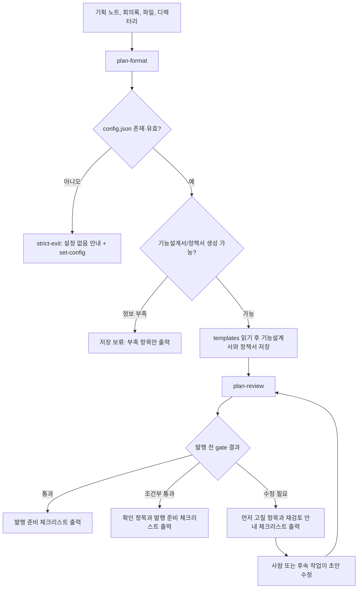
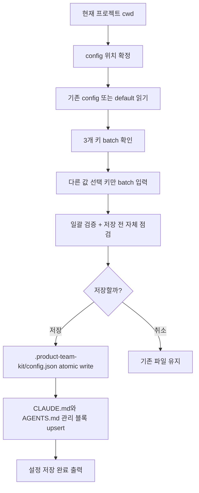
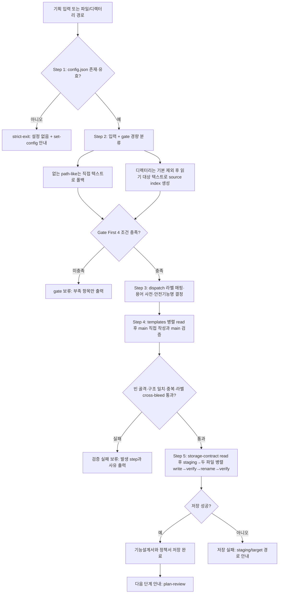
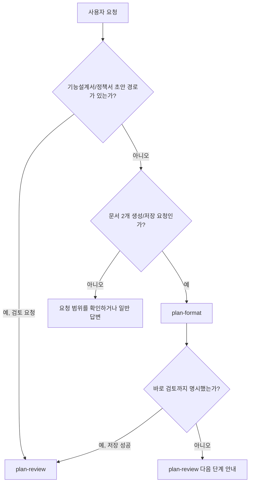

# product-team-kit 스킬 워크플로

`product-team-kit`은 로컬 설정과 프로젝트 agent 안내 파일을 먼저 잡고(`set-config`), 기획 입력을 로컬 초안 두 문서로 정리한 뒤(`plan-format`), 외부 반영 전에 2축(SSOT 충돌·용어 일관성)으로 검토하는(`plan-review`) 제품팀 워크플로다. `plan-format`과 `plan-review`는 필요한 파일을 필요한 단계에서만 읽는 lazy read 계약을 따른다.

이 문서는 README의 빠른 시작보다 한 단계 자세히, 어떤 스킬을 언제 선택하고 어떤 산출물로 이어지는지 설명한다.

## 전체 스킬 맵

| 스킬 | 역할 | 주요 입력 | 주요 산출물 | 다음 단계 |
|---|---|---|---|---|
| `set-config` | `.product-team-kit/config.json`과 agent 안내 블록을 대화형으로 만든다 | 현재 프로젝트 cwd, 기존 config, 기존 `CLAUDE.md`/`AGENTS.md` | `.product-team-kit/config.json`, `CLAUDE.md`, `AGENTS.md` product-team-kit 관리 블록 | `plan-format` 또는 `plan-review` |
| `plan-format` | 충분한 기획 입력을 기능설계서와 정책서 로컬 초안으로 나눈다 | 기획 노트, 회의록, AI 대화 결과물, 문서 스크랩, 파일 경로, 디렉터리 경로 | `[안전기능명]_기능설계서.md`, `[안전기능명]_정책서.md` | `plan-review` |
| `plan-review` | 기능설계서/정책서 초안을 발행 전 gate로 검토한다 | 초안 폴더 또는 기능설계서/정책서 파일 | `통과`, `조건부 통과`, `수정 필요` 판단과 기획팀용 리포트 | 사람의 반영 또는 초안 수정 |

## Lazy read 기준

| 스킬 | 먼저 읽는 것 | 통과 후 읽는 것 | 종료 분기에서 읽지 않는 것 |
|---|---|---|---|
| `plan-format` | `.product-team-kit/config.json` | 입력, templates, storage/output contract | config 실패 시 입력/templates/storage contract, gate 보류 시 templates/storage contract, 검증 실패 보류 시 storage contract |
| `plan-review` | `.product-team-kit/config.json`, 검토 대상 타입 | 검토 대상 본문, `review-rules.md`, corpus 매칭 후 좁힌 SSOT corpus, `output-format.md` | config 실패·문서 타입 실패 시 review rules/SSOT corpus, SSOT 매칭 0건 시 corpus 본문 |

### plan-review 종료 분기별 lazy read 경계

| 분기 | review-rules.md | SSOT corpus 본문 | worker 실행 |
|---|:---:|:---:|:---:|
| config 치명 오류 | X | X | X |
| 지원하지 않는 문서 타입 | X | X | X |
| SSOT corpus 추출 실패 | O | X | X |
| SSOT 매칭 0건 | O | X | O (B 본문만) |
| 정상 | O | O (축소 후보만) | O |

## SSOT 근거 경계

Product Docs SSOT는 현재 프로젝트의 Markdown과 그 Markdown이 상대경로로 명시 참조한 로컬 resource다.

| 항목 | 포함 여부 | 비고 |
|---|:---:|---|
| 현재 프로젝트 `*.md` / `*.markdown` (정책·PRD·기능설계·운영/QA) | O | `ssot.include` glob으로 좁힘 |
| 위 Markdown이 상대경로로 참조한 로컬 resource | O | 명시 참조만 |
| `<outputRoot>/` 산출물 | X (검토 대상은 가능, 근거 X) | 항상 SSOT exclude |
| `.git/`, `node_modules/`, `vendor/`, `build/`, `dist/`, `.cache/`, `generated/` | X | default 제외 |
| 코드 파일, 설정 파일 | X | |
| 외부 URL | X | |
| Markdown에서 미참조 독립 resource | X | |
| 외부 시스템(Confluence 등) export Markdown | △ | 일반 Product Docs 후보로만 취급, 특별 처리 없음 |

## 호출 방식

| 환경 | set-config | plan-format | plan-review |
|---|---|---|---|
| Claude Code | `/product-team-kit:set-config` | `/product-team-kit:plan-format` | `/product-team-kit:plan-review` |
| Codex | `$set-config` | `$plan-format` | `$plan-review` |

## 전체 흐름



## Skill 0. set-config

### 설명

`set-config`는 사용처 프로젝트의 `.product-team-kit/config.json`과 프로젝트 agent 안내 블록을 함께 대화형으로 만들거나 갱신한다. `outputRoot`, `ssot.include`, `ssot.exclude`는 한 번의 질문 묶음으로 확인하고, 다른 값이 필요한 키만 batch로 입력받는다. config 저장이 성공하면 같은 프로젝트 루트의 `CLAUDE.md`와 `AGENTS.md`에 product-team-kit 관리 블록을 항상 생성·갱신한다. 이 설정은 `plan-format`의 저장 root와 `plan-review`의 SSOT corpus 범위를 결정하고, agent 안내 블록은 일반 agent가 해당 SSOT 범위를 먼저 읽도록 안내한다.

### 선택 기준

`set-config`를 선택한다:

- `.product-team-kit/config.json`과 프로젝트 agent 안내 파일을 처음 만들어야 한다.
- 초안 저장 root인 `outputRoot`를 바꿔야 한다.
- `plan-review`가 읽을 Product Docs SSOT allow-list 또는 exclude glob을 조정해야 한다.

`set-config`를 선택하지 않는다:

- 기획 입력을 기능설계서/정책서로 변환해야 하는 경우: `plan-format`
- 이미 생성된 초안을 검토해야 하는 경우: `plan-review`
- 현재 effective config 확인만 필요한 경우: 설정 파일을 직접 읽어 확인

### Workflow



## Skill 1. plan-format

### 설명

`plan-format`은 기획 입력을 기능설계서와 정책서 초안으로 정리하는 formatting 스킬이다. config를 먼저 확인하고, 통과한 뒤에만 입력을 읽어 충분한지 판단한다. 입력이 충분하면 templates를 읽고 두 문서를 하나의 저장 단위로 생성한다.

입력이 부족하면 질문하지 않고 저장 보류를 반환한다. 보류 출력에는 부족 항목만 포함하고 보강용 입력 템플릿은 만들지 않는다.

Product Docs SSOT 근거 검증은 하지 않는다. 검증은 `plan-review` 책임이다.

`plan-format`은 파일 크기와 무관하게 main이 기능설계서와 정책서 본문을 같은 턴에 직접 작성한다. 기능설계서/정책서 worker로 분리하지 않으며, 입력 크기와 파일 개수 상한은 두지 않는다. 큰 입력은 기본 제외 경로 적용 후 남은 읽기 대상 텍스트를 자르거나 샘플링하지 않고 전체 확인한 뒤 source index와 gate 근거 맵으로 압축한다. 비용은 섹션 6 이상 tail 압축(표 row 셀을 marker 또는 `해당 없음` fill 문구로 채움 — 빈 위치 보존 원칙), 표 컬럼 일치 검증, 중복/cross-bleed 국소 repair로 제어한다.

### 선택 기준

`plan-format`을 선택한다:

- 기획 노트, 회의록, AI 대화 결과물, 초안 문서 스크랩, 기획자료 디렉터리를 기능설계서와 정책서로 정리해야 한다.
- 기획 입력을 기능설계서와 정책서 로컬 초안으로 생성하려는 의도가 있다. 저장 가능 여부는 Gate First가 판정한다.
- 저장 보류가 나온 뒤 부족 항목을 보강해 다시 문서 생성을 시도한다.

`plan-format`을 선택하지 않는다:

- 이미 생성된 기능설계서/정책서 초안을 검토해야 하는 경우: `plan-review`
- 단순 질의응답, 아이디어 탐색, 문서 생성 없는 일반 상담이 목적인 경우: 일반 답변

### Workflow



### Gate First 4 조건

Step 2에서 입력 dispatch 후 아래 4 조건을 모두 충족해야 통과. 통과 전에는 저장 폴더·임시 파일을 만들지 않는다.

| # | 조건 | 충족 기준 |
|---|---|---|
| 1 | 기능 목적 또는 기능명 | 기능명, 문제, 목적 중 한 문장 요약 가능 |
| 2 | 적용 대상 또는 업무 범위 | 사용자, 역할, 조직, 업무 대상, 포함 범위 중 확인 가능 |
| 3 | 핵심 사용자 행동 + 기대 결과 | 사용자 행동 1개 + 사용자에게 보이는 결과 1개 이상 |
| 4 | 주요 조건/정책/제약 | 허용/금지/조건/예외/제한/판단 기준 중 업무 판단 기준 1개 이상 |

추가 최소 내용 검사:

- 기능설계서 최소: 사용자 행동 + 사용자에게 보이는 결과 1개 이상
- 정책서 최소: 업무 판단 기준 1개 이상
- 한쪽이 빈 골격에 가까우면 보류

부서 경계 (제외 대상): 디자인 상세(컬러·폰트·Figma), 최종 UX copy, QA 케이스, API 명세, DB schema, 운영 런북, 개발 작업 분해. 위 상세가 입력의 주된 내용이고 제품·업무 판단 정보가 부족하면 보류한다.

조건 미충족 시 templates·storage contract·저장 폴더는 만들거나 읽지 않는다. 디렉터리 입력은 기본 제외 경로를 적용한 뒤 하위의 모든 읽을 수 있는 UTF-8 텍스트 파일을 통합한다. 입력 크기와 파일 개수 상한은 없고, truncate·첫 N개 파일만 읽기·일부 파일 샘플링은 금지한다. 읽기 대상 텍스트 전체를 확인하지 못하면 일부 근거만으로 저장하지 않고 저장 보류로 종료한다. 읽을 수 없는 파일은 보류 사유가 아니며, 저장 완료 시 `[읽기 제외 항목]`, 저장 보류 시 기존 `[입력 제외 항목]`에 남긴다. Python·Node·CLI helper 설치 전제 없음.

### 산출물

일반 입력, 존재하지 않는 path-like 입력, 파일 입력, 디렉터리 입력은 새 timestamp 폴더에 저장한다. `<outputRoot>` 기본값은 `planning`이다:

```text
<outputRoot>/[안전기능명]--YYYY-MM-DD-HHMMSS/[안전기능명]_기능설계서.md
<outputRoot>/[안전기능명]--YYYY-MM-DD-HHMMSS/[안전기능명]_정책서.md
```

### 출력 4종

`references/output-contract.md` 템플릿 4종을 종료 분기 확정 후 1회 read 적용.

| 분기 | 템플릿 | 후속 |
|---|---|---|
| 저장 완료 | "저장 완료" | `plan-review` 다음 단계 안내 |
| 입력 부족 (Gate First 미통과) | "저장 보류" — 부족 항목만 | 보강 후 재실행 (보강용 입력 템플릿·질문 섹션 안 만듦) |
| 검증 실패 보류 (빈 골격·구조 불일치 retry 2회 fail) | "저장 보류" — `이유` 필드에 발생 step 명시 | 입력 보강 후 재실행 (storage-contract 안 읽음) |
| config 없음/실패 | "설정 없음" | `set-config` 안내 |
| 저장 단계 실패 | "저장 실패" | staging/target 경로 안내 |

## Skill 2. plan-review

### 설명

`plan-review`는 `plan-format`으로 저장한 기능설계서/정책서 초안을 외부 반영 전에 검토하는 gate다. 템플릿 모양만 보는 검사가 아니라, Product Docs SSOT 충돌과 용어 일관성을 2축으로 확인한다. 다만 SSOT corpus는 먼저 키워드로 좁히고, 직접 관련된 Markdown과 필요한 linked local resource만 읽는다.

검토 대상은 `<outputRoot>/` 아래 초안일 수 있지만, `<outputRoot>/` 파일은 SSOT 근거로 사용하지 않는다.

### 2축 정의

| 축 | 점검 대상 | 담당 | 비고 |
|---|---|---|---|
| A. SSOT 충돌 | 초안 확정 문장 vs Product Docs SSOT current evidence | main 직접 | corpus 0건 시 `검증 대상 없음` |
| B. 용어 일관성 | 역할명·상태명·권한명·화면명·도메인 stem 통일성 | `plan-review-terminology-worker` | 본문만 |

발견 사항은 분류(필수 수정 / 발행 전 확인 / 참고)와 함께 기록. 합성 우선순위: `수정 필요 > 조건부 통과 > 통과`. 마커(`[미정]`/`[가정]`/`[확인 필요]`/`[충돌 후보]`) 자체는 plan-format 책임 영역이며, plan-review는 마커 자체로 결과를 낮추지 않는다. 다만 마커 본문이 SSOT와 충돌하거나 용어 어긋남에 해당하면 각 축 발견으로 기록한다.

### 선택 기준

`plan-review`를 선택한다:

- 기존 초안 폴더나 기능설계서/정책서 파일을 검토해야 한다.
- 외부 공유 또는 팀 문서 반영 전에 통과 여부를 판단해야 한다.
- Product Docs SSOT와 초안 사이의 충돌, 용어 일관성을 확인해야 한다.

`plan-review`를 선택하지 않는다:

- 기능설계서/정책서 초안을 아직 만들지 않은 경우: `plan-format`
- 초안 검토가 아니라 새 문서 생성이 목적인 경우: `plan-format`

### Workflow

```mermaid
flowchart TD
    A[초안 폴더 또는 기능설계서/정책서 파일] --> B[config 확인]
    B --> C[검토 대상과 짝문서 확정]
    C --> D{지원 문서 타입인가?}
    D -- 아니오 --> E[올바른 검토 대상이 아님 안내]
    D -- 예 --> F[검토 대상 본문 직접 읽기]
    F --> G[corpus 추출 (키워드·도메인·역할명·상태·권한 등)]
    G --> H{SSOT 후보 매칭?}
    H -- 1건 이상 --> I[필요 corpus와 linked local resource 읽기]
    H -- 0건 --> I0[A축 검증 대상 없음 처리]
    I --> J[main A축 점검 + B worker(용어 일관성) 점검]
    I0 --> J
    J --> K[발견 사항 dedup과 보수 합성]
    K --> L{최종 결과}
    L -- 통과 --> M[기획팀용 리포트와 발행 준비 체크리스트 출력]
    L -- 조건부 통과 --> N[확인 항목과 발행 준비 체크리스트 출력]
    L -- 수정 필요 --> O[먼저 고칠 항목과 재검토 안내 체크리스트 출력]
```

### 결과 기준

| 결과 | 의미 |
|---|---|
| `통과` | 중요한 가정, 충돌, 필수 수정, 발행 전 확인, 검증 한계가 없고 근거가 충분하다 |
| `조건부 통과` | 남은 문제가 명시적이고 기획자가 발행 전에 확인하거나 수용할 수 있다 |
| `수정 필요` | 충돌, 불명확한 규칙, 근거 없는 가정 때문에 발행 판단이 달라질 수 있다 |
| `올바른 검토 대상이 아님` | 기능/화면설계서 또는 정책서 초안이 아닌 입력이라 검토를 수행하지 않는다 |

최종 취합은 `수정 필요 > 조건부 통과 > 통과` 순서로 보수적으로 결정한다.

## Routing Decision Tree



## 산출물 경계

- `<outputRoot>/` 아래 산출물은 로컬 초안 템플릿이며 공식 팀 문서가 아니다.
- `plan-format`은 외부 시스템에 직접 게시하지 않는다.
- `plan-format`은 Product Docs SSOT 근거 검증을 수행하지 않는다.
- `plan-format`은 config 실패나 저장 보류 분기에서 templates와 storage contract를 읽지 않는다.
- `plan-review`는 초안을 직접 수정하지 않고, 기획팀용 리포트와 발행 준비 체크리스트 또는 재검토 안내 체크리스트를 출력한다.
- `plan-review`는 config 실패, 문서 타입 실패, SSOT corpus 추출 실패 분기에서 불필요한 corpus read와 worker 실행을 하지 않는다.
- Product Docs SSOT는 현재 프로젝트의 Markdown과 그 Markdown이 상대경로로 참조한 로컬 resource다.
- 코드, 설정, 빌드 산출물, dependency/vendor, 외부 URL, `<outputRoot>/` 산출물은 SSOT 근거에서 제외한다.

## 다음 문서

구현 디테일(분기별 read 순서, dispatch 분류, marker, plan-format main 검증, plan-review main + worker 분담, 인덱스 스캔, merge 합성, 병렬 시퀀스 다이어그램, fallback)은 [`./skills-workflow-detail.md`](./skills-workflow-detail.md)를 참고한다.

## Reference Map

| 주제 | 기준 파일 |
|---|---|
| 스킬 개요 | [`../README.md`](../README.md) |
| 워크플로 상세 | [`./skills-workflow-detail.md`](./skills-workflow-detail.md) |
| 공유 설정 계약 | [`../references/config-contract.md`](../references/config-contract.md) |
| `set-config` 계약 | [`../skills/set-config/SKILL.md`](../skills/set-config/SKILL.md) |
| `plan-format` 계약 (3-step + 입력 dispatch + 분류 + marker) | [`../skills/plan-format/SKILL.md`](../skills/plan-format/SKILL.md) |
| `plan-review` 계약 | [`../skills/plan-review/SKILL.md`](../skills/plan-review/SKILL.md) |
| `plan-format` 저장 위치·안전기능명·collision suffix | [`../skills/plan-format/references/storage-contract.md`](../skills/plan-format/references/storage-contract.md) |
| `plan-format` 사용자 출력 형식 (저장 완료/보류/설정 없음/저장 실패) | [`../skills/plan-format/references/output-contract.md`](../skills/plan-format/references/output-contract.md) |
| `plan-review` 판정·합성 규칙 | [`../skills/plan-review/references/review-rules.md`](../skills/plan-review/references/review-rules.md) |
| `plan-review` 출력 템플릿 | [`../skills/plan-review/references/output-format.md`](../skills/plan-review/references/output-format.md) |
