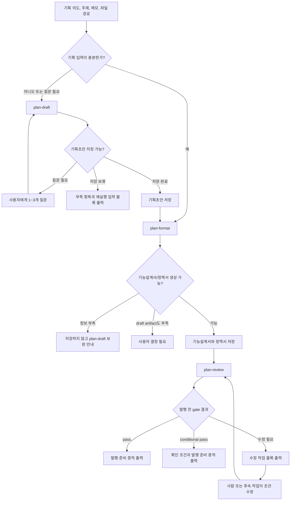
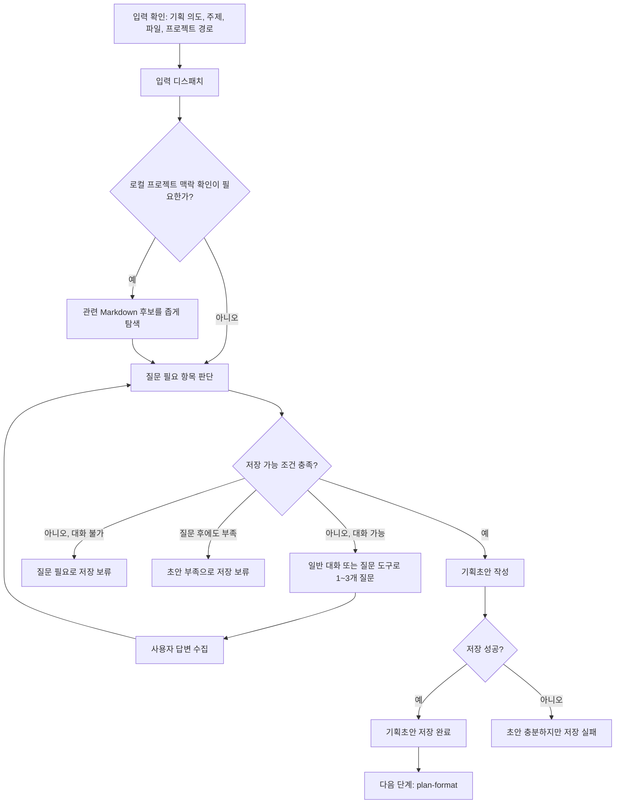
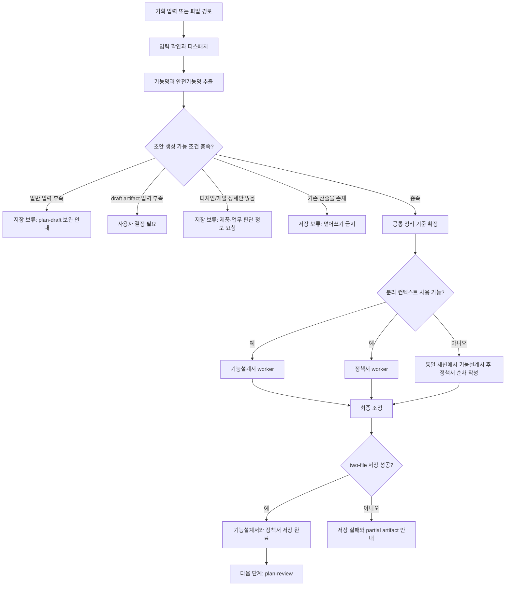
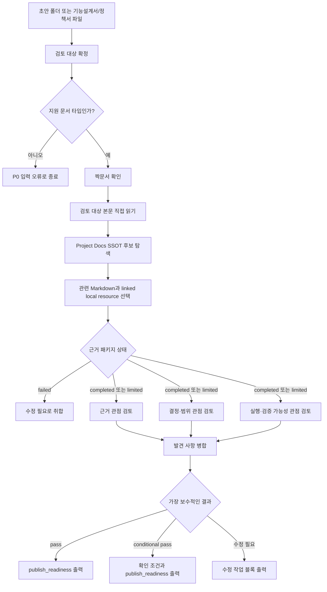
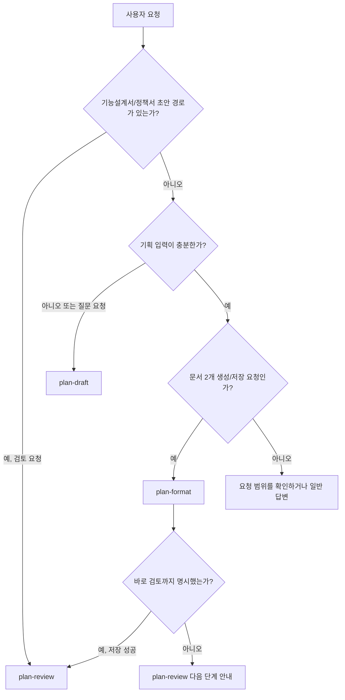

# product-team-kit 스킬 워크플로

`product-team-kit`은 기획을 바로 문서화하는 도구가 아니라, 기획 입력을 만들고(`plan-draft`), 로컬 초안 두 문서로 정리하고(`plan-format`), 외부 반영 전에 검토하는(`plan-review`) 3단계 제품팀 워크플로다.

이 문서는 README의 빠른 시작보다 한 단계 자세히, 어떤 스킬을 언제 선택하고 어떤 산출물로 이어지는지 설명한다.

## 전체 스킬 맵

| 스킬 | 역할 | 주요 입력 | 주요 산출물 | 다음 단계 |
|---|---|---|---|---|
| `plan-draft` | 질문으로 핵심 모호함을 줄여 `plan-format` 입력용 기획초안을 만든다 | 기획 의도, 주제, 파일 경로, 로컬 프로젝트 경로 | `planning/[안전기능명]--YYYY-MM-DD-HHMMSS/[안전기능명]_기획초안.md` | `plan-format` |
| `plan-format` | 충분한 기획 입력을 기능설계서와 정책서 로컬 초안으로 나눈다 | 기획초안, 기획 노트, 회의록, AI 대화 결과물, 문서 스크랩 | `[안전기능명]_기능설계서.md`, `[안전기능명]_정책서.md` | `plan-review` |
| `plan-review` | 기능설계서/정책서 초안을 발행 전 gate로 검토한다 | 초안 폴더 또는 기능설계서/정책서 파일 | `pass`, `conditional pass`, `수정 필요` 판단과 근거/수정 블록 | 사람의 반영 또는 초안 수정 |

## 호출 방식

| 환경 | plan-draft | plan-format | plan-review |
|---|---|---|---|
| Claude Code | `/product-team-kit:plan-draft` | `/product-team-kit:plan-format` | `/product-team-kit:plan-review` |
| Codex | `$plan-draft` | `$plan-format` | `$plan-review` |

## 전체 흐름



## Skill 1. plan-draft

### 설명

`plan-draft`는 사용자가 아직 기획을 정리하는 단계에서 사용한다. 기능 목적, 사용자, 범위, 정책 조건, 화면 흐름, 예외, 권한, 상태, 확인 기준을 질문으로 좁히고 `plan-format`에 넘길 수 있는 기획초안을 저장한다.

직접 기능설계서나 정책서를 만들지 않고, 발행 전 근거 검증도 하지 않는다.

### 선택 기준

`plan-draft`를 선택한다:

- 질문하면서 기획 방향을 잡아야 한다.
- 문제, 사용자, 범위, 정책 조건이 아직 모호하다.
- `plan-format`이 정보 부족으로 저장 보류했다.
- 기능설계서/정책서 생성 전에 입력을 정리해야 한다.

`plan-draft`를 선택하지 않는다:

- 이미 충분한 기획 입력을 문서 2개로 정리하려는 경우: `plan-format`
- 이미 생성된 초안을 발행 전 검토하려는 경우: `plan-review`

### Workflow



### 저장 가능 조건

모두 충족해야 한다:

- 기능명이 있다.
- 문제 또는 목적을 한 문장으로 설명할 수 있다.
- 주요 사용자 또는 업무 범위를 설명할 수 있다.
- 핵심 사용자 행동과 기대 결과가 1개 이상 있다.
- 정책, 조건, 제약 중 최소 1개 이상 있다.

### 산출물

```text
planning/[안전기능명]--YYYY-MM-DD-HHMMSS/[안전기능명]_기획초안.md
```

기획초안에는 문제와 목적, 사용자와 업무 범위, 포함/제외 범위, 사용자 흐름, 정책과 조건, 상태/권한/예외, 화면 또는 입력 정보, 확인 기준, 로컬 출처, 미정/가정/확인 필요 질문이 포함된다.

## Skill 2. plan-format

### 설명

`plan-format`은 기획 입력을 기능설계서와 정책서 초안으로 정리하는 formatting 스킬이다. 입력이 충분한지 먼저 판단하고, 충분하면 두 문서를 하나의 저장 단위로 생성한다.

Project Docs SSOT 근거 검증은 하지 않는다. 검증은 `plan-review` 책임이다.

### 선택 기준

`plan-format`을 선택한다:

- 기획 노트, 회의록, AI 대화 결과물, 초안 문서 스크랩을 기능설계서와 정책서로 정리해야 한다.
- `plan-draft` 산출 `_기획초안.md`를 문서 2개로 변환해야 한다.
- 입력에 기능 목적, 대상, 핵심 행동, 주요 조건이 충분히 있다.

`plan-format`을 선택하지 않는다:

- 질문하면서 기획 방향을 잡아야 하는 경우: `plan-draft`
- 이미 생성된 기능설계서/정책서 초안을 검토해야 하는 경우: `plan-review`

### Workflow



### 생성 가능 조건

각 항목을 1개 이상 충족해야 한다:

- 기능 목적 또는 기능명: 기능명, 문제, 목적 중 한 문장 요약 가능
- 적용 대상 또는 업무 범위: 사용자, 역할, 조직, 업무 대상, 포함 범위 중 확인 가능
- 핵심 사용자 행동과 기대 결과: 행동 1개와 결과 1개
- 주요 조건/정책/제약: 허용, 금지, 조건, 예외, 제한, 판단 기준 중 확인 가능

### 산출물

일반 입력은 새 timestamp 폴더에 저장한다:

```text
planning/[안전기능명]--YYYY-MM-DD-HHMMSS/[안전기능명]_기능설계서.md
planning/[안전기능명]--YYYY-MM-DD-HHMMSS/[안전기능명]_정책서.md
```

`plan-draft` 산출 `_기획초안.md`를 입력으로 받으면 같은 기획초안 폴더를 재사용한다.

## Skill 3. plan-review

### 설명

`plan-review`는 `plan-format`으로 저장한 기능설계서/정책서 초안을 외부 반영 전에 검토하는 gate다. 템플릿 모양만 보는 검사가 아니라, Project Docs SSOT 근거, 결정·범위, 실행·검증 가능성을 확인한다.

검토 대상은 `planning/` 아래 초안일 수 있지만, `planning/` 파일은 SSOT 근거로 사용하지 않는다.

### 선택 기준

`plan-review`를 선택한다:

- 기존 초안 폴더나 기능설계서/정책서 파일을 검토해야 한다.
- 외부 공유 또는 팀 문서 반영 전에 pass 여부를 판단해야 한다.
- Project Docs SSOT와 초안 사이의 충돌, 누락, 실행 가능성을 확인해야 한다.

`plan-review`를 선택하지 않는다:

- 기획 입력 자체가 아직 부족한 경우: `plan-draft`
- 기능설계서/정책서 초안을 아직 만들지 않은 경우: `plan-format`

### Workflow



### 결과 기준

| 결과 | 의미 |
|---|---|
| `pass` | 중요한 가정, 충돌, 수정 포인트, 확인 조건, 검증 한계가 없고 근거가 충분하다 |
| `conditional pass` | 남은 문제가 명시적이고 기획자가 발행 전에 확인하거나 수용할 수 있다 |
| `수정 필요` | 누락된 결정, 충돌, 불명확한 규칙, 근거 없는 가정 때문에 구현 또는 운영 판단이 달라질 수 있다 |

최종 취합은 `수정 필요 > conditional pass > pass` 순서로 보수적으로 결정한다.

## Routing Decision Tree



## 산출물 경계

- `planning/` 아래 산출물은 로컬 초안 템플릿이며 공식 팀 문서가 아니다.
- `plan-draft`와 `plan-format`은 외부 시스템에 직접 게시하지 않는다.
- `plan-format`은 Project Docs SSOT 근거 검증을 수행하지 않는다.
- `plan-review`는 초안을 직접 수정하지 않고, 수정 포인트 또는 발행 준비 증적을 출력한다.
- Project Docs SSOT는 현재 프로젝트의 Markdown과 그 Markdown이 상대경로로 참조한 로컬 resource다.
- 코드, 테스트, 설정, 빌드 산출물, dependency/vendor, 외부 URL, `planning/` 산출물은 SSOT 근거에서 제외한다.

## Reference Map

| 주제 | 기준 파일 |
|---|---|
| 스킬 개요 | [`../README.md`](../README.md) |
| `plan-draft` 계약 | [`../skills/plan-draft/SKILL.md`](../skills/plan-draft/SKILL.md) |
| `plan-format` 계약 | [`../skills/plan-format/SKILL.md`](../skills/plan-format/SKILL.md) |
| `plan-review` 계약 | [`../skills/plan-review/SKILL.md`](../skills/plan-review/SKILL.md) |
| 저장 위치와 atomic write | [`../references/storage-contract.md`](../references/storage-contract.md) |
| 사용자 출력 형식 | [`../references/output-contract.md`](../references/output-contract.md) |
| `plan-format` worker 계약 | [`../skills/plan-format/references/worker-contract.md`](../skills/plan-format/references/worker-contract.md) |
| `plan-review` gate 기준 | [`../skills/plan-review/references/review-gate.md`](../skills/plan-review/references/review-gate.md) |
