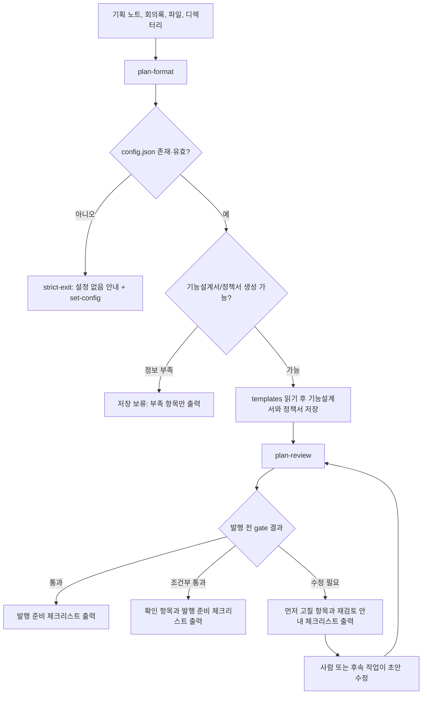
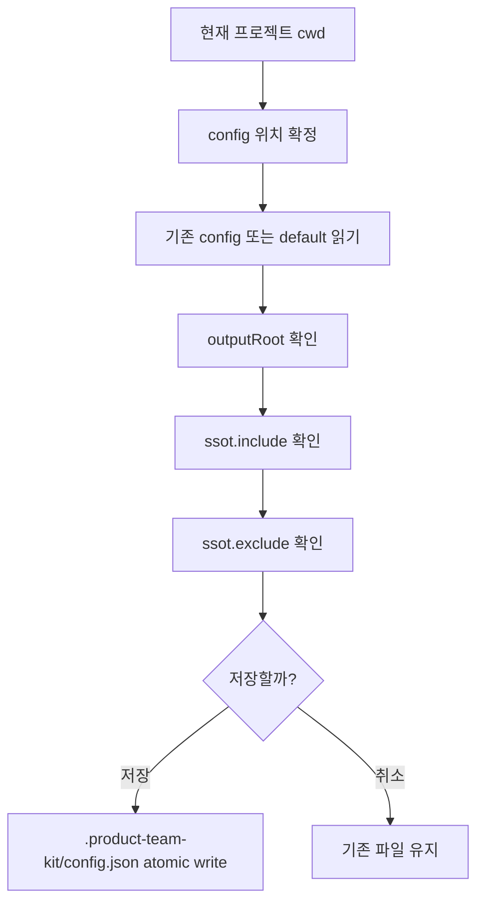
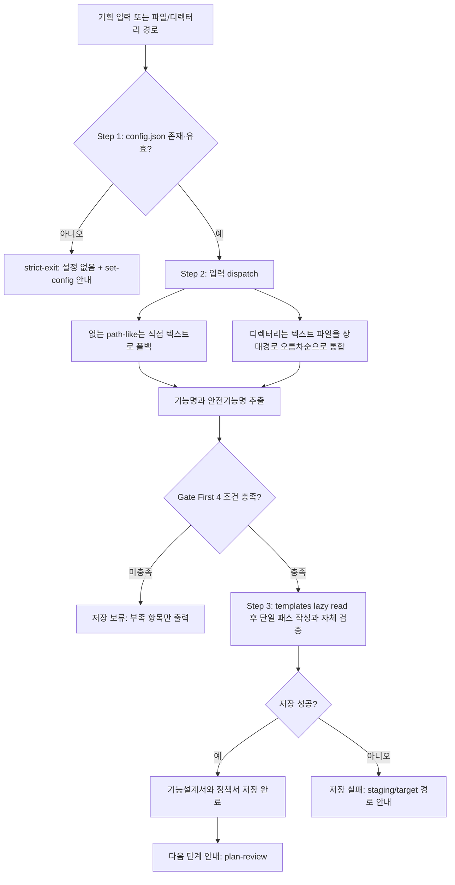
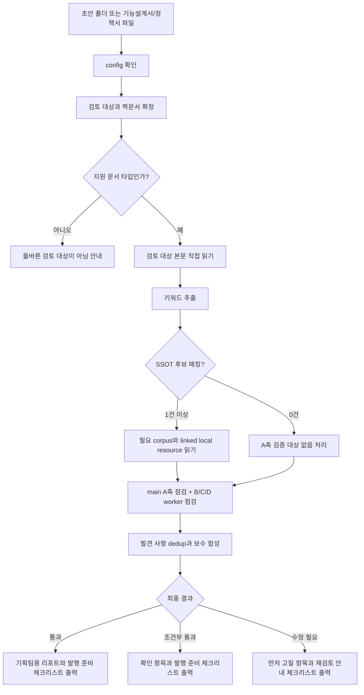
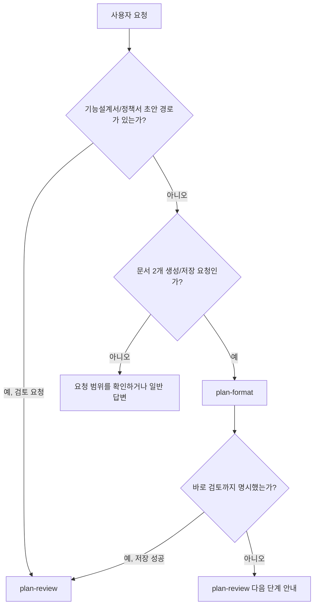

# product-team-kit 스킬 워크플로

`product-team-kit`은 로컬 설정을 먼저 잡고(`set-config`), 기획 입력을 로컬 초안 두 문서로 정리한 뒤(`plan-format`), 외부 반영 전에 4축으로 검토하는(`plan-review`) 제품팀 워크플로다. `plan-format`과 `plan-review`는 필요한 파일을 필요한 단계에서만 읽는 lazy read 계약을 따른다.

이 문서는 README의 빠른 시작보다 한 단계 자세히, 어떤 스킬을 언제 선택하고 어떤 산출물로 이어지는지 설명한다.

## 전체 스킬 맵

| 스킬 | 역할 | 주요 입력 | 주요 산출물 | 다음 단계 |
|---|---|---|---|---|
| `set-config` | `.product-team-kit/config.json`을 대화형으로 만든다 | 현재 프로젝트 cwd, 기존 config | `version`, `outputRoot`, `ssot.include`, `ssot.exclude` | `plan-format` 또는 `plan-review` |
| `plan-format` | 충분한 기획 입력을 기능설계서와 정책서 로컬 초안으로 나눈다 | 기획 노트, 회의록, AI 대화 결과물, 문서 스크랩, 파일 경로, 디렉터리 경로 | `[안전기능명]_기능설계서.md`, `[안전기능명]_정책서.md` | `plan-review` |
| `plan-review` | 기능설계서/정책서 초안을 발행 전 gate로 검토한다 | 초안 폴더 또는 기능설계서/정책서 파일 | `통과`, `조건부 통과`, `수정 필요` 판단과 기획팀용 리포트 | 사람의 반영 또는 초안 수정 |

## Lazy read 기준

| 스킬 | 먼저 읽는 것 | 통과 후 읽는 것 | 종료 분기에서 읽지 않는 것 |
|---|---|---|---|
| `plan-format` | `.product-team-kit/config.json` | 입력, templates, storage/output contract | config 실패 시 입력/templates/storage contract, 저장 보류 시 templates/storage contract |
| `plan-review` | `.product-team-kit/config.json`, 검토 대상 타입 | 검토 대상 본문, `review-rules.md`, 키워드 매칭 SSOT corpus, `output-format.md` | config 실패·문서 타입 실패 시 review rules/SSOT corpus, SSOT 매칭 0건 시 corpus 본문 |

## 호출 방식

| 환경 | set-config | plan-format | plan-review |
|---|---|---|---|
| Claude Code | `/product-team-kit:set-config` | `/product-team-kit:plan-format` | `/product-team-kit:plan-review` |
| Codex | `$set-config` | `$plan-format` | `$plan-review` |

## 전체 흐름



## Skill 0. set-config

### 설명

`set-config`는 사용처 프로젝트의 `.product-team-kit/config.json`을 대화형으로 만들거나 갱신한다. 이 설정은 `plan-format`의 저장 root와 `plan-review`의 SSOT corpus 범위를 결정한다.

### 선택 기준

`set-config`를 선택한다:

- `.product-team-kit/config.json`을 처음 만들어야 한다.
- 초안 저장 root인 `outputRoot`를 바꿔야 한다.
- `plan-review`가 읽을 Product Docs SSOT allow-list 또는 exclude glob을 조정해야 한다.

`set-config`를 선택하지 않는다:

- 기획 입력을 기능설계서/정책서로 변환해야 하는 경우: `plan-format`
- 이미 생성된 초안을 검토해야 하는 경우: `plan-review`
- 현재 effective config 확인만 필요한 경우: 설정 파일을 직접 읽어 확인

### Workflow



## Skill 1. plan-format

### 설명

`plan-format`은 기획 입력을 기능설계서와 정책서 초안으로 정리하는 formatting 스킬이다. config를 먼저 확인하고, 통과한 뒤에만 입력을 읽어 충분한지 판단한다. 입력이 충분하면 templates를 읽고 두 문서를 하나의 저장 단위로 생성한다.

입력이 부족하면 질문하지 않고 저장 보류를 반환한다. 보류 출력에는 부족 항목만 포함하고 보강용 입력 템플릿은 만들지 않는다.

Product Docs SSOT 근거 검증은 하지 않는다. 검증은 `plan-review` 책임이다.

### 선택 기준

`plan-format`을 선택한다:

- 기획 노트, 회의록, AI 대화 결과물, 초안 문서 스크랩, 기획자료 디렉터리를 기능설계서와 정책서로 정리해야 한다.
- 기획 입력을 기능설계서와 정책서 로컬 초안으로 생성하려는 의도가 있다. 저장 가능 여부는 Gate First가 판정한다.
- 저장 보류가 나온 뒤 부족 항목을 보강해 다시 문서 생성을 시도한다.

`plan-format`을 선택하지 않는다:

- 이미 생성된 기능설계서/정책서 초안을 검토해야 하는 경우: `plan-review`
- 단순 질의응답, 아이디어 탐색, 문서 생성 없는 일반 상담이 목적인 경우: 일반 답변

### Workflow



### 생성 가능 조건

각 항목을 1개 이상 충족해야 한다:

- 기능 목적 또는 기능명: 기능명, 문제, 목적 중 한 문장 요약 가능
- 적용 대상 또는 업무 범위: 사용자, 역할, 조직, 업무 대상, 포함 범위 중 확인 가능
- 핵심 사용자 행동과 기대 결과: 행동 1개와 결과 1개
- 주요 조건/정책/제약: 허용, 금지, 조건, 예외, 제한, 판단 기준 중 확인 가능

기능설계서와 정책서 중 한쪽에 실질 내용이 거의 없으면 저장 보류한다. 이때 templates, storage contract, 저장 폴더는 만들거나 읽지 않는다. 디렉터리 입력은 입력 dispatch 계약에 따라 기본 제외 경로만 적용해 통합하며, 입력 크기 상한은 두지 않는다. 읽을 수 없는 파일은 저장 보류 사유가 아니라 출력의 `[입력 제외 항목]`에 남긴다. Python, Node.js, 별도 CLI helper 설치는 전제하지 않는다.

### 산출물

일반 입력, 존재하지 않는 path-like 입력, 파일 입력, 디렉터리 입력은 새 timestamp 폴더에 저장한다. `<outputRoot>` 기본값은 `planning`이다:

```text
<outputRoot>/[안전기능명]--YYYY-MM-DD-HHMMSS/[안전기능명]_기능설계서.md
<outputRoot>/[안전기능명]--YYYY-MM-DD-HHMMSS/[안전기능명]_정책서.md
```

## Skill 2. plan-review

### 설명

`plan-review`는 `plan-format`으로 저장한 기능설계서/정책서 초안을 외부 반영 전에 검토하는 gate다. 템플릿 모양만 보는 검사가 아니라, Product Docs SSOT 충돌, 명확성, 용어 일관성, 디자인·개발·QA·운영 착수 가능성을 4축으로 확인한다. 다만 SSOT corpus는 먼저 키워드로 좁히고, 직접 관련된 Markdown과 필요한 linked local resource만 읽는다.

검토 대상은 `<outputRoot>/` 아래 초안일 수 있지만, `<outputRoot>/` 파일은 SSOT 근거로 사용하지 않는다.

### 선택 기준

`plan-review`를 선택한다:

- 기존 초안 폴더나 기능설계서/정책서 파일을 검토해야 한다.
- 외부 공유 또는 팀 문서 반영 전에 통과 여부를 판단해야 한다.
- Product Docs SSOT와 초안 사이의 충돌, 누락, 착수 가능성을 확인해야 한다.

`plan-review`를 선택하지 않는다:

- 기능설계서/정책서 초안을 아직 만들지 않은 경우: `plan-format`
- 초안 검토가 아니라 새 문서 생성이 목적인 경우: `plan-format`

### Workflow



### 결과 기준

| 결과 | 의미 |
|---|---|
| `통과` | 중요한 가정, 충돌, 필수 수정, 발행 전 확인, 검증 한계가 없고 근거가 충분하다 |
| `조건부 통과` | 남은 문제가 명시적이고 기획자가 발행 전에 확인하거나 수용할 수 있다 |
| `수정 필요` | 충돌, 불명확한 규칙, 근거 없는 가정 때문에 디자인·개발·QA·운영 판단이 달라질 수 있다 |
| `올바른 검토 대상이 아님` | 기능/화면설계서 또는 정책서 초안이 아닌 입력이라 검토를 수행하지 않는다 |

최종 취합은 `수정 필요 > 조건부 통과 > 통과` 순서로 보수적으로 결정한다. 역할별 착수 가능성에 `착수 전 보강 필요`가 있으면 `수정 필요`로 취합한다.

## Routing Decision Tree



## 산출물 경계

- `<outputRoot>/` 아래 산출물은 로컬 초안 템플릿이며 공식 팀 문서가 아니다.
- `plan-format`은 외부 시스템에 직접 게시하지 않는다.
- `plan-format`은 Product Docs SSOT 근거 검증을 수행하지 않는다.
- `plan-format`은 config 실패나 저장 보류 분기에서 templates와 storage contract를 읽지 않는다.
- `plan-review`는 초안을 직접 수정하지 않고, 기획팀용 리포트와 발행 준비 체크리스트 또는 재검토 안내 체크리스트를 출력한다.
- `plan-review`는 config 실패, 문서 타입 실패, SSOT 키워드 추출 실패 분기에서 불필요한 corpus read와 worker 실행을 하지 않는다.
- Product Docs SSOT는 현재 프로젝트의 Markdown과 그 Markdown이 상대경로로 참조한 로컬 resource다.
- 코드, 설정, 빌드 산출물, dependency/vendor, 외부 URL, `<outputRoot>/` 산출물은 SSOT 근거에서 제외한다.

## Reference Map

| 주제 | 기준 파일 |
|---|---|
| 스킬 개요 | [`../README.md`](../README.md) |
| 공유 설정 계약 | [`../references/config-contract.md`](../references/config-contract.md) |
| `set-config` 계약 | [`../skills/set-config/SKILL.md`](../skills/set-config/SKILL.md) |
| `plan-format` 계약 (3-step + 입력 dispatch + 분류 + marker) | [`../skills/plan-format/SKILL.md`](../skills/plan-format/SKILL.md) |
| `plan-review` 계약 | [`../skills/plan-review/SKILL.md`](../skills/plan-review/SKILL.md) |
| `plan-format` 저장 위치·안전기능명·collision suffix | [`../skills/plan-format/references/storage-contract.md`](../skills/plan-format/references/storage-contract.md) |
| `plan-format` 사용자 출력 형식 (저장 완료/보류/설정 없음/저장 실패) | [`../skills/plan-format/references/output-contract.md`](../skills/plan-format/references/output-contract.md) |
| `plan-review` 판정·합성 규칙 | [`../skills/plan-review/references/review-rules.md`](../skills/plan-review/references/review-rules.md) |
| `plan-review` 출력 템플릿 | [`../skills/plan-review/references/output-format.md`](../skills/plan-review/references/output-format.md) |
